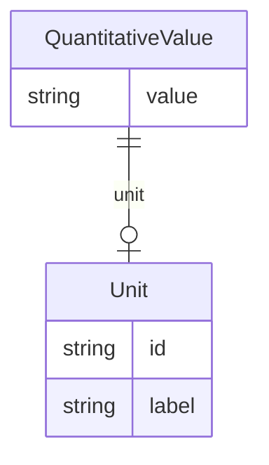

# Class: QuantitativeValue


URI: [dietitian_notes:QuantitativeValue](dietitian_notes:QuantitativeValue)





## Inheritance
* [CompoundExpression](CompoundExpression.md)
    * **QuantitativeValue**
        * [QuantitativeValueWithMetric](QuantitativeValueWithMetric.md)
        * [QuantitativeValueWithFrequency](QuantitativeValueWithFrequency.md)


## Slots

| Name | Cardinality and Range | Description | Inheritance |
| ---  | --- | --- | --- |
| [value](value.md) | 0..1 <br/> [String](String.md) | The value of the quantity, or N/A if not provided | direct |
| [unit](unit.md) | 0..1 <br/> [Unit](Unit.md) | The unit of the quantity, or N/A if not provided | direct |


## Usages

| used by | used in | type | used |
| ---  | --- | --- | --- |
| [ClinicalObservations](ClinicalObservations.md) | [patient_age](patient_age.md) | range | [QuantitativeValue](QuantitativeValue.md) |
| [DietSupplementation](DietSupplementation.md) | [duration](duration.md) | range | [QuantitativeValue](QuantitativeValue.md) |
| [NutritionSupportComponent](NutritionSupportComponent.md) | [duration](duration.md) | range | [QuantitativeValue](QuantitativeValue.md) |
| [DrugTherapy](DrugTherapy.md) | [duration](duration.md) | range | [QuantitativeValue](QuantitativeValue.md) |


## Identifier and Mapping Information


### Annotations

| property | value |
| --- | --- |
| owl | IntersectionOf |


### Schema Source


* from schema: http://w3id.org/ontogpt/dietician_notes


## Mappings

| Mapping Type | Mapped Value |
| ---  | ---  |
| self | dietitian_notes:QuantitativeValue |
| native | dietitian_notes:QuantitativeValue |


## LinkML Source

<!-- TODO: investigate https://stackoverflow.com/questions/37606292/how-to-create-tabbed-code-blocks-in-mkdocs-or-sphinx -->

### Direct

<details>
```yaml
name: QuantitativeValue
annotations:
  owl:
    tag: owl
    value: IntersectionOf
from_schema: http://w3id.org/ontogpt/dietician_notes
is_a: CompoundExpression
attributes:
  value:
    name: value
    annotations:
      owl:
        tag: owl
        value: DataProperty, DataHasValue
    description: The value of the quantity, or N/A if not provided.
    from_schema: http://w3id.org/ontogpt/dietician_notes
    rank: 1000
    domain_of:
    - QuantitativeValue
    range: string
  unit:
    name: unit
    annotations:
      owl:
        tag: owl
        value: ObjectProperty, ObjectSomeValuesFrom
    description: The unit of the quantity, or N/A if not provided.
    from_schema: http://w3id.org/ontogpt/dietician_notes
    rank: 1000
    slot_uri: qudt:unit
    domain_of:
    - QuantitativeValue
    range: Unit

```
</details>

### Induced

<details>
```yaml
name: QuantitativeValue
annotations:
  owl:
    tag: owl
    value: IntersectionOf
from_schema: http://w3id.org/ontogpt/dietician_notes
is_a: CompoundExpression
attributes:
  value:
    name: value
    annotations:
      owl:
        tag: owl
        value: DataProperty, DataHasValue
    description: The value of the quantity, or N/A if not provided.
    from_schema: http://w3id.org/ontogpt/dietician_notes
    rank: 1000
    alias: value
    owner: QuantitativeValue
    domain_of:
    - QuantitativeValue
    range: string
  unit:
    name: unit
    annotations:
      owl:
        tag: owl
        value: ObjectProperty, ObjectSomeValuesFrom
    description: The unit of the quantity, or N/A if not provided.
    from_schema: http://w3id.org/ontogpt/dietician_notes
    rank: 1000
    slot_uri: qudt:unit
    alias: unit
    owner: QuantitativeValue
    domain_of:
    - QuantitativeValue
    range: Unit

```
</details>