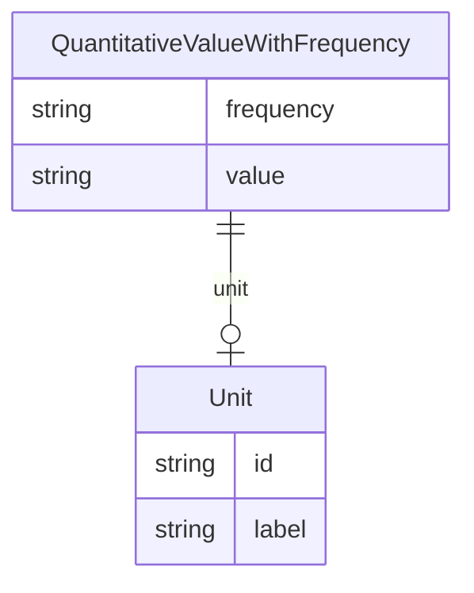

# Class: QuantitativeValueWithFrequency


URI: [dietitian_notes:QuantitativeValueWithFrequency](dietitian_notes:QuantitativeValueWithFrequency)





## Inheritance
* [CompoundExpression](CompoundExpression.md)
    * [QuantitativeValue](QuantitativeValue.md)
        * **QuantitativeValueWithFrequency**


## Slots

| Name | Cardinality and Range | Description | Inheritance |
| ---  | --- | --- | --- |
| [frequency](frequency.md) | 0..1 <br/> [String](String.md) | A phrase describing how often an event or procedure should happen | direct |
| [value](value.md) | 0..1 <br/> [String](String.md) | The value of the quantity, or N/A if not provided | [QuantitativeValue](QuantitativeValue.md) |
| [unit](unit.md) | 0..1 <br/> [Unit](Unit.md) | The unit of the quantity, or N/A if not provided | [QuantitativeValue](QuantitativeValue.md) |


## Usages

| used by | used in | type | used |
| ---  | --- | --- | --- |
| [DietSupplementation](DietSupplementation.md) | [amount](amount.md) | range | [QuantitativeValueWithFrequency](QuantitativeValueWithFrequency.md) |
| [NutritionSupportComponent](NutritionSupportComponent.md) | [amount](amount.md) | range | [QuantitativeValueWithFrequency](QuantitativeValueWithFrequency.md) |
| [DrugTherapy](DrugTherapy.md) | [amount](amount.md) | range | [QuantitativeValueWithFrequency](QuantitativeValueWithFrequency.md) |


## Identifier and Mapping Information


### Annotations

| property | value |
| --- | --- |
| owl | IntersectionOf |


### Schema Source


* from schema: http://w3id.org/ontogpt/dietician_notes


## Mappings

| Mapping Type | Mapped Value |
| ---  | ---  |
| self | dietitian_notes:QuantitativeValueWithFrequency |
| native | dietitian_notes:QuantitativeValueWithFrequency |


## LinkML Source

<!-- TODO: investigate https://stackoverflow.com/questions/37606292/how-to-create-tabbed-code-blocks-in-mkdocs-or-sphinx -->

### Direct

<details>
```yaml
name: QuantitativeValueWithFrequency
annotations:
  owl:
    tag: owl
    value: IntersectionOf
from_schema: http://w3id.org/ontogpt/dietician_notes
is_a: QuantitativeValue
attributes:
  frequency:
    name: frequency
    description: A phrase describing how often an event or procedure should happen.
      May include time phrases such as "per day", Latin version of the same such as
      "per diem", single words such as "daily", or more complex phrases such as "every
      4 hours". N/A if not provided.
    from_schema: http://w3id.org/ontogpt/dietician_notes
    rank: 1000
    domain_of:
    - QuantitativeValueWithFrequency
    range: string

```
</details>

### Induced

<details>
```yaml
name: QuantitativeValueWithFrequency
annotations:
  owl:
    tag: owl
    value: IntersectionOf
from_schema: http://w3id.org/ontogpt/dietician_notes
is_a: QuantitativeValue
attributes:
  frequency:
    name: frequency
    description: A phrase describing how often an event or procedure should happen.
      May include time phrases such as "per day", Latin version of the same such as
      "per diem", single words such as "daily", or more complex phrases such as "every
      4 hours". N/A if not provided.
    from_schema: http://w3id.org/ontogpt/dietician_notes
    rank: 1000
    alias: frequency
    owner: QuantitativeValueWithFrequency
    domain_of:
    - QuantitativeValueWithFrequency
    range: string
  value:
    name: value
    annotations:
      owl:
        tag: owl
        value: DataProperty, DataHasValue
    description: The value of the quantity, or N/A if not provided.
    from_schema: http://w3id.org/ontogpt/dietician_notes
    rank: 1000
    alias: value
    owner: QuantitativeValueWithFrequency
    domain_of:
    - QuantitativeValue
    range: string
  unit:
    name: unit
    annotations:
      owl:
        tag: owl
        value: ObjectProperty, ObjectSomeValuesFrom
    description: The unit of the quantity, or N/A if not provided.
    from_schema: http://w3id.org/ontogpt/dietician_notes
    rank: 1000
    slot_uri: qudt:unit
    alias: unit
    owner: QuantitativeValueWithFrequency
    domain_of:
    - QuantitativeValue
    range: Unit

```
</details>