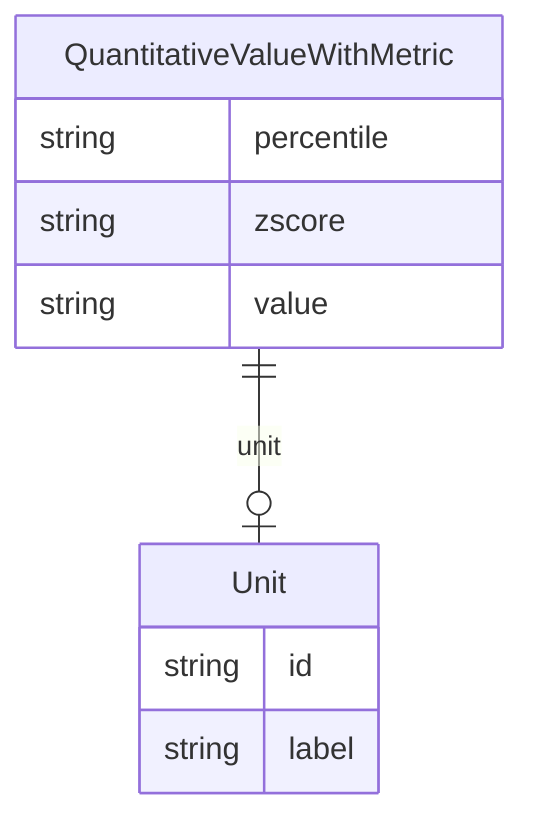

# Class: QuantitativeValueWithMetric


URI: [dietitian_notes:QuantitativeValueWithMetric](dietitian_notes:QuantitativeValueWithMetric)





## Inheritance
* [CompoundExpression](CompoundExpression.md)
    * [QuantitativeValue](QuantitativeValue.md)
        * **QuantitativeValueWithMetric**


## Slots

| Name | Cardinality and Range | Description | Inheritance |
| ---  | --- | --- | --- |
| [percentile](percentile.md) | 0..1 <br/> [String](String.md) | The reported percentile of the value, as compared to a reference patient popu... | direct |
| [zscore](zscore.md) | 0..1 <br/> [String](String.md) | The relative standard deviation of the value, as a function of the percentile | direct |
| [value](value.md) | 0..1 <br/> [String](String.md) | The value of the quantity, or N/A if not provided | [QuantitativeValue](QuantitativeValue.md) |
| [unit](unit.md) | 0..1 <br/> [Unit](Unit.md) | The unit of the quantity, or N/A if not provided | [QuantitativeValue](QuantitativeValue.md) |


## Usages

| used by | used in | type | used |
| ---  | --- | --- | --- |
| [ClinicalObservations](ClinicalObservations.md) | [patient_height](patient_height.md) | range | [QuantitativeValueWithMetric](QuantitativeValueWithMetric.md) |
| [ClinicalObservations](ClinicalObservations.md) | [current_patient_weight](current_patient_weight.md) | range | [QuantitativeValueWithMetric](QuantitativeValueWithMetric.md) |
| [ClinicalObservations](ClinicalObservations.md) | [usual_patient_weight](usual_patient_weight.md) | range | [QuantitativeValueWithMetric](QuantitativeValueWithMetric.md) |
| [ClinicalObservations](ClinicalObservations.md) | [head_circumference](head_circumference.md) | range | [QuantitativeValueWithMetric](QuantitativeValueWithMetric.md) |


## Identifier and Mapping Information


### Annotations

| property | value |
| --- | --- |
| owl | IntersectionOf |


### Schema Source


* from schema: http://w3id.org/ontogpt/dietician_notes


## Mappings

| Mapping Type | Mapped Value |
| ---  | ---  |
| self | dietitian_notes:QuantitativeValueWithMetric |
| native | dietitian_notes:QuantitativeValueWithMetric |


## LinkML Source

<!-- TODO: investigate https://stackoverflow.com/questions/37606292/how-to-create-tabbed-code-blocks-in-mkdocs-or-sphinx -->

### Direct

<details>
```yaml
name: QuantitativeValueWithMetric
annotations:
  owl:
    tag: owl
    value: IntersectionOf
from_schema: http://w3id.org/ontogpt/dietician_notes
is_a: QuantitativeValue
attributes:
  percentile:
    name: percentile
    description: The reported percentile of the value, as compared to a reference
      patient population. Always positive, on a scale from 0 to 99%. May be reported
      as "X%", "X%ile", or "Xth percentile", where X is the value. N/A if not provided.
    from_schema: http://w3id.org/ontogpt/dietician_notes
    rank: 1000
    domain_of:
    - QuantitativeValueWithMetric
    range: string
  zscore:
    name: zscore
    description: The relative standard deviation of the value, as a function of the
      percentile. May be positive or negative. May be reported as "z-score", "Z-score",
      or "Z", followed by the value. N/A if not provided.
    from_schema: http://w3id.org/ontogpt/dietician_notes
    rank: 1000
    domain_of:
    - QuantitativeValueWithMetric
    range: string

```
</details>

### Induced

<details>
```yaml
name: QuantitativeValueWithMetric
annotations:
  owl:
    tag: owl
    value: IntersectionOf
from_schema: http://w3id.org/ontogpt/dietician_notes
is_a: QuantitativeValue
attributes:
  percentile:
    name: percentile
    description: The reported percentile of the value, as compared to a reference
      patient population. Always positive, on a scale from 0 to 99%. May be reported
      as "X%", "X%ile", or "Xth percentile", where X is the value. N/A if not provided.
    from_schema: http://w3id.org/ontogpt/dietician_notes
    rank: 1000
    alias: percentile
    owner: QuantitativeValueWithMetric
    domain_of:
    - QuantitativeValueWithMetric
    range: string
  zscore:
    name: zscore
    description: The relative standard deviation of the value, as a function of the
      percentile. May be positive or negative. May be reported as "z-score", "Z-score",
      or "Z", followed by the value. N/A if not provided.
    from_schema: http://w3id.org/ontogpt/dietician_notes
    rank: 1000
    alias: zscore
    owner: QuantitativeValueWithMetric
    domain_of:
    - QuantitativeValueWithMetric
    range: string
  value:
    name: value
    annotations:
      owl:
        tag: owl
        value: DataProperty, DataHasValue
    description: The value of the quantity, or N/A if not provided.
    from_schema: http://w3id.org/ontogpt/dietician_notes
    rank: 1000
    alias: value
    owner: QuantitativeValueWithMetric
    domain_of:
    - QuantitativeValue
    range: string
  unit:
    name: unit
    annotations:
      owl:
        tag: owl
        value: ObjectProperty, ObjectSomeValuesFrom
    description: The unit of the quantity, or N/A if not provided.
    from_schema: http://w3id.org/ontogpt/dietician_notes
    rank: 1000
    slot_uri: qudt:unit
    alias: unit
    owner: QuantitativeValueWithMetric
    domain_of:
    - QuantitativeValue
    range: Unit

```
</details>