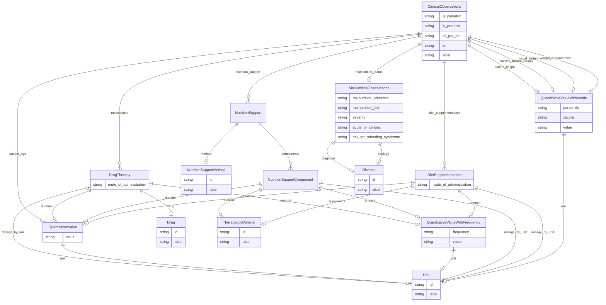

# Dietitian Notes Extraction Template

A template for extracting clinical observations from dietitian notes. Developed with guidance from Lauren Chan, PhD, RD and Alyson Lawrence, RD, CNSC

URI: http://w3id.org/ontogpt/dietician_notes

Name: dietitian_notes

## Schema Diagram

## Classes

| Class | Description |
| --- | --- |
| [AnnotatorResult](AnnotatorResult.md) | None |
| [Any](Any.md) | None |
| [ClinicalObservationSet](ClinicalObservationSet.md) | A set of sets of clinical observations. |
| [CompoundExpression](CompoundExpression.md) | None |
| &nbsp;&nbsp;&nbsp;&nbsp;&nbsp;&nbsp;&nbsp;&nbsp;[DietSupplementation](DietSupplementation.md) | None |
| &nbsp;&nbsp;&nbsp;&nbsp;&nbsp;&nbsp;&nbsp;&nbsp;[DrugTherapy](DrugTherapy.md) | None |
| &nbsp;&nbsp;&nbsp;&nbsp;&nbsp;&nbsp;&nbsp;&nbsp;[NutritionSupport](NutritionSupport.md) | None |
| &nbsp;&nbsp;&nbsp;&nbsp;&nbsp;&nbsp;&nbsp;&nbsp;[NutritionSupportComponent](NutritionSupportComponent.md) | None |
| &nbsp;&nbsp;&nbsp;&nbsp;&nbsp;&nbsp;&nbsp;&nbsp;[QuantitativeValue](QuantitativeValue.md) | None |
| &nbsp;&nbsp;&nbsp;&nbsp;&nbsp;&nbsp;&nbsp;&nbsp;&nbsp;&nbsp;&nbsp;&nbsp;&nbsp;&nbsp;&nbsp;&nbsp;[QuantitativeValueWithFrequency](QuantitativeValueWithFrequency.md) | None |
| &nbsp;&nbsp;&nbsp;&nbsp;&nbsp;&nbsp;&nbsp;&nbsp;&nbsp;&nbsp;&nbsp;&nbsp;&nbsp;&nbsp;&nbsp;&nbsp;[QuantitativeValueWithMetric](QuantitativeValueWithMetric.md) | None |
| &nbsp;&nbsp;&nbsp;&nbsp;&nbsp;&nbsp;&nbsp;&nbsp;[Triple](Triple.md) | Abstract parent for Relation Extraction tasks |
| [ExtractionResult](ExtractionResult.md) | A result of extracting knowledge on text |
| [MalnutritionObservations](MalnutritionObservations.md) | None |
| [NamedEntity](NamedEntity.md) | None |
| &nbsp;&nbsp;&nbsp;&nbsp;&nbsp;&nbsp;&nbsp;&nbsp;[ClinicalObservations](ClinicalObservations.md) | A set of clinical observations about a single patient at a single time. |
| &nbsp;&nbsp;&nbsp;&nbsp;&nbsp;&nbsp;&nbsp;&nbsp;[Disease](Disease.md) | None |
| &nbsp;&nbsp;&nbsp;&nbsp;&nbsp;&nbsp;&nbsp;&nbsp;[Drug](Drug.md) | None |
| &nbsp;&nbsp;&nbsp;&nbsp;&nbsp;&nbsp;&nbsp;&nbsp;[NutritionSupportMethod](NutritionSupportMethod.md) | A method of nutrition support therapy used to treat or prevent malnutrition. This includes any method of feeding intended to replace or support oral feeding. |
| &nbsp;&nbsp;&nbsp;&nbsp;&nbsp;&nbsp;&nbsp;&nbsp;[RelationshipType](RelationshipType.md) | None |
| &nbsp;&nbsp;&nbsp;&nbsp;&nbsp;&nbsp;&nbsp;&nbsp;[TherapeuticMaterial](TherapeuticMaterial.md) | A specific material added to a patient's diet or included as part of a nutritional plan. |
| &nbsp;&nbsp;&nbsp;&nbsp;&nbsp;&nbsp;&nbsp;&nbsp;[Unit](Unit.md) | None |
| [Publication](Publication.md) | None |
| [TextWithEntity](TextWithEntity.md) | A text containing one or more instances of a single type of entity. |
| [TextWithTriples](TextWithTriples.md) | A text containing one or more relations of the Triple type. |

## Slots

| Slot | Description |
| --- | --- |
| [abstract](abstract.md) | The abstract of the publication |
| [acute_or_chronic](acute_or_chronic.md) | The duration of the patient's malnutrition, if present |
| [amount](amount.md) | The quantity or dosage of the therapy, if provided |
| [combined_text](combined_text.md) |  |
| [components](components.md) | The names of specific components included in a patient's diet |
| [current_patient_weight](current_patient_weight.md) |  |
| [diagnosis](diagnosis.md) | The patient's malnutrition diagnosis, if present |
| [diet_supplementation](diet_supplementation.md) | A semicolon-separated list of the patient's diet supplementation therapies |
| [dosage_by_unit](dosage_by_unit.md) | The unit of a patient's properties used to determine supplement dosage |
| [drug](drug.md) | The name of a specific drug for a patient's preventative or therapeutic treat... |
| [duration](duration.md) | The duration of the supplementation, if provided |
| [entities](entities.md) |  |
| [etiology](etiology.md) | The cause of the patient's malnutrition, if known |
| [extracted_object](extracted_object.md) | The complex objects extracted from the text |
| [frequency](frequency.md) | A phrase describing how often an event or procedure should happen |
| [full_text](full_text.md) | The full text of the publication |
| [head_circumference](head_circumference.md) |  |
| [id](id.md) | A unique identifier for the named entity |
| [input_id](input_id.md) |  |
| [input_text](input_text.md) |  |
| [input_title](input_title.md) |  |
| [is_pediatric](is_pediatric.md) |  |
| [is_preterm](is_preterm.md) |  |
| [label](label.md) | The label (name) of the named thing |
| [malnutrition_presence](malnutrition_presence.md) | True if the patient is malnourished, False otherwise |
| [malnutrition_risk](malnutrition_risk.md) | True if the patient has a demonstrable risk for malnutrition, False otherwise |
| [malnutrition_status](malnutrition_status.md) |  |
| [material](material.md) | The name of a specific material included in a patient's diet |
| [medications](medications.md) | A semicolon-separated list of the patient's medications |
| [method](method.md) | The name of a method used to provide nutritional support |
| [named_entities](named_entities.md) | Named entities extracted from the text |
| [nil_per_os](nil_per_os.md) | True if the patient is not receiving any oral nutrition, False otherwise |
| [nutrition_support](nutrition_support.md) | A semicolon-separated list of the patient's nutrition support therapies, usua... |
| [object](object.md) |  |
| [object_id](object_id.md) |  |
| [object_qualifier](object_qualifier.md) | An optional qualifier or modifier for the object of the statement, e |
| [object_text](object_text.md) |  |
| [observations](observations.md) |  |
| [patient_age](patient_age.md) |  |
| [patient_height](patient_height.md) |  |
| [percentile](percentile.md) | The reported percentile of the value, as compared to a reference patient popu... |
| [predicate](predicate.md) |  |
| [prompt](prompt.md) |  |
| [publication](publication.md) |  |
| [qualifier](qualifier.md) | A qualifier for the statements, e |
| [raw_completion_output](raw_completion_output.md) |  |
| [risk_for_refeeding_syndrome](risk_for_refeeding_syndrome.md) | True if the patient is at risk for refeeding syndrome, False otherwise |
| [route_of_administration](route_of_administration.md) | The route of administration for the supplementation, if provided |
| [severity](severity.md) | The severity of the patient's malnutrition, if present |
| [subject](subject.md) |  |
| [subject_qualifier](subject_qualifier.md) | An optional qualifier or modifier for the subject of the statement, e |
| [subject_text](subject_text.md) |  |
| [supplement](supplement.md) | The name of a specific material added to a patient's diet |
| [title](title.md) | The title of the publication |
| [triples](triples.md) |  |
| [unit](unit.md) | The unit of the quantity, or N/A if not provided |
| [usual_patient_weight](usual_patient_weight.md) |  |
| [value](value.md) | The value of the quantity, or N/A if not provided |
| [zscore](zscore.md) | The relative standard deviation of the value, as a function of the percentile |

## Enumerations

| Enumeration | Description |
| --- | --- |
| [NullDataOptions](NullDataOptions.md) |  |

## Types

| Type | Description |
| --- | --- |
| [Boolean](Boolean.md) | A binary (true or false) value |
| [Curie](Curie.md) | a compact URI |
| [Date](Date.md) | a date (year, month and day) in an idealized calendar |
| [DateOrDatetime](DateOrDatetime.md) | Either a date or a datetime |
| [Datetime](Datetime.md) | The combination of a date and time |
| [Decimal](Decimal.md) | A real number with arbitrary precision that conforms to the xsd:decimal speci... |
| [Double](Double.md) | A real number that conforms to the xsd:double specification |
| [Float](Float.md) | A real number that conforms to the xsd:float specification |
| [Integer](Integer.md) | An integer |
| [Jsonpath](Jsonpath.md) | A string encoding a JSON Path |
| [Jsonpointer](Jsonpointer.md) | A string encoding a JSON Pointer |
| [Ncname](Ncname.md) | Prefix part of CURIE |
| [Nodeidentifier](Nodeidentifier.md) | A URI, CURIE or BNODE that represents a node in a model |
| [Objectidentifier](Objectidentifier.md) | A URI or CURIE that represents an object in the model |
| [Sparqlpath](Sparqlpath.md) | A string encoding a SPARQL Property Path |
| [String](String.md) | A character string |
| [Time](Time.md) | A time object represents a (local) time of day, independent of any particular... |
| [Uri](Uri.md) | a complete URI |
| [Uriorcurie](Uriorcurie.md) | a URI or a CURIE |

## Subsets

| Subset | Description |
| --- | --- |
