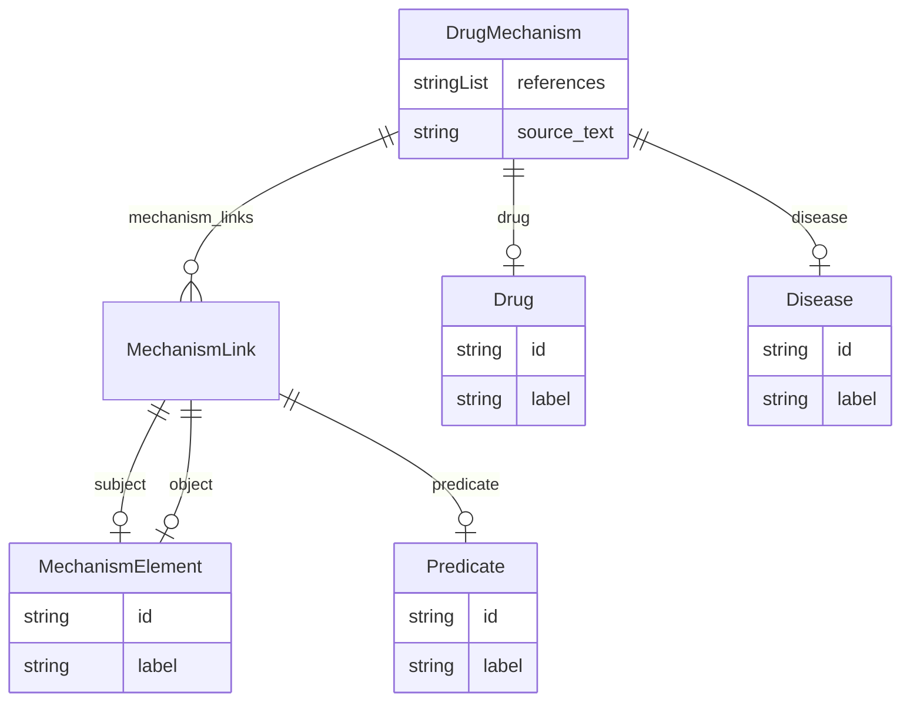

# Class: DrugMechanism


URI: [drug:DrugMechanism](http://w3id.org/ontogpt/drug/DrugMechanism)





<!-- no inheritance hierarchy -->


## Slots

| Name | Cardinality and Range | Description | Inheritance |
| ---  | --- | --- | --- |
| [disease](disease.md) | 0..1 <br/> [Disease](Disease.md) | the name of the disease that is treated | direct |
| [drug](drug.md) | 0..1 <br/> [Drug](Drug.md) | the name of the drug that treats the disease | direct |
| [mechanism_links](mechanism_links.md) | 0..* <br/> [MechanismLink](MechanismLink.md) | semicolon-separated list of links, where each link is a triple connecting two... | direct |
| [references](references.md) | 0..* <br/> [String](String.md) |  | direct |
| [source_text](source_text.md) | 0..1 <br/> [String](String.md) |  | direct |


## Identifier and Mapping Information


### Schema Source


* from schema: http://w3id.org/ontogpt/drug


## Mappings

| Mapping Type | Mapped Value |
| ---  | ---  |
| self | drug:DrugMechanism |
| native | drug:DrugMechanism |


## LinkML Source

<!-- TODO: investigate https://stackoverflow.com/questions/37606292/how-to-create-tabbed-code-blocks-in-mkdocs-or-sphinx -->

### Direct

<details>
```yaml
name: DrugMechanism
from_schema: http://w3id.org/ontogpt/drug
rank: 1000
attributes:
  disease:
    name: disease
    description: the name of the disease that is treated
    from_schema: http://w3id.org/ontogpt/drug
    rank: 1000
    range: Disease
  drug:
    name: drug
    description: the name of the drug that treats the disease
    from_schema: http://w3id.org/ontogpt/drug
    rank: 1000
    range: Drug
  mechanism_links:
    name: mechanism_links
    description: semicolon-separated list of links, where each link is a triple connecting
      two entities via a relationship type
    from_schema: http://w3id.org/ontogpt/drug
    rank: 1000
    multivalued: true
    range: MechanismLink
  references:
    name: references
    annotations:
      prompt.skip:
        tag: prompt.skip
        value: 'true'
    from_schema: http://w3id.org/ontogpt/drug
    rank: 1000
    multivalued: true
    range: string
  source_text:
    name: source_text
    annotations:
      prompt.skip:
        tag: prompt.skip
        value: 'true'
    from_schema: http://w3id.org/ontogpt/drug
    rank: 1000
    range: string
tree_root: true

```
</details>

### Induced

<details>
```yaml
name: DrugMechanism
from_schema: http://w3id.org/ontogpt/drug
rank: 1000
attributes:
  disease:
    name: disease
    description: the name of the disease that is treated
    from_schema: http://w3id.org/ontogpt/drug
    rank: 1000
    alias: disease
    owner: DrugMechanism
    domain_of:
    - DrugMechanism
    range: Disease
  drug:
    name: drug
    description: the name of the drug that treats the disease
    from_schema: http://w3id.org/ontogpt/drug
    rank: 1000
    alias: drug
    owner: DrugMechanism
    domain_of:
    - DrugMechanism
    range: Drug
  mechanism_links:
    name: mechanism_links
    description: semicolon-separated list of links, where each link is a triple connecting
      two entities via a relationship type
    from_schema: http://w3id.org/ontogpt/drug
    rank: 1000
    multivalued: true
    alias: mechanism_links
    owner: DrugMechanism
    domain_of:
    - DrugMechanism
    range: MechanismLink
  references:
    name: references
    annotations:
      prompt.skip:
        tag: prompt.skip
        value: 'true'
    from_schema: http://w3id.org/ontogpt/drug
    rank: 1000
    multivalued: true
    alias: references
    owner: DrugMechanism
    domain_of:
    - DrugMechanism
    range: string
  source_text:
    name: source_text
    annotations:
      prompt.skip:
        tag: prompt.skip
        value: 'true'
    from_schema: http://w3id.org/ontogpt/drug
    rank: 1000
    alias: source_text
    owner: DrugMechanism
    domain_of:
    - DrugMechanism
    range: string
tree_root: true

```
</details>