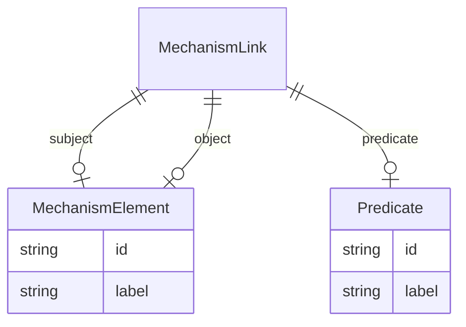

# Class: MechanismLink


URI: [drug:MechanismLink](http://w3id.org/ontogpt/drug/MechanismLink)





## Inheritance
* [CompoundExpression](CompoundExpression.md)
    * **MechanismLink**


## Slots

| Name | Cardinality and Range | Description | Inheritance |
| ---  | --- | --- | --- |
| [subject](subject.md) | 0..1 <br/> [MechanismElement](MechanismElement.md) |  | direct |
| [predicate](predicate.md) | 0..1 <br/> [Predicate](Predicate.md) |  | direct |
| [object](object.md) | 0..1 <br/> [MechanismElement](MechanismElement.md) |  | direct |


## Usages

| used by | used in | type | used |
| ---  | --- | --- | --- |
| [DrugMechanism](DrugMechanism.md) | [mechanism_links](mechanism_links.md) | range | [MechanismLink](MechanismLink.md) |


## Identifier and Mapping Information


### Schema Source


* from schema: http://w3id.org/ontogpt/drug


## Mappings

| Mapping Type | Mapped Value |
| ---  | ---  |
| self | drug:MechanismLink |
| native | drug:MechanismLink |


## LinkML Source

<!-- TODO: investigate https://stackoverflow.com/questions/37606292/how-to-create-tabbed-code-blocks-in-mkdocs-or-sphinx -->

### Direct

<details>
```yaml
name: MechanismLink
from_schema: http://w3id.org/ontogpt/drug
is_a: CompoundExpression
attributes:
  subject:
    name: subject
    from_schema: http://w3id.org/ontogpt/drug
    rank: 1000
    domain_of:
    - MechanismLink
    - Triple
    range: MechanismElement
  predicate:
    name: predicate
    from_schema: http://w3id.org/ontogpt/drug
    rank: 1000
    domain_of:
    - MechanismLink
    - Triple
    range: Predicate
  object:
    name: object
    from_schema: http://w3id.org/ontogpt/drug
    rank: 1000
    domain_of:
    - MechanismLink
    - Triple
    range: MechanismElement

```
</details>

### Induced

<details>
```yaml
name: MechanismLink
from_schema: http://w3id.org/ontogpt/drug
is_a: CompoundExpression
attributes:
  subject:
    name: subject
    from_schema: http://w3id.org/ontogpt/drug
    rank: 1000
    alias: subject
    owner: MechanismLink
    domain_of:
    - MechanismLink
    - Triple
    range: MechanismElement
  predicate:
    name: predicate
    from_schema: http://w3id.org/ontogpt/drug
    rank: 1000
    alias: predicate
    owner: MechanismLink
    domain_of:
    - MechanismLink
    - Triple
    range: Predicate
  object:
    name: object
    from_schema: http://w3id.org/ontogpt/drug
    rank: 1000
    alias: object
    owner: MechanismLink
    domain_of:
    - MechanismLink
    - Triple
    range: MechanismElement

```
</details>