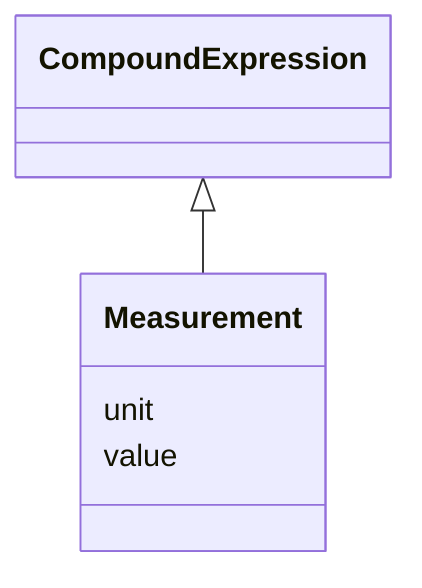

# Class: Measurement


URI: [sample:Measurement](http://w3id.org/ontogpt/environmental-sample/Measurement)





## Inheritance
* [CompoundExpression](CompoundExpression.md)
    * **Measurement**


## Slots

| Name | Cardinality and Range | Description | Inheritance |
| ---  | --- | --- | --- |
| [value](value.md) | 0..1 <br/> NONE | the value of the measurement | direct |
| [unit](unit.md) | 0..1 <br/> [Unit](Unit.md) | the unit of the measurement | direct |


## Usages

| used by | used in | type | used |
| ---  | --- | --- | --- |
| [Study](Study.md) | [measurements](measurements.md) | range | [Measurement](Measurement.md) |


## Identifier and Mapping Information


### Schema Source


* from schema: http://w3id.org/ontogpt/environmental-sample


## Mappings

| Mapping Type | Mapped Value |
| ---  | ---  |
| self | sample:Measurement |
| native | sample:Measurement |


## LinkML Source

<!-- TODO: investigate https://stackoverflow.com/questions/37606292/how-to-create-tabbed-code-blocks-in-mkdocs-or-sphinx -->

### Direct

<details>
```yaml
name: Measurement
from_schema: http://w3id.org/ontogpt/environmental-sample
rank: 1000
is_a: CompoundExpression
attributes:
  value:
    name: value
    description: the value of the measurement
    from_schema: http://w3id.org/ontogpt/environmental-sample
    rank: 1000
  unit:
    name: unit
    description: the unit of the measurement
    from_schema: http://w3id.org/ontogpt/environmental-sample
    rank: 1000
    range: Unit

```
</details>

### Induced

<details>
```yaml
name: Measurement
from_schema: http://w3id.org/ontogpt/environmental-sample
rank: 1000
is_a: CompoundExpression
attributes:
  value:
    name: value
    description: the value of the measurement
    from_schema: http://w3id.org/ontogpt/environmental-sample
    rank: 1000
    alias: value
    owner: Measurement
    domain_of:
    - Measurement
    range: string
  unit:
    name: unit
    description: the unit of the measurement
    from_schema: http://w3id.org/ontogpt/environmental-sample
    rank: 1000
    alias: unit
    owner: Measurement
    domain_of:
    - Measurement
    range: Unit

```
</details>