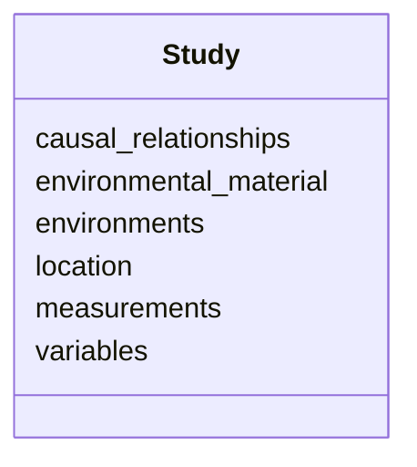

# Class: Study


URI: [sample:Study](http://w3id.org/ontogpt/environmental-sample/Study)





<!-- no inheritance hierarchy -->


## Slots

| Name | Cardinality and Range | Description | Inheritance |
| ---  | --- | --- | --- |
| [location](location.md) | 0..* <br/> [Location](Location.md) | the sites at which the study was conducted | direct |
| [environmental_material](environmental_material.md) | 0..* <br/> [EnvironmentalMaterial](EnvironmentalMaterial.md) | the environmental material that was sampled | direct |
| [environments](environments.md) | 0..* <br/> [Environment](Environment.md) |  | direct |
| [causal_relationships](causal_relationships.md) | 0..* <br/> [CausalRelationship](CausalRelationship.md) |  | direct |
| [variables](variables.md) | 0..* <br/> [Variable](Variable.md) |  | direct |
| [measurements](measurements.md) | 0..* <br/> [Measurement](Measurement.md) |  | direct |


## Identifier and Mapping Information


### Schema Source


* from schema: http://w3id.org/ontogpt/environmental-sample


## Mappings

| Mapping Type | Mapped Value |
| ---  | ---  |
| self | sample:Study |
| native | sample:Study |


## LinkML Source

<!-- TODO: investigate https://stackoverflow.com/questions/37606292/how-to-create-tabbed-code-blocks-in-mkdocs-or-sphinx -->

### Direct

<details>
```yaml
name: Study
from_schema: http://w3id.org/ontogpt/environmental-sample
rank: 1000
attributes:
  location:
    name: location
    annotations:
      prompt:
        tag: prompt
        value: semicolon-separated list of sites at which the study was conducted
    description: the sites at which the study was conducted
    from_schema: http://w3id.org/ontogpt/environmental-sample
    rank: 1000
    multivalued: true
    range: Location
  environmental_material:
    name: environmental_material
    annotations:
      prompt:
        tag: prompt
        value: semicolon-separated list of environmental materials
    description: the environmental material that was sampled
    from_schema: http://w3id.org/ontogpt/environmental-sample
    rank: 1000
    multivalued: true
    range: EnvironmentalMaterial
  environments:
    name: environments
    annotations:
      prompt:
        tag: prompt
        value: semicolon-separated list of environmental contexts in which the study
          was conducted
    from_schema: http://w3id.org/ontogpt/environmental-sample
    rank: 1000
    multivalued: true
    range: Environment
  causal_relationships:
    name: causal_relationships
    annotations:
      prompt:
        tag: prompt
        value: semicolon-separated list of cause-effect pairs, for example, effect
          of temperature on growth
    from_schema: http://w3id.org/ontogpt/environmental-sample
    rank: 1000
    multivalued: true
    range: CausalRelationship
  variables:
    name: variables
    annotations:
      prompt:
        tag: prompt
        value: semicolon-separated list of study variables
    from_schema: http://w3id.org/ontogpt/environmental-sample
    rank: 1000
    multivalued: true
    range: Variable
  measurements:
    name: measurements
    annotations:
      prompt:
        tag: prompt
        value: semicolon-separated list of value-measurement pairs
    from_schema: http://w3id.org/ontogpt/environmental-sample
    rank: 1000
    multivalued: true
    range: Measurement

```
</details>

### Induced

<details>
```yaml
name: Study
from_schema: http://w3id.org/ontogpt/environmental-sample
rank: 1000
attributes:
  location:
    name: location
    annotations:
      prompt:
        tag: prompt
        value: semicolon-separated list of sites at which the study was conducted
    description: the sites at which the study was conducted
    from_schema: http://w3id.org/ontogpt/environmental-sample
    rank: 1000
    multivalued: true
    alias: location
    owner: Study
    domain_of:
    - Study
    range: Location
  environmental_material:
    name: environmental_material
    annotations:
      prompt:
        tag: prompt
        value: semicolon-separated list of environmental materials
    description: the environmental material that was sampled
    from_schema: http://w3id.org/ontogpt/environmental-sample
    rank: 1000
    multivalued: true
    alias: environmental_material
    owner: Study
    domain_of:
    - Study
    range: EnvironmentalMaterial
  environments:
    name: environments
    annotations:
      prompt:
        tag: prompt
        value: semicolon-separated list of environmental contexts in which the study
          was conducted
    from_schema: http://w3id.org/ontogpt/environmental-sample
    rank: 1000
    multivalued: true
    alias: environments
    owner: Study
    domain_of:
    - Study
    range: Environment
  causal_relationships:
    name: causal_relationships
    annotations:
      prompt:
        tag: prompt
        value: semicolon-separated list of cause-effect pairs, for example, effect
          of temperature on growth
    from_schema: http://w3id.org/ontogpt/environmental-sample
    rank: 1000
    multivalued: true
    alias: causal_relationships
    owner: Study
    domain_of:
    - Study
    range: CausalRelationship
  variables:
    name: variables
    annotations:
      prompt:
        tag: prompt
        value: semicolon-separated list of study variables
    from_schema: http://w3id.org/ontogpt/environmental-sample
    rank: 1000
    multivalued: true
    alias: variables
    owner: Study
    domain_of:
    - Study
    range: Variable
  measurements:
    name: measurements
    annotations:
      prompt:
        tag: prompt
        value: semicolon-separated list of value-measurement pairs
    from_schema: http://w3id.org/ontogpt/environmental-sample
    rank: 1000
    multivalued: true
    alias: measurements
    owner: Study
    domain_of:
    - Study
    range: Measurement

```
</details>