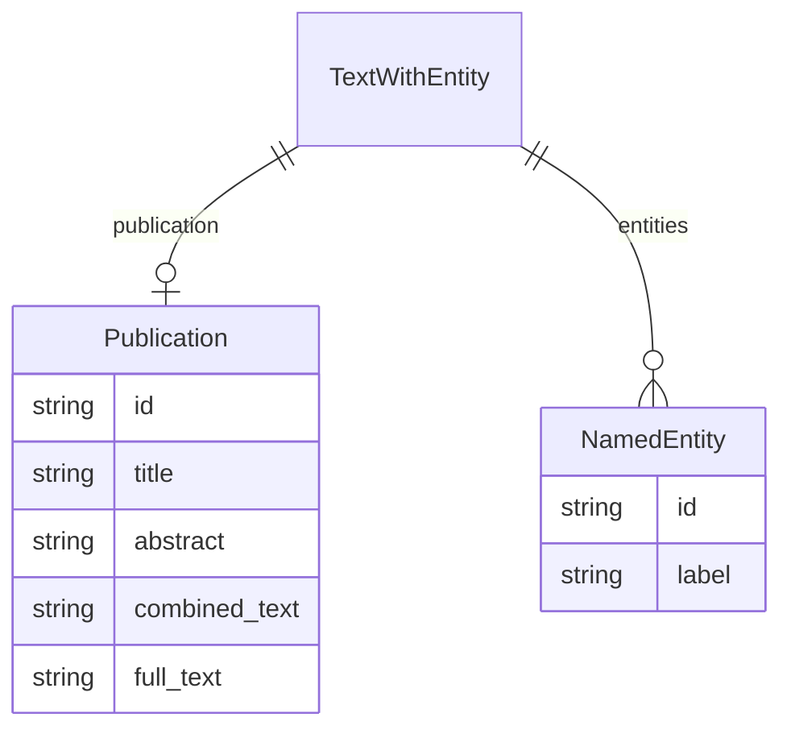

# Class: TextWithEntity


_A text containing one or more instances of a single type of entity._


URI: [sample:TextWithEntity](http://w3id.org/ontogpt/environmental-sample-ungrounded/TextWithEntity)





<!-- no inheritance hierarchy -->


## Slots

| Name | Cardinality and Range | Description | Inheritance |
| ---  | --- | --- | --- |
| [publication](publication.md) | 0..1 <br/> [Publication](Publication.md) |  | direct |
| [entities](entities.md) | * <br/> [NamedEntity](NamedEntity.md) |  | direct |


## Identifier and Mapping Information


### Schema Source


* from schema: http://w3id.org/ontogpt/environmental-sample-ungrounded


## Mappings

| Mapping Type | Mapped Value |
| ---  | ---  |
| self | sample:TextWithEntity |
| native | sample:TextWithEntity |


## LinkML Source

<!-- TODO: investigate https://stackoverflow.com/questions/37606292/how-to-create-tabbed-code-blocks-in-mkdocs-or-sphinx -->

### Direct

<details>
```yaml
name: TextWithEntity
description: A text containing one or more instances of a single type of entity.
from_schema: http://w3id.org/ontogpt/environmental-sample-ungrounded
attributes:
  publication:
    name: publication
    annotations:
      prompt.skip:
        tag: prompt.skip
        value: 'true'
    from_schema: http://w3id.org/ontogpt/environmental-sample-ungrounded
    domain_of:
    - TextWithTriples
    - TextWithEntity
    range: Publication
    inlined: true
  entities:
    name: entities
    from_schema: http://w3id.org/ontogpt/environmental-sample-ungrounded
    rank: 1000
    domain_of:
    - TextWithEntity
    range: NamedEntity
    multivalued: true

```
</details>

### Induced

<details>
```yaml
name: TextWithEntity
description: A text containing one or more instances of a single type of entity.
from_schema: http://w3id.org/ontogpt/environmental-sample-ungrounded
attributes:
  publication:
    name: publication
    annotations:
      prompt.skip:
        tag: prompt.skip
        value: 'true'
    from_schema: http://w3id.org/ontogpt/environmental-sample-ungrounded
    alias: publication
    owner: TextWithEntity
    domain_of:
    - TextWithTriples
    - TextWithEntity
    range: Publication
    inlined: true
  entities:
    name: entities
    from_schema: http://w3id.org/ontogpt/environmental-sample-ungrounded
    rank: 1000
    alias: entities
    owner: TextWithEntity
    domain_of:
    - TextWithEntity
    range: NamedEntity
    multivalued: true

```
</details>