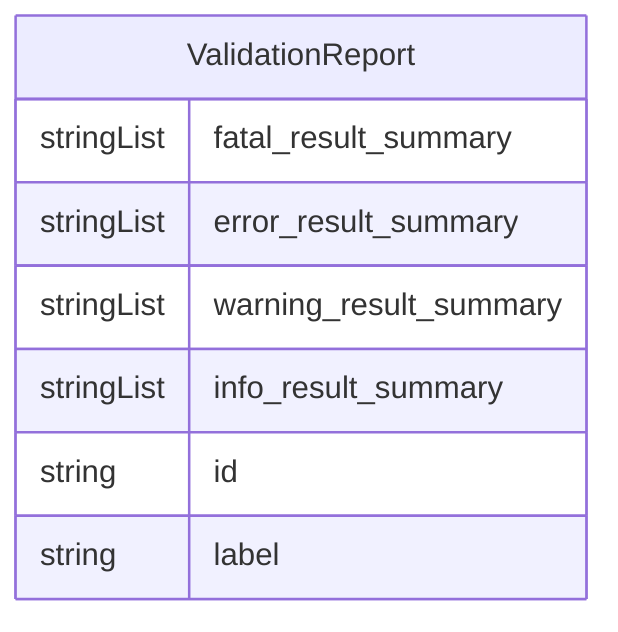

# Class: ValidationReport


_A report object containing one or more validation errors or notifications._


URI: [error_analysis:ValidationReport](http://w3id.org/ontogpt/error_analysisValidationReport)





## Inheritance
* [NamedEntity](NamedEntity.md)
    * **ValidationReport**


## Slots

| Name | Cardinality and Range | Description | Inheritance |
| ---  | --- | --- | --- |
| [fatal_result_summary](fatal_result_summary.md) | * <br/> [String](String.md) | Identify similarities among errors in the report with the category of FATAL | direct |
| [error_result_summary](error_result_summary.md) | * <br/> [String](String.md) | Identify similarities among errors in the report with the category of ERROR | direct |
| [warning_result_summary](warning_result_summary.md) | * <br/> [String](String.md) | Identify similarities among errors in the report with the category of WARNING | direct |
| [info_result_summary](info_result_summary.md) | * <br/> [String](String.md) | Identify similarities among errors in the report with the category of INFO | direct |
| [id](id.md) | 1 <br/> [String](String.md) | A unique identifier for the named entity | [NamedEntity](NamedEntity.md) |
| [label](label.md) | 0..1 <br/> [String](String.md) | The label (name) of the named thing | [NamedEntity](NamedEntity.md) |


## Identifier and Mapping Information


### Schema Source


* from schema: http://w3id.org/ontogpt/error_analysis


## Mappings

| Mapping Type | Mapped Value |
| ---  | ---  |
| self | error_analysis:ValidationReport |
| native | error_analysis:ValidationReport |


## LinkML Source

<!-- TODO: investigate https://stackoverflow.com/questions/37606292/how-to-create-tabbed-code-blocks-in-mkdocs-or-sphinx -->

### Direct

<details>
```yaml
name: ValidationReport
description: A report object containing one or more validation errors or notifications.
from_schema: http://w3id.org/ontogpt/error_analysis
is_a: NamedEntity
attributes:
  fatal_result_summary:
    name: fatal_result_summary
    description: Identify similarities among errors in the report with the category
      of FATAL. What is similar about these errors? Do they include many of the same
      prefixes or namespaces? If the same patterns or rules are violated, what are
      they? Separate each summary with a semicolons. If no errors are present, this
      field should be NONE.
    from_schema: http://w3id.org/ontogpt/error_analysis
    rank: 1000
    domain_of:
    - ValidationReport
    range: string
    multivalued: true
  error_result_summary:
    name: error_result_summary
    description: Identify similarities among errors in the report with the category
      of ERROR. What is similar about these errors? Do they include many of the same
      prefixes or namespaces? If the same patterns or rules are violated, what are
      they? Separate each summary with a semicolons. If no errors are present, this
      field should be NONE.
    from_schema: http://w3id.org/ontogpt/error_analysis
    rank: 1000
    domain_of:
    - ValidationReport
    range: string
    multivalued: true
  warning_result_summary:
    name: warning_result_summary
    description: Identify similarities among errors in the report with the category
      of WARNING. What is similar about these errors? Do they include many of the
      same prefixes or namespaces? If the same patterns or rules are violated, what
      are they? Separate each summary with a semicolons. If no errors are present,
      this field should be NONE.
    from_schema: http://w3id.org/ontogpt/error_analysis
    rank: 1000
    domain_of:
    - ValidationReport
    range: string
    multivalued: true
  info_result_summary:
    name: info_result_summary
    description: Identify similarities among errors in the report with the category
      of INFO. What is similar about these errors? Do they include many of the same
      prefixes or namespaces? If the same patterns or rules are violated, what are
      they? Separate each summary with a semicolons. If no errors are present, this
      field should be NONE.
    from_schema: http://w3id.org/ontogpt/error_analysis
    rank: 1000
    domain_of:
    - ValidationReport
    range: string
    multivalued: true
tree_root: true

```
</details>

### Induced

<details>
```yaml
name: ValidationReport
description: A report object containing one or more validation errors or notifications.
from_schema: http://w3id.org/ontogpt/error_analysis
is_a: NamedEntity
attributes:
  fatal_result_summary:
    name: fatal_result_summary
    description: Identify similarities among errors in the report with the category
      of FATAL. What is similar about these errors? Do they include many of the same
      prefixes or namespaces? If the same patterns or rules are violated, what are
      they? Separate each summary with a semicolons. If no errors are present, this
      field should be NONE.
    from_schema: http://w3id.org/ontogpt/error_analysis
    rank: 1000
    alias: fatal_result_summary
    owner: ValidationReport
    domain_of:
    - ValidationReport
    range: string
    multivalued: true
  error_result_summary:
    name: error_result_summary
    description: Identify similarities among errors in the report with the category
      of ERROR. What is similar about these errors? Do they include many of the same
      prefixes or namespaces? If the same patterns or rules are violated, what are
      they? Separate each summary with a semicolons. If no errors are present, this
      field should be NONE.
    from_schema: http://w3id.org/ontogpt/error_analysis
    rank: 1000
    alias: error_result_summary
    owner: ValidationReport
    domain_of:
    - ValidationReport
    range: string
    multivalued: true
  warning_result_summary:
    name: warning_result_summary
    description: Identify similarities among errors in the report with the category
      of WARNING. What is similar about these errors? Do they include many of the
      same prefixes or namespaces? If the same patterns or rules are violated, what
      are they? Separate each summary with a semicolons. If no errors are present,
      this field should be NONE.
    from_schema: http://w3id.org/ontogpt/error_analysis
    rank: 1000
    alias: warning_result_summary
    owner: ValidationReport
    domain_of:
    - ValidationReport
    range: string
    multivalued: true
  info_result_summary:
    name: info_result_summary
    description: Identify similarities among errors in the report with the category
      of INFO. What is similar about these errors? Do they include many of the same
      prefixes or namespaces? If the same patterns or rules are violated, what are
      they? Separate each summary with a semicolons. If no errors are present, this
      field should be NONE.
    from_schema: http://w3id.org/ontogpt/error_analysis
    rank: 1000
    alias: info_result_summary
    owner: ValidationReport
    domain_of:
    - ValidationReport
    range: string
    multivalued: true
  id:
    name: id
    annotations:
      prompt.skip:
        tag: prompt.skip
        value: 'true'
    description: A unique identifier for the named entity
    comments:
    - this is populated during the grounding and normalization step
    from_schema: http://w3id.org/ontogpt/error_analysis
    rank: 1000
    identifier: true
    alias: id
    owner: ValidationReport
    domain_of:
    - NamedEntity
    - Publication
    range: string
    required: true
  label:
    name: label
    annotations:
      owl:
        tag: owl
        value: AnnotationProperty, AnnotationAssertion
    description: The label (name) of the named thing
    from_schema: http://w3id.org/ontogpt/error_analysis
    aliases:
    - name
    rank: 1000
    slot_uri: rdfs:label
    alias: label
    owner: ValidationReport
    domain_of:
    - NamedEntity
    range: string
tree_root: true

```
</details>