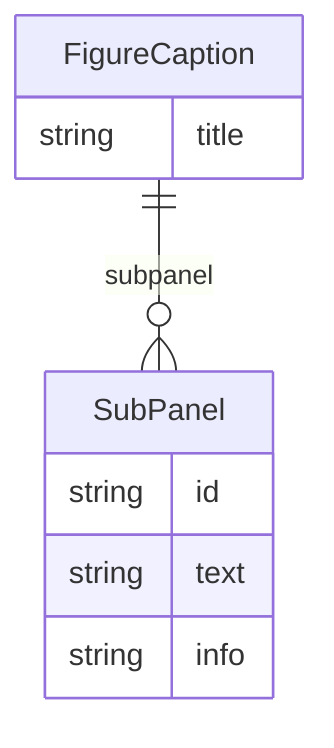

# Class: FigureCaption


_A caption for a figure from a scientific paper. The caption may contain multiple subpanel descriptions._


URI: [fig:FigureCaption](http://w3id.org/ontogpt/figure-templateFigureCaption)





<!-- no inheritance hierarchy -->


## Slots

| Name | Cardinality and Range | Description | Inheritance |
| ---  | --- | --- | --- |
| [title](title.md) | 0..1 <br/> [String](String.md) | the overall title of the figure caption | direct |
| [subpanel](subpanel.md) | * <br/> [SubPanel](SubPanel.md) | a subpanel of the figure | direct |


## Identifier and Mapping Information


### Schema Source


* from schema: https://w3id.org/ontogpt/figure


## Mappings

| Mapping Type | Mapped Value |
| ---  | ---  |
| self | fig:FigureCaption |
| native | fig:FigureCaption |


## LinkML Source

<!-- TODO: investigate https://stackoverflow.com/questions/37606292/how-to-create-tabbed-code-blocks-in-mkdocs-or-sphinx -->

### Direct

<details>
```yaml
name: FigureCaption
description: A caption for a figure from a scientific paper. The caption may contain
  multiple subpanel descriptions.
from_schema: https://w3id.org/ontogpt/figure
attributes:
  title:
    name: title
    description: the overall title of the figure caption
    from_schema: https://w3id.org/ontogpt/figure
    rank: 1000
    domain_of:
    - FigureCaption
    - Publication
  subpanel:
    name: subpanel
    annotations:
      prompt:
        tag: prompt
        value: 'a semicolon separated list of descriptions of every panel in the text.
          Keep the panel id and text together. for example: "1A: A side view of the
          foo; 1B: A frontal view of the foo"'
    description: a subpanel of the figure
    from_schema: https://w3id.org/ontogpt/figure
    rank: 1000
    multivalued: true
    domain_of:
    - FigureCaption
    range: SubPanel
tree_root: true

```
</details>

### Induced

<details>
```yaml
name: FigureCaption
description: A caption for a figure from a scientific paper. The caption may contain
  multiple subpanel descriptions.
from_schema: https://w3id.org/ontogpt/figure
attributes:
  title:
    name: title
    description: the overall title of the figure caption
    from_schema: https://w3id.org/ontogpt/figure
    rank: 1000
    alias: title
    owner: FigureCaption
    domain_of:
    - FigureCaption
    - Publication
    range: string
  subpanel:
    name: subpanel
    annotations:
      prompt:
        tag: prompt
        value: 'a semicolon separated list of descriptions of every panel in the text.
          Keep the panel id and text together. for example: "1A: A side view of the
          foo; 1B: A frontal view of the foo"'
    description: a subpanel of the figure
    from_schema: https://w3id.org/ontogpt/figure
    rank: 1000
    multivalued: true
    alias: subpanel
    owner: FigureCaption
    domain_of:
    - FigureCaption
    range: SubPanel
tree_root: true

```
</details>