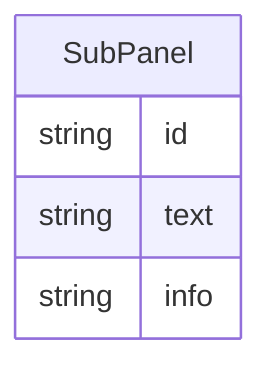

# Class: SubPanel


_A subcomponent of the overall figure caption._


URI: [fig:SubPanel](http://w3id.org/ontogpt/figure-templateSubPanel)





<!-- no inheritance hierarchy -->


## Slots

| Name | Cardinality and Range | Description | Inheritance |
| ---  | --- | --- | --- |
| [id](id.md) | 0..1 <br/> [String](String.md) | The identifier for this figure subpanel | direct |
| [text](text.md) | 0..1 <br/> [String](String.md) | The text associated with this figure subpanel | direct |
| [info](info.md) | 0..1 <br/> [String](String.md) | any information from the overall figure caption that applies to that subpanel... | direct |


## Usages

| used by | used in | type | used |
| ---  | --- | --- | --- |
| [FigureCaption](FigureCaption.md) | [subpanel](subpanel.md) | range | [SubPanel](SubPanel.md) |


## Identifier and Mapping Information


### Schema Source


* from schema: https://w3id.org/ontogpt/figure


## Mappings

| Mapping Type | Mapped Value |
| ---  | ---  |
| self | fig:SubPanel |
| native | fig:SubPanel |


## LinkML Source

<!-- TODO: investigate https://stackoverflow.com/questions/37606292/how-to-create-tabbed-code-blocks-in-mkdocs-or-sphinx -->

### Direct

<details>
```yaml
name: SubPanel
description: A subcomponent of the overall figure caption.
from_schema: https://w3id.org/ontogpt/figure
attributes:
  id:
    name: id
    annotations:
      prompt.example:
        tag: prompt.example
        value: 1, 2, A, B, I, II
    description: The identifier for this figure subpanel
    from_schema: https://w3id.org/ontogpt/figure
    rank: 1000
    domain_of:
    - SubPanel
    - NamedEntity
    - Publication
  text:
    name: text
    description: The text associated with this figure subpanel
    from_schema: https://w3id.org/ontogpt/figure
    rank: 1000
    domain_of:
    - SubPanel
  info:
    name: info
    description: any information from the overall figure caption that applies to that
      subpanel (which may be duplicated across other subpanels).
    from_schema: https://w3id.org/ontogpt/figure
    rank: 1000
    domain_of:
    - SubPanel

```
</details>

### Induced

<details>
```yaml
name: SubPanel
description: A subcomponent of the overall figure caption.
from_schema: https://w3id.org/ontogpt/figure
attributes:
  id:
    name: id
    annotations:
      prompt.example:
        tag: prompt.example
        value: 1, 2, A, B, I, II
    description: The identifier for this figure subpanel
    from_schema: https://w3id.org/ontogpt/figure
    rank: 1000
    alias: id
    owner: SubPanel
    domain_of:
    - SubPanel
    - NamedEntity
    - Publication
    range: string
  text:
    name: text
    description: The text associated with this figure subpanel
    from_schema: https://w3id.org/ontogpt/figure
    rank: 1000
    alias: text
    owner: SubPanel
    domain_of:
    - SubPanel
    range: string
  info:
    name: info
    description: any information from the overall figure caption that applies to that
      subpanel (which may be duplicated across other subpanels).
    from_schema: https://w3id.org/ontogpt/figure
    rank: 1000
    alias: info
    owner: SubPanel
    domain_of:
    - SubPanel
    range: string

```
</details>