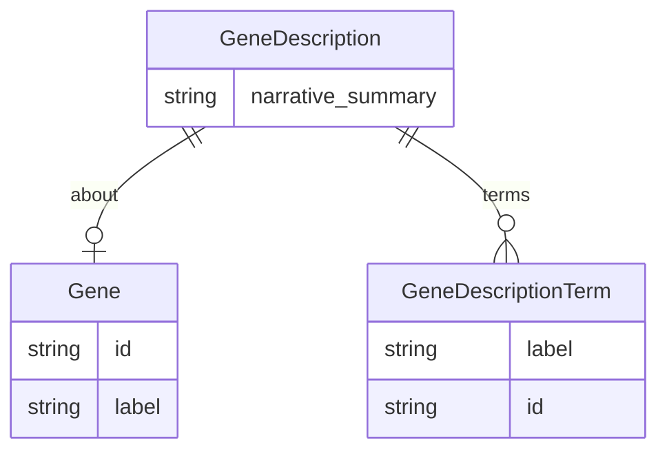

# Class: GeneDescription
_A summarization of an individual gene_


URI: [bp:GeneDescription](http://w3id.org/ontogpt/biological-process-templateGeneDescription)





<!-- no inheritance hierarchy -->


## Slots

| Name | Cardinality and Range | Description | Inheritance |
| ---  | --- | --- | --- |
| [about](about.md) | 0..1 <br/> [Gene](Gene.md) | The official symbol of the gene that is described | direct |
| [narrative_summary](narrative_summary.md) | 0..1 <br/> [String](String.md) | A free text summary describing the function of the gene | direct |
| [terms](terms.md) | 0..* <br/> [GeneDescriptionTerm](GeneDescriptionTerm.md) | A semicolon separated list of controlled terms drawn from the Gene Ontology t... | direct |


## Identifier and Mapping Information


### Schema Source


* from schema: https://w3id.org/ontogpt/go_term


## Mappings

| Mapping Type | Mapped Value |
| ---  | ---  |
| self | bp:GeneDescription |
| native | bp:GeneDescription |


## LinkML Source

<!-- TODO: investigate https://stackoverflow.com/questions/37606292/how-to-create-tabbed-code-blocks-in-mkdocs-or-sphinx -->

### Direct

<details>
```yaml
name: GeneDescription
description: A summarization of an individual gene
from_schema: https://w3id.org/ontogpt/go_term
rank: 1000
attributes:
  about:
    name: about
    description: The official symbol of the gene that is described. For example "TP53".
      Do not include the word "gene" in the answer.
    from_schema: https://w3id.org/ontogpt/go_term
    rank: 1000
    range: Gene
  narrative_summary:
    name: narrative_summary
    description: A free text summary describing the function of the gene
    from_schema: https://w3id.org/ontogpt/go_term
    rank: 1000
    range: string
  terms:
    name: terms
    description: A semicolon separated list of controlled terms drawn from the Gene
      Ontology that describe the function of the gene
    from_schema: https://w3id.org/ontogpt/go_term
    rank: 1000
    multivalued: true
    range: GeneDescriptionTerm

```
</details>

### Induced

<details>
```yaml
name: GeneDescription
description: A summarization of an individual gene
from_schema: https://w3id.org/ontogpt/go_term
rank: 1000
attributes:
  about:
    name: about
    description: The official symbol of the gene that is described. For example "TP53".
      Do not include the word "gene" in the answer.
    from_schema: https://w3id.org/ontogpt/go_term
    rank: 1000
    alias: about
    owner: GeneDescription
    domain_of:
    - GeneDescription
    range: Gene
  narrative_summary:
    name: narrative_summary
    description: A free text summary describing the function of the gene
    from_schema: https://w3id.org/ontogpt/go_term
    rank: 1000
    alias: narrative_summary
    owner: GeneDescription
    domain_of:
    - GeneDescription
    range: string
  terms:
    name: terms
    description: A semicolon separated list of controlled terms drawn from the Gene
      Ontology that describe the function of the gene
    from_schema: https://w3id.org/ontogpt/go_term
    rank: 1000
    multivalued: true
    alias: terms
    owner: GeneDescription
    domain_of:
    - GeneDescription
    range: GeneDescriptionTerm

```
</details>