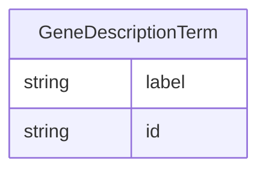

# Class: GeneDescriptionTerm


URI: [bp:GeneDescriptionTerm](http://w3id.org/ontogpt/biological-process-templateGeneDescriptionTerm)





## Inheritance
* [NamedEntity](NamedEntity.md)
    * **GeneDescriptionTerm**


## Slots

| Name | Cardinality and Range | Description | Inheritance |
| ---  | --- | --- | --- |
| [label](label.md) | 0..1 <br/> [String](String.md) | the name of the GO term | direct |
| [id](id.md) | 1 <br/> [String](String.md) | A unique identifier for the named entity | [NamedEntity](NamedEntity.md) |


## Usages

| used by | used in | type | used |
| ---  | --- | --- | --- |
| [GeneDescription](GeneDescription.md) | [terms](terms.md) | range | [GeneDescriptionTerm](GeneDescriptionTerm.md) |


## Identifier and Mapping Information


### Valid ID Prefixes

Instances of this class *should* have identifiers with one of the following prefixes:

* GO

* MONDO

* UBERON

* MESH


### Annotations

| property | value |
| --- | --- |
| annotators | sqlite:obo:go, sqlite:obo:mondo, sqlite:obo:uberon, sqlite:obo:mesh |


### Schema Source


* from schema: https://w3id.org/ontogpt/go_term


## Mappings

| Mapping Type | Mapped Value |
| ---  | ---  |
| self | bp:GeneDescriptionTerm |
| native | bp:GeneDescriptionTerm |


## LinkML Source

<!-- TODO: investigate https://stackoverflow.com/questions/37606292/how-to-create-tabbed-code-blocks-in-mkdocs-or-sphinx -->

### Direct

<details>
```yaml
name: GeneDescriptionTerm
id_prefixes:
- GO
- MONDO
- UBERON
- MESH
annotations:
  annotators:
    tag: annotators
    value: sqlite:obo:go, sqlite:obo:mondo, sqlite:obo:uberon, sqlite:obo:mesh
from_schema: https://w3id.org/ontogpt/go_term
is_a: NamedEntity
attributes:
  label:
    name: label
    description: the name of the GO term
    from_schema: https://w3id.org/ontogpt/go_term
    rank: 1000
    domain_of:
    - GeneDescriptionTerm
    - NamedEntity
tree_root: true

```
</details>

### Induced

<details>
```yaml
name: GeneDescriptionTerm
id_prefixes:
- GO
- MONDO
- UBERON
- MESH
annotations:
  annotators:
    tag: annotators
    value: sqlite:obo:go, sqlite:obo:mondo, sqlite:obo:uberon, sqlite:obo:mesh
from_schema: https://w3id.org/ontogpt/go_term
is_a: NamedEntity
attributes:
  label:
    name: label
    description: the name of the GO term
    from_schema: https://w3id.org/ontogpt/go_term
    rank: 1000
    alias: label
    owner: GeneDescriptionTerm
    domain_of:
    - GeneDescriptionTerm
    - NamedEntity
    range: string
  id:
    name: id
    annotations:
      prompt.skip:
        tag: prompt.skip
        value: 'true'
    description: A unique identifier for the named entity
    comments:
    - this is populated during the grounding and normalization step
    from_schema: https://w3id.org/ontogpt/go_term
    rank: 1000
    identifier: true
    alias: id
    owner: GeneDescriptionTerm
    domain_of:
    - NamedEntity
    - Publication
    range: string
    required: true
tree_root: true

```
</details>