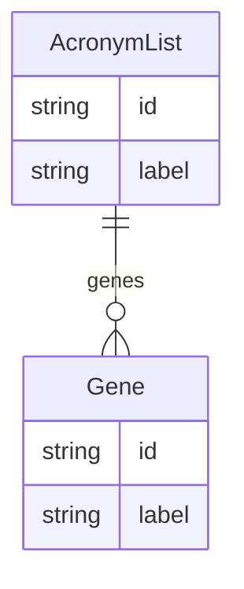

# Class: AcronymList


URI: [geneextraction:AcronymList](http://w3id.org/ontogpt/gene_extractionAcronymList)





## Inheritance
* [NamedEntity](NamedEntity.md)
    * **AcronymList**


## Slots

| Name | Cardinality and Range | Description | Inheritance |
| ---  | --- | --- | --- |
| [genes](genes.md) | * <br/> [Gene](Gene.md) |  | direct |
| [id](id.md) | 1 <br/> [String](String.md) | A unique identifier for the named entity | [NamedEntity](NamedEntity.md) |
| [label](label.md) | 0..1 <br/> [String](String.md) | The label (name) of the named thing | [NamedEntity](NamedEntity.md) |


## Identifier and Mapping Information


### Schema Source


* from schema: http://w3id.org/ontogpt/gene_extraction


## Mappings

| Mapping Type | Mapped Value |
| ---  | ---  |
| self | geneextraction:AcronymList |
| native | geneextraction:AcronymList |


## LinkML Source

<!-- TODO: investigate https://stackoverflow.com/questions/37606292/how-to-create-tabbed-code-blocks-in-mkdocs-or-sphinx -->

### Direct

<details>
```yaml
name: AcronymList
from_schema: http://w3id.org/ontogpt/gene_extraction
is_a: NamedEntity
attributes:
  genes:
    name: genes
    annotations:
      prompt:
        tag: prompt
        value: 'A semicolon-delimited list of potential gene symbols within the text.
          Include all acronyms that could be gene symbols, i.e., any string of capital
          letters, particularly if it is followed by a number. Examples of gene symbols
          include: BRCA1, TP53, EGR2, ITGB6, PRKCD. Gene symbols may resemble acronyms
          referring to diseases or phenotypes, and may be surrounded by punctuation
          or other text.'
    from_schema: http://w3id.org/ontogpt/gene_extraction
    rank: 1000
    domain_of:
    - AcronymList
    range: Gene
    multivalued: true
tree_root: true

```
</details>

### Induced

<details>
```yaml
name: AcronymList
from_schema: http://w3id.org/ontogpt/gene_extraction
is_a: NamedEntity
attributes:
  genes:
    name: genes
    annotations:
      prompt:
        tag: prompt
        value: 'A semicolon-delimited list of potential gene symbols within the text.
          Include all acronyms that could be gene symbols, i.e., any string of capital
          letters, particularly if it is followed by a number. Examples of gene symbols
          include: BRCA1, TP53, EGR2, ITGB6, PRKCD. Gene symbols may resemble acronyms
          referring to diseases or phenotypes, and may be surrounded by punctuation
          or other text.'
    from_schema: http://w3id.org/ontogpt/gene_extraction
    rank: 1000
    alias: genes
    owner: AcronymList
    domain_of:
    - AcronymList
    range: Gene
    multivalued: true
  id:
    name: id
    annotations:
      prompt.skip:
        tag: prompt.skip
        value: 'true'
    description: A unique identifier for the named entity
    comments:
    - this is populated during the grounding and normalization step
    from_schema: http://w3id.org/ontogpt/gene_extraction
    rank: 1000
    identifier: true
    alias: id
    owner: AcronymList
    domain_of:
    - NamedEntity
    - Publication
    range: string
    required: true
  label:
    name: label
    annotations:
      owl:
        tag: owl
        value: AnnotationProperty, AnnotationAssertion
    description: The label (name) of the named thing
    from_schema: http://w3id.org/ontogpt/gene_extraction
    aliases:
    - name
    rank: 1000
    slot_uri: rdfs:label
    alias: label
    owner: AcronymList
    domain_of:
    - NamedEntity
    range: string
tree_root: true

```
</details>