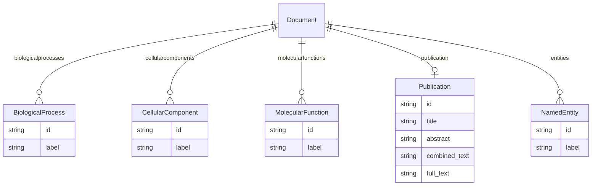

# Class: Document


_A document that contains biological or biomedical concepts._


URI: [go_terms:Document](http://w3id.org/ontogpt/go_termsDocument)





## Inheritance
* [TextWithEntity](TextWithEntity.md)
    * **Document**


## Slots

| Name | Cardinality and Range | Description | Inheritance |
| ---  | --- | --- | --- |
| [biologicalprocesses](biologicalprocesses.md) | * <br/> [BiologicalProcess](BiologicalProcess.md) | One or more biological processes, as defined by the Gene Ontology | direct |
| [cellularcomponents](cellularcomponents.md) | * <br/> [CellularComponent](CellularComponent.md) | One or more cellular components, as defined by the Gene Ontology | direct |
| [molecularfunctions](molecularfunctions.md) | * <br/> [MolecularFunction](MolecularFunction.md) | One or more molecular functions, as defined by the Gene Ontology | direct |
| [publication](publication.md) | 0..1 <br/> [Publication](Publication.md) |  | [TextWithEntity](TextWithEntity.md) |
| [entities](entities.md) | * <br/> [NamedEntity](NamedEntity.md) |  | [TextWithEntity](TextWithEntity.md) |


## Identifier and Mapping Information


### Schema Source


* from schema: http://w3id.org/ontogpt/go_terms


## Mappings

| Mapping Type | Mapped Value |
| ---  | ---  |
| self | go_terms:Document |
| native | go_terms:Document |


## LinkML Source

<!-- TODO: investigate https://stackoverflow.com/questions/37606292/how-to-create-tabbed-code-blocks-in-mkdocs-or-sphinx -->

### Direct

<details>
```yaml
name: Document
description: A document that contains biological or biomedical concepts.
from_schema: http://w3id.org/ontogpt/go_terms
is_a: TextWithEntity
attributes:
  biologicalprocesses:
    name: biologicalprocesses
    annotations:
      prompt:
        tag: prompt
        value: 'A semi-colon separated list of biological processes, for example:
          nuclear axial expansion; intracellular transport; medial surface of mandible;
          ribosomal subunit export from nucleus; pole cell development'
    description: One or more biological processes, as defined by the Gene Ontology.
    from_schema: http://w3id.org/ontogpt/go_terms
    rank: 1000
    multivalued: true
    domain_of:
    - Document
    range: BiologicalProcess
  cellularcomponents:
    name: cellularcomponents
    annotations:
      prompt:
        tag: prompt
        value: 'A semi-colon separated list of cellular components and structures,
          for example: tubulin complex; proteasome complex; cytoplasm; keratohyalin
          granule; nucleus'
    description: One or more cellular components, as defined by the Gene Ontology.
    from_schema: http://w3id.org/ontogpt/go_terms
    rank: 1000
    multivalued: true
    domain_of:
    - Document
    range: CellularComponent
  molecularfunctions:
    name: molecularfunctions
    annotations:
      prompt:
        tag: prompt
        value: 'A semi-colon separated list of molecular functions, for example: catalytic
          activity; amine binding; peptide receptor activity; oxygen carrier activity;
          structural constituent of cytoskeleton'
    description: One or more molecular functions, as defined by the Gene Ontology.
    from_schema: http://w3id.org/ontogpt/go_terms
    rank: 1000
    multivalued: true
    domain_of:
    - Document
    range: MolecularFunction
tree_root: true

```
</details>

### Induced

<details>
```yaml
name: Document
description: A document that contains biological or biomedical concepts.
from_schema: http://w3id.org/ontogpt/go_terms
is_a: TextWithEntity
attributes:
  biologicalprocesses:
    name: biologicalprocesses
    annotations:
      prompt:
        tag: prompt
        value: 'A semi-colon separated list of biological processes, for example:
          nuclear axial expansion; intracellular transport; medial surface of mandible;
          ribosomal subunit export from nucleus; pole cell development'
    description: One or more biological processes, as defined by the Gene Ontology.
    from_schema: http://w3id.org/ontogpt/go_terms
    rank: 1000
    multivalued: true
    alias: biologicalprocesses
    owner: Document
    domain_of:
    - Document
    range: BiologicalProcess
  cellularcomponents:
    name: cellularcomponents
    annotations:
      prompt:
        tag: prompt
        value: 'A semi-colon separated list of cellular components and structures,
          for example: tubulin complex; proteasome complex; cytoplasm; keratohyalin
          granule; nucleus'
    description: One or more cellular components, as defined by the Gene Ontology.
    from_schema: http://w3id.org/ontogpt/go_terms
    rank: 1000
    multivalued: true
    alias: cellularcomponents
    owner: Document
    domain_of:
    - Document
    range: CellularComponent
  molecularfunctions:
    name: molecularfunctions
    annotations:
      prompt:
        tag: prompt
        value: 'A semi-colon separated list of molecular functions, for example: catalytic
          activity; amine binding; peptide receptor activity; oxygen carrier activity;
          structural constituent of cytoskeleton'
    description: One or more molecular functions, as defined by the Gene Ontology.
    from_schema: http://w3id.org/ontogpt/go_terms
    rank: 1000
    multivalued: true
    alias: molecularfunctions
    owner: Document
    domain_of:
    - Document
    range: MolecularFunction
  publication:
    name: publication
    annotations:
      prompt.skip:
        tag: prompt.skip
        value: 'true'
    from_schema: http://w3id.org/ontogpt/go_terms
    alias: publication
    owner: Document
    domain_of:
    - TextWithTriples
    - TextWithEntity
    range: Publication
    inlined: true
  entities:
    name: entities
    from_schema: http://w3id.org/ontogpt/go_terms
    rank: 1000
    multivalued: true
    alias: entities
    owner: Document
    domain_of:
    - TextWithEntity
    range: NamedEntity
tree_root: true

```
</details>