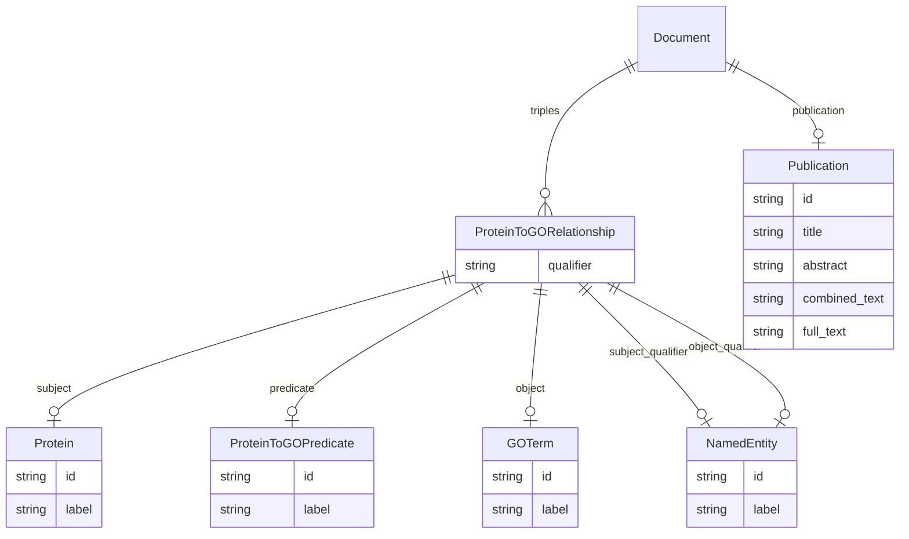

# Class: Document


_A document that contains biological or biomedical concepts._


URI: [go_terms_relational:Document](http://w3id.org/ontogpt/go_terms_relationalDocument)





## Inheritance
* [TextWithTriples](TextWithTriples.md)
    * **Document**


## Slots

| Name | Cardinality and Range | Description | Inheritance |
| ---  | --- | --- | --- |
| [publication](publication.md) | 0..1 <br/> [Publication](Publication.md) |  | [TextWithTriples](TextWithTriples.md) |
| [triples](triples.md) | * <br/> [ProteinToGORelationship](ProteinToGORelationship.md) |  | [TextWithTriples](TextWithTriples.md) |


## Identifier and Mapping Information


### Schema Source


* from schema: http://w3id.org/ontogpt/go_terms_relational


## Mappings

| Mapping Type | Mapped Value |
| ---  | ---  |
| self | go_terms_relational:Document |
| native | go_terms_relational:Document |


## LinkML Source

<!-- TODO: investigate https://stackoverflow.com/questions/37606292/how-to-create-tabbed-code-blocks-in-mkdocs-or-sphinx -->

### Direct

<details>
```yaml
name: Document
description: A document that contains biological or biomedical concepts.
from_schema: http://w3id.org/ontogpt/go_terms_relational
is_a: TextWithTriples
slot_usage:
  triples:
    name: triples
    annotations:
      prompt:
        tag: prompt
        value: 'A semi-colon separated list of protein to GO term relationships, where
          the relationship is HAS ANNOTATION, for example: RPS7B HAS ANNOTATION structural
          constituent of ribosome; granzyme M HAS ANNOTATION endopeptidase activity;
          Mknk1 HAS ANNOTATION nucleoplasm'
    domain_of:
    - TextWithTriples
    range: ProteinToGORelationship
tree_root: true

```
</details>

### Induced

<details>
```yaml
name: Document
description: A document that contains biological or biomedical concepts.
from_schema: http://w3id.org/ontogpt/go_terms_relational
is_a: TextWithTriples
slot_usage:
  triples:
    name: triples
    annotations:
      prompt:
        tag: prompt
        value: 'A semi-colon separated list of protein to GO term relationships, where
          the relationship is HAS ANNOTATION, for example: RPS7B HAS ANNOTATION structural
          constituent of ribosome; granzyme M HAS ANNOTATION endopeptidase activity;
          Mknk1 HAS ANNOTATION nucleoplasm'
    domain_of:
    - TextWithTriples
    range: ProteinToGORelationship
attributes:
  publication:
    name: publication
    annotations:
      prompt.skip:
        tag: prompt.skip
        value: 'true'
    from_schema: http://w3id.org/ontogpt/go_terms_relational
    rank: 1000
    alias: publication
    owner: Document
    domain_of:
    - TextWithTriples
    - TextWithEntity
    range: Publication
    inlined: true
  triples:
    name: triples
    annotations:
      prompt:
        tag: prompt
        value: 'A semi-colon separated list of protein to GO term relationships, where
          the relationship is HAS ANNOTATION, for example: RPS7B HAS ANNOTATION structural
          constituent of ribosome; granzyme M HAS ANNOTATION endopeptidase activity;
          Mknk1 HAS ANNOTATION nucleoplasm'
    from_schema: http://w3id.org/ontogpt/go_terms_relational
    rank: 1000
    multivalued: true
    alias: triples
    owner: Document
    domain_of:
    - TextWithTriples
    range: ProteinToGORelationship
    inlined: true
    inlined_as_list: true
tree_root: true

```
</details>