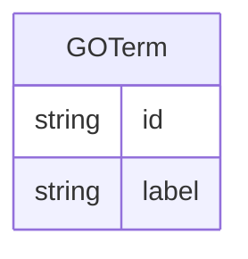

# Class: GOTerm


URI: [go_terms_relational:GOTerm](http://w3id.org/ontogpt/go_terms_relationalGOTerm)





## Inheritance
* [NamedEntity](NamedEntity.md)
    * **GOTerm**


## Slots

| Name | Cardinality and Range | Description | Inheritance |
| ---  | --- | --- | --- |
| [id](id.md) | 1 <br/> [String](String.md) | A unique identifier for the named entity | [NamedEntity](NamedEntity.md) |
| [label](label.md) | 0..1 <br/> [String](String.md) | The label (name) of the named thing | [NamedEntity](NamedEntity.md) |


## Usages

| used by | used in | type | used |
| ---  | --- | --- | --- |
| [ProteinToGORelationship](ProteinToGORelationship.md) | [object](object.md) | range | [GOTerm](GOTerm.md) |


## Identifier and Mapping Information


### Valid ID Prefixes

Instances of this class *should* have identifiers with one of the following prefixes:

* GO


### Annotations

| property | value |
| --- | --- |
| annotators | sqlite:obo:go || prompt.examples | nuclear axial expansion, intracellular transport, medial surface of mandible, ribosomal subunit export from nucleus, pole cell development, tubulin complex, proteasome complex, cytoplasm, keratohyalin granule, catalytic activity, amine binding, peptide receptor activity, oxygen carrier activity, structural constituent of cytoskeleton |


### Schema Source


* from schema: http://w3id.org/ontogpt/go_terms_relational


## Mappings

| Mapping Type | Mapped Value |
| ---  | ---  |
| self | go_terms_relational:GOTerm |
| native | go_terms_relational:GOTerm |


## LinkML Source

<!-- TODO: investigate https://stackoverflow.com/questions/37606292/how-to-create-tabbed-code-blocks-in-mkdocs-or-sphinx -->

### Direct

<details>
```yaml
name: GOTerm
id_prefixes:
- GO
annotations:
  annotators:
    tag: annotators
    value: sqlite:obo:go
  prompt.examples:
    tag: prompt.examples
    value: nuclear axial expansion, intracellular transport, medial surface of mandible,
      ribosomal subunit export from nucleus, pole cell development, tubulin complex,
      proteasome complex, cytoplasm, keratohyalin granule, catalytic activity, amine
      binding, peptide receptor activity, oxygen carrier activity, structural constituent
      of cytoskeleton
from_schema: http://w3id.org/ontogpt/go_terms_relational
is_a: NamedEntity

```
</details>

### Induced

<details>
```yaml
name: GOTerm
id_prefixes:
- GO
annotations:
  annotators:
    tag: annotators
    value: sqlite:obo:go
  prompt.examples:
    tag: prompt.examples
    value: nuclear axial expansion, intracellular transport, medial surface of mandible,
      ribosomal subunit export from nucleus, pole cell development, tubulin complex,
      proteasome complex, cytoplasm, keratohyalin granule, catalytic activity, amine
      binding, peptide receptor activity, oxygen carrier activity, structural constituent
      of cytoskeleton
from_schema: http://w3id.org/ontogpt/go_terms_relational
is_a: NamedEntity
attributes:
  id:
    name: id
    annotations:
      prompt.skip:
        tag: prompt.skip
        value: 'true'
    description: A unique identifier for the named entity
    comments:
    - this is populated during the grounding and normalization step
    from_schema: http://w3id.org/ontogpt/go_terms_relational
    rank: 1000
    identifier: true
    alias: id
    owner: GOTerm
    domain_of:
    - NamedEntity
    - Publication
    range: string
    required: true
  label:
    name: label
    annotations:
      owl:
        tag: owl
        value: AnnotationProperty, AnnotationAssertion
    description: The label (name) of the named thing
    from_schema: http://w3id.org/ontogpt/go_terms_relational
    aliases:
    - name
    rank: 1000
    slot_uri: rdfs:label
    alias: label
    owner: GOTerm
    domain_of:
    - NamedEntity
    range: string

```
</details>