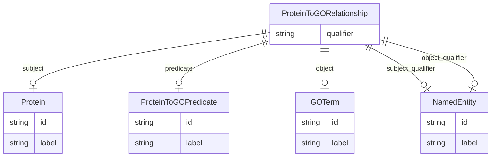

# Class: ProteinToGORelationship


_A triple where the subject is a protein and the object is a GO term._


URI: [go_terms_relational:ProteinToGORelationship](http://w3id.org/ontogpt/go_terms_relationalProteinToGORelationship)





## Inheritance
* [CompoundExpression](CompoundExpression.md)
    * [Triple](Triple.md)
        * **ProteinToGORelationship**


## Slots

| Name | Cardinality and Range | Description | Inheritance |
| ---  | --- | --- | --- |
| [subject](subject.md) | 0..1 <br/> [Protein](Protein.md) | The protein participating in the relationship, for example: Klp61F, GATA bind... | [Triple](Triple.md) |
| [predicate](predicate.md) | 0..1 <br/> [ProteinToGOPredicate](ProteinToGOPredicate.md) | The relationship type, usually HAS ANNOTATION | [Triple](Triple.md) |
| [object](object.md) | 0..1 <br/> [GOTerm](GOTerm.md) | The Gene Ontology term participating in the relationship, for example: cytoso... | [Triple](Triple.md) |
| [qualifier](qualifier.md) | 0..1 <br/> [String](String.md) | A qualifier for the statements, e | [Triple](Triple.md) |
| [subject_qualifier](subject_qualifier.md) | 0..1 <br/> [NamedEntity](NamedEntity.md) | An optional qualifier or modifier for the protein | [Triple](Triple.md) |
| [object_qualifier](object_qualifier.md) | 0..1 <br/> [NamedEntity](NamedEntity.md) | An optional qualifier or modifier for the GO term | [Triple](Triple.md) |


## Usages

| used by | used in | type | used |
| ---  | --- | --- | --- |
| [Document](Document.md) | [triples](triples.md) | range | [ProteinToGORelationship](ProteinToGORelationship.md) |


## Identifier and Mapping Information


### Schema Source


* from schema: http://w3id.org/ontogpt/go_terms_relational


## Mappings

| Mapping Type | Mapped Value |
| ---  | ---  |
| self | go_terms_relational:ProteinToGORelationship |
| native | go_terms_relational:ProteinToGORelationship |


## LinkML Source

<!-- TODO: investigate https://stackoverflow.com/questions/37606292/how-to-create-tabbed-code-blocks-in-mkdocs-or-sphinx -->

### Direct

<details>
```yaml
name: ProteinToGORelationship
description: A triple where the subject is a protein and the object is a GO term.
from_schema: http://w3id.org/ontogpt/go_terms_relational
is_a: Triple
slot_usage:
  subject:
    name: subject
    description: 'The protein participating in the relationship, for example: Klp61F,
      GATA binding protein 3, S-formylglutathione hydrolase'
    domain_of:
    - Triple
    range: Protein
  object:
    name: object
    description: 'The Gene Ontology term participating in the relationship, for example:
      cytosol, plasma cell differentiation, small-subunit processome'
    domain_of:
    - Triple
    range: GOTerm
  predicate:
    name: predicate
    description: The relationship type, usually HAS ANNOTATION.
    domain_of:
    - Triple
    range: ProteinToGOPredicate
  subject_qualifier:
    name: subject_qualifier
    description: An optional qualifier or modifier for the protein.
    domain_of:
    - Triple
    range: NamedEntity
  object_qualifier:
    name: object_qualifier
    description: An optional qualifier or modifier for the GO term.
    domain_of:
    - Triple
    range: NamedEntity

```
</details>

### Induced

<details>
```yaml
name: ProteinToGORelationship
description: A triple where the subject is a protein and the object is a GO term.
from_schema: http://w3id.org/ontogpt/go_terms_relational
is_a: Triple
slot_usage:
  subject:
    name: subject
    description: 'The protein participating in the relationship, for example: Klp61F,
      GATA binding protein 3, S-formylglutathione hydrolase'
    domain_of:
    - Triple
    range: Protein
  object:
    name: object
    description: 'The Gene Ontology term participating in the relationship, for example:
      cytosol, plasma cell differentiation, small-subunit processome'
    domain_of:
    - Triple
    range: GOTerm
  predicate:
    name: predicate
    description: The relationship type, usually HAS ANNOTATION.
    domain_of:
    - Triple
    range: ProteinToGOPredicate
  subject_qualifier:
    name: subject_qualifier
    description: An optional qualifier or modifier for the protein.
    domain_of:
    - Triple
    range: NamedEntity
  object_qualifier:
    name: object_qualifier
    description: An optional qualifier or modifier for the GO term.
    domain_of:
    - Triple
    range: NamedEntity
attributes:
  subject:
    name: subject
    description: 'The protein participating in the relationship, for example: Klp61F,
      GATA binding protein 3, S-formylglutathione hydrolase'
    from_schema: http://w3id.org/ontogpt/go_terms_relational
    rank: 1000
    alias: subject
    owner: ProteinToGORelationship
    domain_of:
    - Triple
    range: Protein
  predicate:
    name: predicate
    description: The relationship type, usually HAS ANNOTATION.
    from_schema: http://w3id.org/ontogpt/go_terms_relational
    rank: 1000
    alias: predicate
    owner: ProteinToGORelationship
    domain_of:
    - Triple
    range: ProteinToGOPredicate
  object:
    name: object
    description: 'The Gene Ontology term participating in the relationship, for example:
      cytosol, plasma cell differentiation, small-subunit processome'
    from_schema: http://w3id.org/ontogpt/go_terms_relational
    rank: 1000
    alias: object
    owner: ProteinToGORelationship
    domain_of:
    - Triple
    range: GOTerm
  qualifier:
    name: qualifier
    description: A qualifier for the statements, e.g. "NOT" for negation
    from_schema: http://w3id.org/ontogpt/go_terms_relational
    rank: 1000
    alias: qualifier
    owner: ProteinToGORelationship
    domain_of:
    - Triple
    range: string
  subject_qualifier:
    name: subject_qualifier
    description: An optional qualifier or modifier for the protein.
    from_schema: http://w3id.org/ontogpt/go_terms_relational
    rank: 1000
    alias: subject_qualifier
    owner: ProteinToGORelationship
    domain_of:
    - Triple
    range: NamedEntity
  object_qualifier:
    name: object_qualifier
    description: An optional qualifier or modifier for the GO term.
    from_schema: http://w3id.org/ontogpt/go_terms_relational
    rank: 1000
    alias: object_qualifier
    owner: ProteinToGORelationship
    domain_of:
    - Triple
    range: NamedEntity

```
</details>