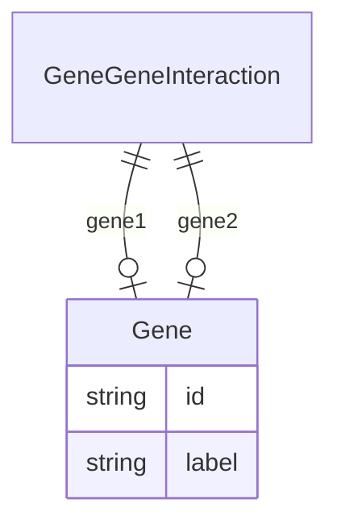

# Class: GeneGeneInteraction


URI: [gocam:GeneGeneInteraction](http://w3id.org/ontogpt/gocam/GeneGeneInteraction)





## Inheritance
* [CompoundExpression](CompoundExpression.md)
    * **GeneGeneInteraction**


## Slots

| Name | Cardinality and Range | Description | Inheritance |
| ---  | --- | --- | --- |
| [gene1](gene1.md) | 0..1 <br/> [Gene](Gene.md) |  | direct |
| [gene2](gene2.md) | 0..1 <br/> [Gene](Gene.md) |  | direct |


## Usages

| used by | used in | type | used |
| ---  | --- | --- | --- |
| [GoCamAnnotations](GoCamAnnotations.md) | [gene_gene_interactions](gene_gene_interactions.md) | range | [GeneGeneInteraction](GeneGeneInteraction.md) |


## Identifier and Mapping Information


### Schema Source


* from schema: http://w3id.org/ontogpt/gocam


## Mappings

| Mapping Type | Mapped Value |
| ---  | ---  |
| self | gocam:GeneGeneInteraction |
| native | gocam:GeneGeneInteraction |


## LinkML Source

<!-- TODO: investigate https://stackoverflow.com/questions/37606292/how-to-create-tabbed-code-blocks-in-mkdocs-or-sphinx -->

### Direct

<details>
```yaml
name: GeneGeneInteraction
from_schema: http://w3id.org/ontogpt/gocam
rank: 1000
is_a: CompoundExpression
attributes:
  gene1:
    name: gene1
    from_schema: http://w3id.org/ontogpt/gocam
    rank: 1000
    range: Gene
  gene2:
    name: gene2
    from_schema: http://w3id.org/ontogpt/gocam
    rank: 1000
    range: Gene

```
</details>

### Induced

<details>
```yaml
name: GeneGeneInteraction
from_schema: http://w3id.org/ontogpt/gocam
rank: 1000
is_a: CompoundExpression
attributes:
  gene1:
    name: gene1
    from_schema: http://w3id.org/ontogpt/gocam
    rank: 1000
    alias: gene1
    owner: GeneGeneInteraction
    domain_of:
    - GeneGeneInteraction
    range: Gene
  gene2:
    name: gene2
    from_schema: http://w3id.org/ontogpt/gocam
    rank: 1000
    alias: gene2
    owner: GeneGeneInteraction
    domain_of:
    - GeneGeneInteraction
    range: Gene

```
</details>