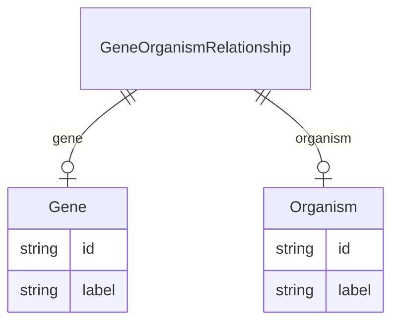

# Class: GeneOrganismRelationship


URI: [gocam:GeneOrganismRelationship](http://w3id.org/ontogpt/gocam/GeneOrganismRelationship)





## Inheritance
* [CompoundExpression](CompoundExpression.md)
    * **GeneOrganismRelationship**


## Slots

| Name | Cardinality and Range | Description | Inheritance |
| ---  | --- | --- | --- |
| [gene](gene.md) | 0..1 <br/> [Gene](Gene.md) |  | direct |
| [organism](organism.md) | 0..1 <br/> [Organism](Organism.md) |  | direct |


## Usages

| used by | used in | type | used |
| ---  | --- | --- | --- |
| [GoCamAnnotations](GoCamAnnotations.md) | [gene_organisms](gene_organisms.md) | range | [GeneOrganismRelationship](GeneOrganismRelationship.md) |


## Identifier and Mapping Information


### Schema Source


* from schema: http://w3id.org/ontogpt/gocam


## Mappings

| Mapping Type | Mapped Value |
| ---  | ---  |
| self | gocam:GeneOrganismRelationship |
| native | gocam:GeneOrganismRelationship |


## LinkML Source

<!-- TODO: investigate https://stackoverflow.com/questions/37606292/how-to-create-tabbed-code-blocks-in-mkdocs-or-sphinx -->

### Direct

<details>
```yaml
name: GeneOrganismRelationship
from_schema: http://w3id.org/ontogpt/gocam
rank: 1000
is_a: CompoundExpression
attributes:
  gene:
    name: gene
    from_schema: http://w3id.org/ontogpt/gocam
    rank: 1000
    range: Gene
  organism:
    name: organism
    from_schema: http://w3id.org/ontogpt/gocam
    rank: 1000
    range: Organism

```
</details>

### Induced

<details>
```yaml
name: GeneOrganismRelationship
from_schema: http://w3id.org/ontogpt/gocam
rank: 1000
is_a: CompoundExpression
attributes:
  gene:
    name: gene
    from_schema: http://w3id.org/ontogpt/gocam
    rank: 1000
    alias: gene
    owner: GeneOrganismRelationship
    domain_of:
    - GeneOrganismRelationship
    - GeneMolecularActivityRelationship
    - GeneMolecularActivityRelationship2
    - GeneSubcellularLocalizationRelationship
    range: Gene
  organism:
    name: organism
    from_schema: http://w3id.org/ontogpt/gocam
    rank: 1000
    alias: organism
    owner: GeneOrganismRelationship
    domain_of:
    - GeneOrganismRelationship
    range: Organism

```
</details>