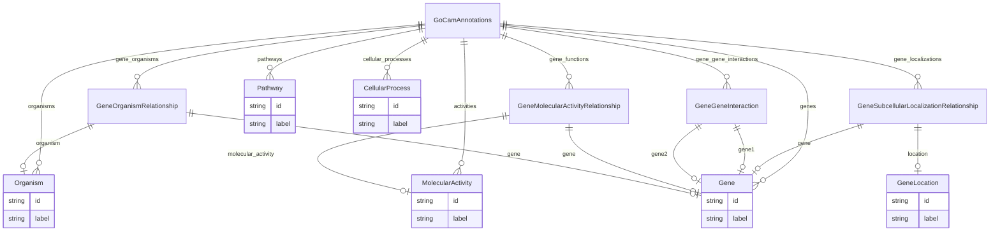

# Class: GoCamAnnotations


URI: [gocam:GoCamAnnotations](http://w3id.org/ontogpt/gocam/GoCamAnnotations)





<!-- no inheritance hierarchy -->


## Slots

| Name | Cardinality and Range | Description | Inheritance |
| ---  | --- | --- | --- |
| [genes](genes.md) | * <br/> [Gene](Gene.md) | semicolon-separated list of genes | direct |
| [organisms](organisms.md) | * <br/> [Organism](Organism.md) | semicolon-separated list of organism taxons | direct |
| [gene_organisms](gene_organisms.md) | * <br/> [GeneOrganismRelationship](GeneOrganismRelationship.md) |  | direct |
| [activities](activities.md) | * <br/> [MolecularActivity](MolecularActivity.md) | semicolon-separated list of molecular activities | direct |
| [gene_functions](gene_functions.md) | * <br/> [GeneMolecularActivityRelationship](GeneMolecularActivityRelationship.md) | semicolon-separated list of gene to molecular activity relationships | direct |
| [cellular_processes](cellular_processes.md) | * <br/> [CellularProcess](CellularProcess.md) | semicolon-separated list of cellular processes | direct |
| [pathways](pathways.md) | * <br/> [Pathway](Pathway.md) | semicolon-separated list of pathways | direct |
| [gene_gene_interactions](gene_gene_interactions.md) | * <br/> [GeneGeneInteraction](GeneGeneInteraction.md) | semicolon-separated list of gene to gene interactions | direct |
| [gene_localizations](gene_localizations.md) | * <br/> [GeneSubcellularLocalizationRelationship](GeneSubcellularLocalizationRelationship.md) | semicolon-separated list of genes plus their location in the cell; for exampl... | direct |


## Identifier and Mapping Information


### Schema Source


* from schema: http://w3id.org/ontogpt/gocam


## Mappings

| Mapping Type | Mapped Value |
| ---  | ---  |
| self | gocam:GoCamAnnotations |
| native | gocam:GoCamAnnotations |


## LinkML Source

<!-- TODO: investigate https://stackoverflow.com/questions/37606292/how-to-create-tabbed-code-blocks-in-mkdocs-or-sphinx -->

### Direct

<details>
```yaml
name: GoCamAnnotations
from_schema: http://w3id.org/ontogpt/gocam
attributes:
  genes:
    name: genes
    description: semicolon-separated list of genes
    from_schema: http://w3id.org/ontogpt/gocam
    rank: 1000
    multivalued: true
    domain_of:
    - GoCamAnnotations
    range: Gene
  organisms:
    name: organisms
    description: semicolon-separated list of organism taxons
    from_schema: http://w3id.org/ontogpt/gocam
    rank: 1000
    multivalued: true
    domain_of:
    - GoCamAnnotations
    range: Organism
  gene_organisms:
    name: gene_organisms
    annotations:
      prompt:
        tag: prompt
        value: semicolon-separated list of asterisk separated gene to organism relationships
    from_schema: http://w3id.org/ontogpt/gocam
    rank: 1000
    multivalued: true
    domain_of:
    - GoCamAnnotations
    range: GeneOrganismRelationship
  activities:
    name: activities
    description: semicolon-separated list of molecular activities
    from_schema: http://w3id.org/ontogpt/gocam
    rank: 1000
    multivalued: true
    domain_of:
    - GoCamAnnotations
    range: MolecularActivity
  gene_functions:
    name: gene_functions
    description: semicolon-separated list of gene to molecular activity relationships
    from_schema: http://w3id.org/ontogpt/gocam
    rank: 1000
    multivalued: true
    domain_of:
    - GoCamAnnotations
    range: GeneMolecularActivityRelationship
  cellular_processes:
    name: cellular_processes
    description: semicolon-separated list of cellular processes
    from_schema: http://w3id.org/ontogpt/gocam
    rank: 1000
    multivalued: true
    domain_of:
    - GoCamAnnotations
    range: CellularProcess
  pathways:
    name: pathways
    description: semicolon-separated list of pathways
    from_schema: http://w3id.org/ontogpt/gocam
    rank: 1000
    multivalued: true
    domain_of:
    - GoCamAnnotations
    range: Pathway
  gene_gene_interactions:
    name: gene_gene_interactions
    description: semicolon-separated list of gene to gene interactions
    from_schema: http://w3id.org/ontogpt/gocam
    rank: 1000
    multivalued: true
    domain_of:
    - GoCamAnnotations
    range: GeneGeneInteraction
  gene_localizations:
    name: gene_localizations
    description: semicolon-separated list of genes plus their location in the cell;
      for example, "gene1 / cytoplasm; gene2 / mitochondrion"
    from_schema: http://w3id.org/ontogpt/gocam
    rank: 1000
    multivalued: true
    domain_of:
    - GoCamAnnotations
    range: GeneSubcellularLocalizationRelationship
tree_root: true

```
</details>

### Induced

<details>
```yaml
name: GoCamAnnotations
from_schema: http://w3id.org/ontogpt/gocam
attributes:
  genes:
    name: genes
    description: semicolon-separated list of genes
    from_schema: http://w3id.org/ontogpt/gocam
    rank: 1000
    multivalued: true
    alias: genes
    owner: GoCamAnnotations
    domain_of:
    - GoCamAnnotations
    range: Gene
  organisms:
    name: organisms
    description: semicolon-separated list of organism taxons
    from_schema: http://w3id.org/ontogpt/gocam
    rank: 1000
    multivalued: true
    alias: organisms
    owner: GoCamAnnotations
    domain_of:
    - GoCamAnnotations
    range: Organism
  gene_organisms:
    name: gene_organisms
    annotations:
      prompt:
        tag: prompt
        value: semicolon-separated list of asterisk separated gene to organism relationships
    from_schema: http://w3id.org/ontogpt/gocam
    rank: 1000
    multivalued: true
    alias: gene_organisms
    owner: GoCamAnnotations
    domain_of:
    - GoCamAnnotations
    range: GeneOrganismRelationship
  activities:
    name: activities
    description: semicolon-separated list of molecular activities
    from_schema: http://w3id.org/ontogpt/gocam
    rank: 1000
    multivalued: true
    alias: activities
    owner: GoCamAnnotations
    domain_of:
    - GoCamAnnotations
    range: MolecularActivity
  gene_functions:
    name: gene_functions
    description: semicolon-separated list of gene to molecular activity relationships
    from_schema: http://w3id.org/ontogpt/gocam
    rank: 1000
    multivalued: true
    alias: gene_functions
    owner: GoCamAnnotations
    domain_of:
    - GoCamAnnotations
    range: GeneMolecularActivityRelationship
  cellular_processes:
    name: cellular_processes
    description: semicolon-separated list of cellular processes
    from_schema: http://w3id.org/ontogpt/gocam
    rank: 1000
    multivalued: true
    alias: cellular_processes
    owner: GoCamAnnotations
    domain_of:
    - GoCamAnnotations
    range: CellularProcess
  pathways:
    name: pathways
    description: semicolon-separated list of pathways
    from_schema: http://w3id.org/ontogpt/gocam
    rank: 1000
    multivalued: true
    alias: pathways
    owner: GoCamAnnotations
    domain_of:
    - GoCamAnnotations
    range: Pathway
  gene_gene_interactions:
    name: gene_gene_interactions
    description: semicolon-separated list of gene to gene interactions
    from_schema: http://w3id.org/ontogpt/gocam
    rank: 1000
    multivalued: true
    alias: gene_gene_interactions
    owner: GoCamAnnotations
    domain_of:
    - GoCamAnnotations
    range: GeneGeneInteraction
  gene_localizations:
    name: gene_localizations
    description: semicolon-separated list of genes plus their location in the cell;
      for example, "gene1 / cytoplasm; gene2 / mitochondrion"
    from_schema: http://w3id.org/ontogpt/gocam
    rank: 1000
    multivalued: true
    alias: gene_localizations
    owner: GoCamAnnotations
    domain_of:
    - GoCamAnnotations
    range: GeneSubcellularLocalizationRelationship
tree_root: true

```
</details>