# GO-CAM Template

A template for GO-CAMs

URI: http://w3id.org/ontogpt/gocam
Name: gocam-template

## Schema Diagram

```mermaid
erDiagram
GoCamAnnotations {

}
Gene {
    string id  
    string label  
}
Pathway {
    string id  
    string label  
}
CellularProcess {
    string id  
    string label  
}
MolecularActivity {
    string id  
    string label  
}
CellularComponent {
    string id  
    string label  
}
Organism {
    string id  
    string label  
}
Molecule {
    string id  
    string label  
}
GeneOrganismRelationship {

}
GeneMolecularActivityRelationship {

}
GeneMolecularActivityRelationship2 {

}
GeneSubcellularLocalizationRelationship {

}
GeneGeneInteraction {

}
Any {

}
ExtractionResult {
    string input_id  
    string input_title  
    string input_text  
    string raw_completion_output  
    string prompt  
}
NamedEntity {
    string id  
    string label  
}
CompoundExpression {

}
Triple {
    string qualifier  
}
TextWithTriples {

}
RelationshipType {
    string id  
    string label  
}
Publication {
    string id  
    string title  
    string abstract  
    string combined_text  
    string full_text  
}
AnnotatorResult {
    string subject_text  
    string object_id  
    string object_text  
}

GoCamAnnotations ||--}o Gene : "genes"
GoCamAnnotations ||--}o Organism : "organisms"
GoCamAnnotations ||--}o GeneOrganismRelationship : "gene_organisms"
GoCamAnnotations ||--}o MolecularActivity : "activities"
GoCamAnnotations ||--}o GeneMolecularActivityRelationship : "gene_functions"
GoCamAnnotations ||--}o CellularProcess : "cellular_processes"
GoCamAnnotations ||--}o Pathway : "pathways"
GoCamAnnotations ||--}o GeneGeneInteraction : "gene_gene_interactions"
GoCamAnnotations ||--}o GeneSubcellularLocalizationRelationship : "gene_localizations"
GeneOrganismRelationship ||--|o Gene : "gene"
GeneOrganismRelationship ||--|o Organism : "organism"
GeneMolecularActivityRelationship ||--|o Gene : "gene"
GeneMolecularActivityRelationship ||--|o MolecularActivity : "molecular_activity"
GeneMolecularActivityRelationship2 ||--|o Gene : "gene"
GeneMolecularActivityRelationship2 ||--|o MolecularActivity : "molecular_activity"
GeneMolecularActivityRelationship2 ||--|o Molecule : "target"
GeneSubcellularLocalizationRelationship ||--|o Gene : "gene"
GeneSubcellularLocalizationRelationship ||--|o CellularComponent : "location"
GeneGeneInteraction ||--|o Gene : "gene1"
GeneGeneInteraction ||--|o Gene : "gene2"
ExtractionResult ||--|o Any : "extracted_object"
ExtractionResult ||--}o Any : "named_entities"
Triple ||--|o NamedEntity : "subject"
Triple ||--|o RelationshipType : "predicate"
Triple ||--|o NamedEntity : "object"
Triple ||--|o NamedEntity : "subject_qualifier"
Triple ||--|o NamedEntity : "object_qualifier"
TextWithTriples ||--|o Publication : "publication"
TextWithTriples ||--}o Triple : "triples"

```

## Classes

| Class | Description |
| --- | --- |
| [AnnotatorResult](AnnotatorResult.md) |  |
| [Any](Any.md) |  |
| [CellularComponent](CellularComponent.md) |  |
| [CellularProcess](CellularProcess.md) |  |
| [CompoundExpression](CompoundExpression.md) |  |
| [ExtractionResult](ExtractionResult.md) | A result of extracting knowledge on text |
| [Gene](Gene.md) |  |
| [GeneGeneInteraction](GeneGeneInteraction.md) |  |
| [GeneMolecularActivityRelationship](GeneMolecularActivityRelationship.md) |  |
| [GeneMolecularActivityRelationship2](GeneMolecularActivityRelationship2.md) |  |
| [GeneOrganismRelationship](GeneOrganismRelationship.md) |  |
| [GeneSubcellularLocalizationRelationship](GeneSubcellularLocalizationRelationship.md) |  |
| [GoCamAnnotations](GoCamAnnotations.md) |  |
| [MolecularActivity](MolecularActivity.md) |  |
| [Molecule](Molecule.md) |  |
| [NamedEntity](NamedEntity.md) |  |
| [Organism](Organism.md) |  |
| [Pathway](Pathway.md) |  |
| [Publication](Publication.md) |  |
| [RelationshipType](RelationshipType.md) |  |
| [TextWithTriples](TextWithTriples.md) |  |
| [Triple](Triple.md) | Abstract parent for Relation Extraction tasks |

## Slots

| Slot | Description |
| --- | --- |
| [abstract](abstract.md) | The abstract of the publication |
| [activities](activities.md) | semicolon-separated list of molecular activities |
| [cellular_processes](cellular_processes.md) | semicolon-separated list of cellular processes |
| [combined_text](combined_text.md) |  |
| [extracted_object](extracted_object.md) | The complex objects extracted from the text |
| [full_text](full_text.md) | The full text of the publication |
| [gene](gene.md) |  |
| [gene1](gene1.md) |  |
| [gene2](gene2.md) |  |
| [gene_functions](gene_functions.md) | semicolon-separated list of gene to molecular activity relationships |
| [gene_gene_interactions](gene_gene_interactions.md) | semicolon-separated list of gene to gene interactions |
| [gene_localizations](gene_localizations.md) | semicolon-separated list of genes plus their location in the cell; for exampl... |
| [gene_organisms](gene_organisms.md) |  |
| [genes](genes.md) | semicolon-separated list of genes |
| [id](id.md) | A unique identifier for the named entity |
| [input_id](input_id.md) |  |
| [input_text](input_text.md) |  |
| [input_title](input_title.md) |  |
| [label](label.md) | The label (name) of the named thing |
| [location](location.md) |  |
| [molecular_activity](molecular_activity.md) |  |
| [named_entities](named_entities.md) | Named entities extracted from the text |
| [object](object.md) |  |
| [object_id](object_id.md) |  |
| [object_qualifier](object_qualifier.md) | An optional qualifier or modifier for the object of the statement, e |
| [object_text](object_text.md) |  |
| [organism](organism.md) |  |
| [organisms](organisms.md) | semicolon-separated list of organism taxons |
| [pathways](pathways.md) | semicolon-separated list of pathways |
| [predicate](predicate.md) |  |
| [prompt](prompt.md) |  |
| [publication](publication.md) |  |
| [qualifier](qualifier.md) | A qualifier for the statements, e |
| [raw_completion_output](raw_completion_output.md) |  |
| [subject](subject.md) |  |
| [subject_qualifier](subject_qualifier.md) | An optional qualifier or modifier for the subject of the statement, e |
| [subject_text](subject_text.md) |  |
| [target](target.md) |  |
| [title](title.md) | The title of the publication |
| [triples](triples.md) |  |

## Enumerations

| Enumeration | Description |
| --- | --- |

## Types

| Type | Description |
| --- | --- |
| [xsd:boolean](xsd:boolean) | A binary (true or false) value |
| [xsd:date](xsd:date) | a date (year, month and day) in an idealized calendar |
| [linkml:DateOrDatetime](https://w3id.org/linkml/DateOrDatetime) | Either a date or a datetime |
| [xsd:dateTime](xsd:dateTime) | The combination of a date and time |
| [xsd:decimal](xsd:decimal) | A real number with arbitrary precision that conforms to the xsd:decimal speci... |
| [xsd:double](xsd:double) | A real number that conforms to the xsd:double specification |
| [xsd:float](xsd:float) | A real number that conforms to the xsd:float specification |
| [xsd:integer](xsd:integer) | An integer |
| [xsd:string](xsd:string) | Prefix part of CURIE |
| [shex:nonLiteral](shex:nonLiteral) | A URI, CURIE or BNODE that represents a node in a model |
| [shex:iri](shex:iri) | A URI or CURIE that represents an object in the model |
| [xsd:string](xsd:string) | A character string |
| [xsd:dateTime](xsd:dateTime) | A time object represents a (local) time of day, independent of any particular... |
| [xsd:anyURI](xsd:anyURI) | a complete URI |
| [xsd:anyURI](xsd:anyURI) | a URI or a CURIE |

## Subsets

| Subset | Description |
| --- | --- |
