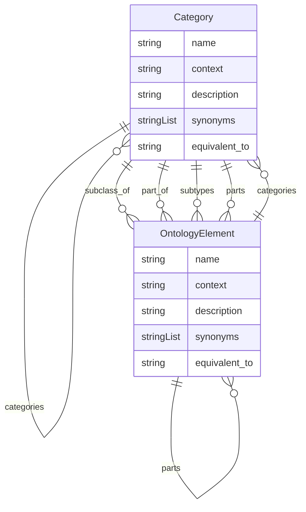

# Class: Category


URI: [oc:Category](http://w3id.org/ontogpt/ontology-class-templateCategory)





## Inheritance
* [OntologyElement](OntologyElement.md)
    * **Category**


## Slots

| Name | Cardinality and Range | Description | Inheritance |
| ---  | --- | --- | --- |
| [name](name.md) | 1..1 <br/> [String](String.md) | the name of the entity | [OntologyElement](OntologyElement.md) |
| [context](context.md) | 0..1 <br/> [String](String.md) | the ontology to which this belongs (single-valued) | [OntologyElement](OntologyElement.md) |
| [description](description.md) | 0..1 <br/> [String](String.md) | a textual description of the entity (single-valued) | [OntologyElement](OntologyElement.md) |
| [synonyms](synonyms.md) | 0..* <br/> [String](String.md) | a list of alternative names of the entity | [OntologyElement](OntologyElement.md) |
| [categories](categories.md) | 0..* <br/> [Category](Category.md) | a list of the categories to which this entity belongs | [OntologyElement](OntologyElement.md) |
| [subclass_of](subclass_of.md) | 0..* <br/> [OntologyElement](OntologyElement.md) | a list of parent class (superclasses) of this entity | [OntologyElement](OntologyElement.md) |
| [part_of](part_of.md) | 0..* <br/> [OntologyElement](OntologyElement.md) | a list of things this element is part of | [OntologyElement](OntologyElement.md) |
| [subtypes](subtypes.md) | 0..* <br/> [OntologyElement](OntologyElement.md) | a list of child classes (subclasses) of this entity | [OntologyElement](OntologyElement.md) |
| [parts](parts.md) | 0..* <br/> [OntologyElement](OntologyElement.md) | a list of names of things this element has as parts (components) | [OntologyElement](OntologyElement.md) |
| [equivalent_to](equivalent_to.md) | 0..1 <br/> [String](String.md) | an OWL class expression with the necessary and sufficient conditions for this... | [OntologyElement](OntologyElement.md) |


## Usages

| used by | used in | type | used |
| ---  | --- | --- | --- |
| [OntologyElement](OntologyElement.md) | [categories](categories.md) | range | [Category](Category.md) |
| [Category](Category.md) | [categories](categories.md) | range | [Category](Category.md) |


## Identifier and Mapping Information


### Schema Source


* from schema: https://w3id.org/ontogpt/halo


## Mappings

| Mapping Type | Mapped Value |
| ---  | ---  |
| self | oc:Category |
| native | oc:Category |


## LinkML Source

<!-- TODO: investigate https://stackoverflow.com/questions/37606292/how-to-create-tabbed-code-blocks-in-mkdocs-or-sphinx -->

### Direct

<details>
```yaml
name: Category
from_schema: https://w3id.org/ontogpt/halo
rank: 1000
is_a: OntologyElement

```
</details>

### Induced

<details>
```yaml
name: Category
from_schema: https://w3id.org/ontogpt/halo
rank: 1000
is_a: OntologyElement
attributes:
  name:
    name: name
    description: the name of the entity
    from_schema: https://w3id.org/ontogpt/halo
    rank: 1000
    identifier: true
    alias: name
    owner: Category
    domain_of:
    - OntologyElement
    range: string
  context:
    name: context
    description: the ontology to which this belongs (single-valued)
    from_schema: https://w3id.org/ontogpt/halo
    rank: 1000
    alias: context
    owner: Category
    domain_of:
    - OntologyElement
    range: string
  description:
    name: description
    description: a textual description of the entity (single-valued)
    from_schema: https://w3id.org/ontogpt/halo
    rank: 1000
    alias: description
    owner: Category
    domain_of:
    - OntologyElement
    range: string
  synonyms:
    name: synonyms
    description: a list of alternative names of the entity
    from_schema: https://w3id.org/ontogpt/halo
    rank: 1000
    multivalued: true
    alias: synonyms
    owner: Category
    domain_of:
    - OntologyElement
    range: string
  categories:
    name: categories
    description: a list of the categories to which this entity belongs
    from_schema: https://w3id.org/ontogpt/halo
    rank: 1000
    multivalued: true
    alias: categories
    owner: Category
    domain_of:
    - OntologyElement
    range: Category
  subclass_of:
    name: subclass_of
    description: a list of parent class (superclasses) of this entity
    from_schema: https://w3id.org/ontogpt/halo
    slot_uri: rdfs:subClassOf
    multivalued: true
    alias: subclass_of
    owner: Category
    domain_of:
    - OntologyElement
    range: OntologyElement
  part_of:
    name: part_of
    description: a list of things this element is part of
    from_schema: https://w3id.org/ontogpt/halo
    slot_uri: BFO:0000050
    multivalued: true
    alias: part_of
    owner: Category
    domain_of:
    - OntologyElement
    range: OntologyElement
  subtypes:
    name: subtypes
    description: a list of child classes (subclasses) of this entity
    from_schema: https://w3id.org/ontogpt/halo
    rank: 1000
    multivalued: true
    alias: subtypes
    owner: Category
    domain_of:
    - OntologyElement
    inverse: subclass_of
    range: OntologyElement
  parts:
    name: parts
    description: a list of names of things this element has as parts (components)
    from_schema: https://w3id.org/ontogpt/halo
    rank: 1000
    multivalued: true
    alias: parts
    owner: Category
    domain_of:
    - OntologyElement
    inverse: part_of
    range: OntologyElement
  equivalent_to:
    name: equivalent_to
    description: an OWL class expression with the necessary and sufficient conditions
      for this entity to be an instance of this class
    from_schema: https://w3id.org/ontogpt/halo
    rank: 1000
    alias: equivalent_to
    owner: Category
    domain_of:
    - OntologyElement
    range: string

```
</details>