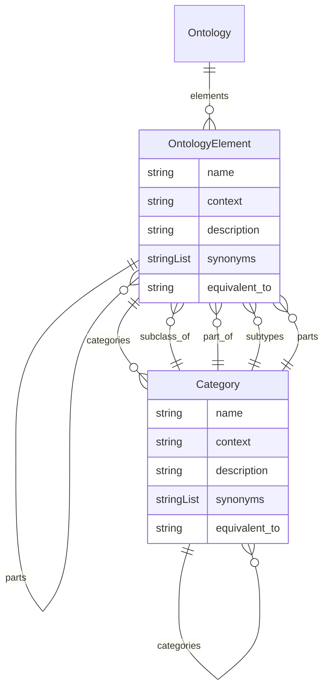

# Class: Ontology


URI: [oc:Ontology](http://w3id.org/ontogpt/ontology-class-templateOntology)





<!-- no inheritance hierarchy -->


## Slots

| Name | Cardinality and Range | Description | Inheritance |
| ---  | --- | --- | --- |
| [elements](elements.md) | 0..* <br/> [OntologyElement](OntologyElement.md) |  | direct |


## Identifier and Mapping Information


### Schema Source


* from schema: https://w3id.org/ontogpt/halo


## Mappings

| Mapping Type | Mapped Value |
| ---  | ---  |
| self | oc:Ontology |
| native | oc:Ontology |


## LinkML Source

<!-- TODO: investigate https://stackoverflow.com/questions/37606292/how-to-create-tabbed-code-blocks-in-mkdocs-or-sphinx -->

### Direct

<details>
```yaml
name: Ontology
from_schema: https://w3id.org/ontogpt/halo
rank: 1000
attributes:
  elements:
    name: elements
    from_schema: https://w3id.org/ontogpt/halo
    rank: 1000
    multivalued: true
    range: OntologyElement
    inlined: true
    inlined_as_list: true

```
</details>

### Induced

<details>
```yaml
name: Ontology
from_schema: https://w3id.org/ontogpt/halo
rank: 1000
attributes:
  elements:
    name: elements
    from_schema: https://w3id.org/ontogpt/halo
    rank: 1000
    multivalued: true
    alias: elements
    owner: Ontology
    domain_of:
    - Ontology
    range: OntologyElement
    inlined: true
    inlined_as_list: true

```
</details>