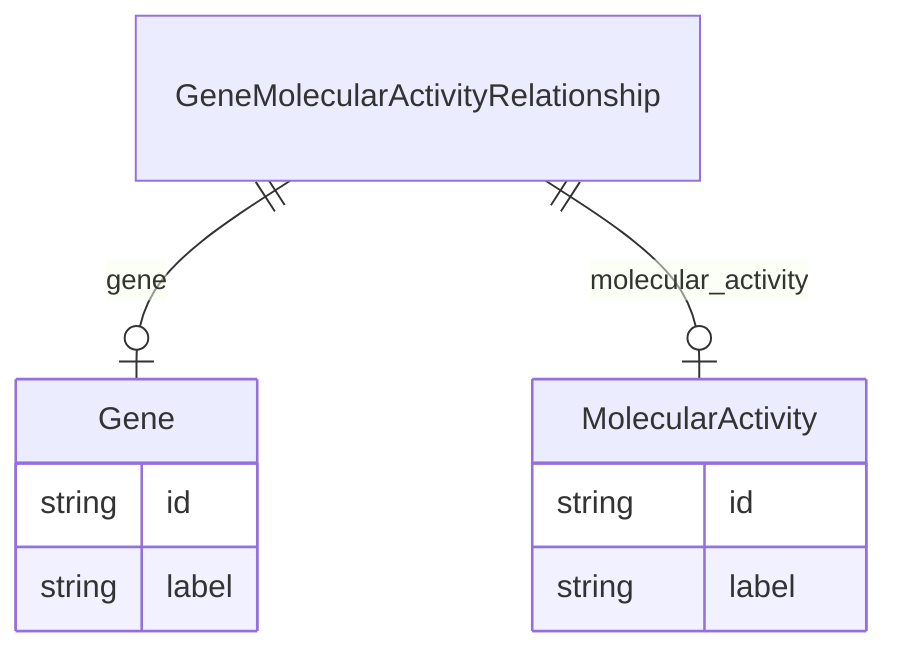

# Class: GeneMolecularActivityRelationship


URI: [gocam:GeneMolecularActivityRelationship](http://w3id.org/ontogpt/gocam/GeneMolecularActivityRelationship)





## Inheritance
* [CompoundExpression](CompoundExpression.md)
    * **GeneMolecularActivityRelationship**


## Slots

| Name | Cardinality and Range | Description | Inheritance |
| ---  | --- | --- | --- |
| [gene](gene.md) | 0..1 <br/> [Gene](Gene.md) |  | direct |
| [molecular_activity](molecular_activity.md) | 0..1 <br/> [MolecularActivity](MolecularActivity.md) |  | direct |


## Usages

| used by | used in | type | used |
| ---  | --- | --- | --- |
| [IBDAnnotations](IBDAnnotations.md) | [gene_functions](gene_functions.md) | range | [GeneMolecularActivityRelationship](GeneMolecularActivityRelationship.md) |


## Identifier and Mapping Information


### Annotations

| property | value |
| --- | --- |
| prompt.example | TODO

gene: HGNC:1234
molecular_activity: GO:0003674 |


### Schema Source


* from schema: http://w3id.org/ontogpt/gocam


## Mappings

| Mapping Type | Mapped Value |
| ---  | ---  |
| self | gocam:GeneMolecularActivityRelationship |
| native | gocam:GeneMolecularActivityRelationship |


## LinkML Source

<!-- TODO: investigate https://stackoverflow.com/questions/37606292/how-to-create-tabbed-code-blocks-in-mkdocs-or-sphinx -->

### Direct

<details>
```yaml
name: GeneMolecularActivityRelationship
annotations:
  prompt.example:
    tag: prompt.example
    value: 'TODO


      gene: HGNC:1234

      molecular_activity: GO:0003674'
from_schema: http://w3id.org/ontogpt/gocam
is_a: CompoundExpression
attributes:
  gene:
    name: gene
    annotations:
      prompt:
        tag: prompt
        value: the name of the gene in the pair. This comes first.
    from_schema: http://w3id.org/ontogpt/gocam
    domain_of:
    - GeneOrganismRelationship
    - GeneMolecularActivityRelationship
    - GeneMolecularActivityRelationship2
    - GeneSubcellularLocalizationRelationship
    range: Gene
  molecular_activity:
    name: molecular_activity
    annotations:
      prompt:
        tag: prompt
        value: the name of the molecular function in the pair. This comes second.
          May be a GO term.
    from_schema: http://w3id.org/ontogpt/gocam
    rank: 1000
    domain_of:
    - GeneMolecularActivityRelationship
    - GeneMolecularActivityRelationship2
    range: MolecularActivity

```
</details>

### Induced

<details>
```yaml
name: GeneMolecularActivityRelationship
annotations:
  prompt.example:
    tag: prompt.example
    value: 'TODO


      gene: HGNC:1234

      molecular_activity: GO:0003674'
from_schema: http://w3id.org/ontogpt/gocam
is_a: CompoundExpression
attributes:
  gene:
    name: gene
    annotations:
      prompt:
        tag: prompt
        value: the name of the gene in the pair. This comes first.
    from_schema: http://w3id.org/ontogpt/gocam
    alias: gene
    owner: GeneMolecularActivityRelationship
    domain_of:
    - GeneOrganismRelationship
    - GeneMolecularActivityRelationship
    - GeneMolecularActivityRelationship2
    - GeneSubcellularLocalizationRelationship
    range: Gene
  molecular_activity:
    name: molecular_activity
    annotations:
      prompt:
        tag: prompt
        value: the name of the molecular function in the pair. This comes second.
          May be a GO term.
    from_schema: http://w3id.org/ontogpt/gocam
    rank: 1000
    alias: molecular_activity
    owner: GeneMolecularActivityRelationship
    domain_of:
    - GeneMolecularActivityRelationship
    - GeneMolecularActivityRelationship2
    range: MolecularActivity

```
</details>