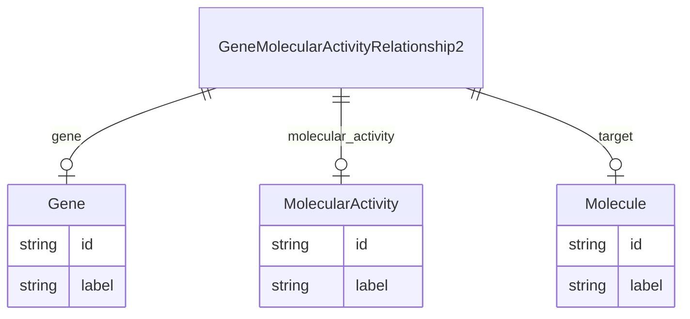

# Class: GeneMolecularActivityRelationship2


URI: [gocam:GeneMolecularActivityRelationship2](http://w3id.org/ontogpt/gocam/GeneMolecularActivityRelationship2)





## Inheritance
* [CompoundExpression](CompoundExpression.md)
    * **GeneMolecularActivityRelationship2**


## Slots

| Name | Cardinality and Range | Description | Inheritance |
| ---  | --- | --- | --- |
| [gene](gene.md) | 0..1 <br/> [String](String.md) |  | direct |
| [molecular_activity](molecular_activity.md) | 0..1 <br/> [String](String.md) |  | direct |
| [target](target.md) | 0..1 <br/> [Molecule](Molecule.md) |  | direct |


## Identifier and Mapping Information


### Schema Source


* from schema: http://w3id.org/ontogpt/gocam


## Mappings

| Mapping Type | Mapped Value |
| ---  | ---  |
| self | gocam:GeneMolecularActivityRelationship2 |
| native | gocam:GeneMolecularActivityRelationship2 |


## LinkML Source

<!-- TODO: investigate https://stackoverflow.com/questions/37606292/how-to-create-tabbed-code-blocks-in-mkdocs-or-sphinx -->

### Direct

<details>
```yaml
name: GeneMolecularActivityRelationship2
from_schema: http://w3id.org/ontogpt/gocam
rank: 1000
is_a: CompoundExpression
attributes:
  gene:
    name: gene
    annotations:
      prompt:
        tag: prompt
        value: the name of the gene.
    from_schema: http://w3id.org/ontogpt/gocam
    range: Gene
  molecular_activity:
    name: molecular_activity
    annotations:
      prompt:
        tag: prompt
        value: the name of the molecular activity, for example, ubiquitination. May
          be a GO term.
    from_schema: http://w3id.org/ontogpt/gocam
    range: MolecularActivity
  target:
    name: target
    annotations:
      prompt:
        tag: prompt
        value: the name of the molecular entity that is the target of the molecular
          activity.
    from_schema: http://w3id.org/ontogpt/gocam
    rank: 1000
    range: Molecule

```
</details>

### Induced

<details>
```yaml
name: GeneMolecularActivityRelationship2
from_schema: http://w3id.org/ontogpt/gocam
rank: 1000
is_a: CompoundExpression
attributes:
  gene:
    name: gene
    annotations:
      prompt:
        tag: prompt
        value: the name of the gene.
    from_schema: http://w3id.org/ontogpt/gocam
    alias: gene
    owner: GeneMolecularActivityRelationship2
    domain_of:
    - GeneOrganismRelationship
    - GeneMolecularActivityRelationship
    - GeneMolecularActivityRelationship2
    - GeneSubcellularLocalizationRelationship
    range: Gene
  molecular_activity:
    name: molecular_activity
    annotations:
      prompt:
        tag: prompt
        value: the name of the molecular activity, for example, ubiquitination. May
          be a GO term.
    from_schema: http://w3id.org/ontogpt/gocam
    alias: molecular_activity
    owner: GeneMolecularActivityRelationship2
    domain_of:
    - GeneMolecularActivityRelationship
    - GeneMolecularActivityRelationship2
    range: MolecularActivity
  target:
    name: target
    annotations:
      prompt:
        tag: prompt
        value: the name of the molecular entity that is the target of the molecular
          activity.
    from_schema: http://w3id.org/ontogpt/gocam
    rank: 1000
    alias: target
    owner: GeneMolecularActivityRelationship2
    domain_of:
    - GeneMolecularActivityRelationship2
    range: Molecule

```
</details>