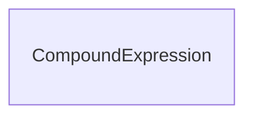

# Class: CompoundExpression


* __NOTE__: this is an abstract class and should not be instantiated directly


URI: [ibdlit:CompoundExpression](http://w3id.org/ontogpt/ibd_literature/CompoundExpression)





## Inheritance
* **CompoundExpression**
    * [GeneExposureRelationship](GeneExposureRelationship.md)
    * [DiseaseCellularProcessRelationship](DiseaseCellularProcessRelationship.md)
    * [Triple](Triple.md)


## Slots

| Name | Cardinality and Range | Description | Inheritance |
| ---  | --- | --- | --- |


## Identifier and Mapping Information


### Schema Source


* from schema: http://w3id.org/ontogpt/ibd_literature


## Mappings

| Mapping Type | Mapped Value |
| ---  | ---  |
| self | ibdlit:CompoundExpression |
| native | ibdlit:CompoundExpression |


## LinkML Source

<!-- TODO: investigate https://stackoverflow.com/questions/37606292/how-to-create-tabbed-code-blocks-in-mkdocs-or-sphinx -->

### Direct

<details>
```yaml
name: CompoundExpression
from_schema: http://w3id.org/ontogpt/ibd_literature
abstract: true

```
</details>

### Induced

<details>
```yaml
name: CompoundExpression
from_schema: http://w3id.org/ontogpt/ibd_literature
abstract: true

```
</details>