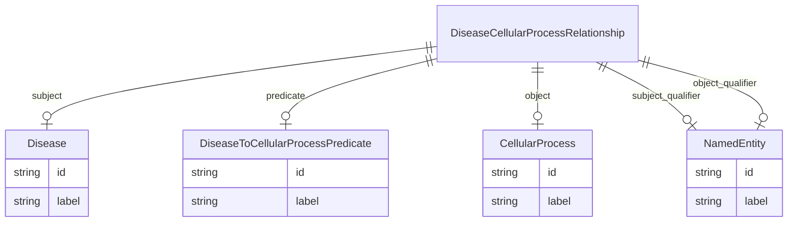

# Class: DiseaseCellularProcessRelationship


URI: [ibdlit:DiseaseCellularProcessRelationship](http://w3id.org/ontogpt/ibd_literature/DiseaseCellularProcessRelationship)





## Inheritance
* [CompoundExpression](CompoundExpression.md)
    * **DiseaseCellularProcessRelationship**


## Slots

| Name | Cardinality and Range | Description | Inheritance |
| ---  | --- | --- | --- |
| [subject](subject.md) | 0..1 <br/> [Disease](Disease.md) | The name of the disease | direct |
| [predicate](predicate.md) | 0..1 <br/> [DiseaseToCellularProcessPredicate](DiseaseToCellularProcessPredicate.md) | The name of the type of relationship between a disease and a cellular process | direct |
| [object](object.md) | 0..1 <br/> [CellularProcess](CellularProcess.md) | The name of the cellular process | direct |
| [subject_qualifier](subject_qualifier.md) | 0..1 <br/> [NamedEntity](NamedEntity.md) |  | direct |
| [object_qualifier](object_qualifier.md) | 0..1 <br/> [NamedEntity](NamedEntity.md) |  | direct |


## Usages

| used by | used in | type | used |
| ---  | --- | --- | --- |
| [IBDAnnotations](IBDAnnotations.md) | [disease_cellular_process_relationships](disease_cellular_process_relationships.md) | range | [DiseaseCellularProcessRelationship](DiseaseCellularProcessRelationship.md) |


## Identifier and Mapping Information


### Schema Source


* from schema: http://w3id.org/ontogpt/ibd_literature


## Mappings

| Mapping Type | Mapped Value |
| ---  | ---  |
| self | ibdlit:DiseaseCellularProcessRelationship |
| native | ibdlit:DiseaseCellularProcessRelationship |


## LinkML Source

<!-- TODO: investigate https://stackoverflow.com/questions/37606292/how-to-create-tabbed-code-blocks-in-mkdocs-or-sphinx -->

### Direct

<details>
```yaml
name: DiseaseCellularProcessRelationship
from_schema: http://w3id.org/ontogpt/ibd_literature
is_a: CompoundExpression
attributes:
  subject:
    name: subject
    description: The name of the disease.
    from_schema: http://w3id.org/ontogpt/ibd_literature
    domain_of:
    - GeneExposureRelationship
    - DiseaseCellularProcessRelationship
    - Triple
    range: Disease
  predicate:
    name: predicate
    description: The name of the type of relationship between a disease and a cellular
      process.
    from_schema: http://w3id.org/ontogpt/ibd_literature
    domain_of:
    - GeneExposureRelationship
    - DiseaseCellularProcessRelationship
    - Triple
    range: DiseaseToCellularProcessPredicate
  object:
    name: object
    description: The name of the cellular process.
    from_schema: http://w3id.org/ontogpt/ibd_literature
    domain_of:
    - GeneExposureRelationship
    - DiseaseCellularProcessRelationship
    - Triple
    range: CellularProcess
  subject_qualifier:
    name: subject_qualifier
    from_schema: http://w3id.org/ontogpt/ibd_literature
    domain_of:
    - GeneExposureRelationship
    - DiseaseCellularProcessRelationship
    - Triple
    range: NamedEntity
  object_qualifier:
    name: object_qualifier
    from_schema: http://w3id.org/ontogpt/ibd_literature
    domain_of:
    - GeneExposureRelationship
    - DiseaseCellularProcessRelationship
    - Triple
    range: NamedEntity

```
</details>

### Induced

<details>
```yaml
name: DiseaseCellularProcessRelationship
from_schema: http://w3id.org/ontogpt/ibd_literature
is_a: CompoundExpression
attributes:
  subject:
    name: subject
    description: The name of the disease.
    from_schema: http://w3id.org/ontogpt/ibd_literature
    alias: subject
    owner: DiseaseCellularProcessRelationship
    domain_of:
    - GeneExposureRelationship
    - DiseaseCellularProcessRelationship
    - Triple
    range: Disease
  predicate:
    name: predicate
    description: The name of the type of relationship between a disease and a cellular
      process.
    from_schema: http://w3id.org/ontogpt/ibd_literature
    alias: predicate
    owner: DiseaseCellularProcessRelationship
    domain_of:
    - GeneExposureRelationship
    - DiseaseCellularProcessRelationship
    - Triple
    range: DiseaseToCellularProcessPredicate
  object:
    name: object
    description: The name of the cellular process.
    from_schema: http://w3id.org/ontogpt/ibd_literature
    alias: object
    owner: DiseaseCellularProcessRelationship
    domain_of:
    - GeneExposureRelationship
    - DiseaseCellularProcessRelationship
    - Triple
    range: CellularProcess
  subject_qualifier:
    name: subject_qualifier
    from_schema: http://w3id.org/ontogpt/ibd_literature
    alias: subject_qualifier
    owner: DiseaseCellularProcessRelationship
    domain_of:
    - GeneExposureRelationship
    - DiseaseCellularProcessRelationship
    - Triple
    range: NamedEntity
  object_qualifier:
    name: object_qualifier
    from_schema: http://w3id.org/ontogpt/ibd_literature
    alias: object_qualifier
    owner: DiseaseCellularProcessRelationship
    domain_of:
    - GeneExposureRelationship
    - DiseaseCellularProcessRelationship
    - Triple
    range: NamedEntity

```
</details>