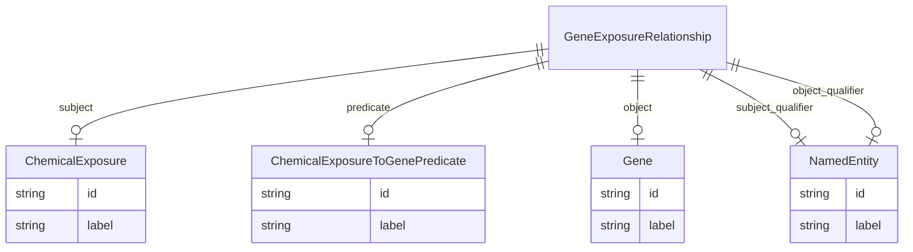

# Class: GeneExposureRelationship


URI: [ibdlit:GeneExposureRelationship](http://w3id.org/ontogpt/ibd_literature/GeneExposureRelationship)





## Inheritance
* [CompoundExpression](CompoundExpression.md)
    * **GeneExposureRelationship**


## Slots

| Name | Cardinality and Range | Description | Inheritance |
| ---  | --- | --- | --- |
| [subject](subject.md) | 0..1 <br/> [ChemicalExposure](ChemicalExposure.md) | The name of the exposure, such as a exposure to a chemical toxin | direct |
| [predicate](predicate.md) | 0..1 <br/> [ChemicalExposureToGenePredicate](ChemicalExposureToGenePredicate.md) | The name of the type of relationship between a chemical exposure and a gene | direct |
| [object](object.md) | 0..1 <br/> [Gene](Gene.md) | The name of the gene in the pair | direct |
| [subject_qualifier](subject_qualifier.md) | 0..1 <br/> [NamedEntity](NamedEntity.md) | An optional qualifier or modifier for the chemical exposure | direct |
| [object_qualifier](object_qualifier.md) | 0..1 <br/> [NamedEntity](NamedEntity.md) | An optional qualifier or modifier for the gene | direct |


## Usages

| used by | used in | type | used |
| ---  | --- | --- | --- |
| [IBDAnnotations](IBDAnnotations.md) | [gene_exposures_relationships](gene_exposures_relationships.md) | range | [GeneExposureRelationship](GeneExposureRelationship.md) |


## Identifier and Mapping Information


### Schema Source


* from schema: http://w3id.org/ontogpt/ibd_literature


## Mappings

| Mapping Type | Mapped Value |
| ---  | ---  |
| self | ibdlit:GeneExposureRelationship |
| native | ibdlit:GeneExposureRelationship |


## LinkML Source

<!-- TODO: investigate https://stackoverflow.com/questions/37606292/how-to-create-tabbed-code-blocks-in-mkdocs-or-sphinx -->

### Direct

<details>
```yaml
name: GeneExposureRelationship
from_schema: http://w3id.org/ontogpt/ibd_literature
is_a: CompoundExpression
attributes:
  subject:
    name: subject
    description: The name of the exposure, such as a exposure to a chemical toxin.
    from_schema: http://w3id.org/ontogpt/ibd_literature
    rank: 1000
    domain_of:
    - GeneExposureRelationship
    - DiseaseCellularProcessRelationship
    - Triple
    range: ChemicalExposure
  predicate:
    name: predicate
    description: The name of the type of relationship between a chemical exposure
      and a gene.
    from_schema: http://w3id.org/ontogpt/ibd_literature
    rank: 1000
    domain_of:
    - GeneExposureRelationship
    - DiseaseCellularProcessRelationship
    - Triple
    range: ChemicalExposureToGenePredicate
  object:
    name: object
    description: The name of the gene in the pair. This comes second in the pair.
    from_schema: http://w3id.org/ontogpt/ibd_literature
    rank: 1000
    domain_of:
    - GeneExposureRelationship
    - DiseaseCellularProcessRelationship
    - Triple
    range: Gene
  subject_qualifier:
    name: subject_qualifier
    description: An optional qualifier or modifier for the chemical exposure.
    from_schema: http://w3id.org/ontogpt/ibd_literature
    rank: 1000
    domain_of:
    - GeneExposureRelationship
    - DiseaseCellularProcessRelationship
    - Triple
    range: NamedEntity
  object_qualifier:
    name: object_qualifier
    description: An optional qualifier or modifier for the gene.
    from_schema: http://w3id.org/ontogpt/ibd_literature
    rank: 1000
    domain_of:
    - GeneExposureRelationship
    - DiseaseCellularProcessRelationship
    - Triple
    range: NamedEntity

```
</details>

### Induced

<details>
```yaml
name: GeneExposureRelationship
from_schema: http://w3id.org/ontogpt/ibd_literature
is_a: CompoundExpression
attributes:
  subject:
    name: subject
    description: The name of the exposure, such as a exposure to a chemical toxin.
    from_schema: http://w3id.org/ontogpt/ibd_literature
    rank: 1000
    alias: subject
    owner: GeneExposureRelationship
    domain_of:
    - GeneExposureRelationship
    - DiseaseCellularProcessRelationship
    - Triple
    range: ChemicalExposure
  predicate:
    name: predicate
    description: The name of the type of relationship between a chemical exposure
      and a gene.
    from_schema: http://w3id.org/ontogpt/ibd_literature
    rank: 1000
    alias: predicate
    owner: GeneExposureRelationship
    domain_of:
    - GeneExposureRelationship
    - DiseaseCellularProcessRelationship
    - Triple
    range: ChemicalExposureToGenePredicate
  object:
    name: object
    description: The name of the gene in the pair. This comes second in the pair.
    from_schema: http://w3id.org/ontogpt/ibd_literature
    rank: 1000
    alias: object
    owner: GeneExposureRelationship
    domain_of:
    - GeneExposureRelationship
    - DiseaseCellularProcessRelationship
    - Triple
    range: Gene
  subject_qualifier:
    name: subject_qualifier
    description: An optional qualifier or modifier for the chemical exposure.
    from_schema: http://w3id.org/ontogpt/ibd_literature
    rank: 1000
    alias: subject_qualifier
    owner: GeneExposureRelationship
    domain_of:
    - GeneExposureRelationship
    - DiseaseCellularProcessRelationship
    - Triple
    range: NamedEntity
  object_qualifier:
    name: object_qualifier
    description: An optional qualifier or modifier for the gene.
    from_schema: http://w3id.org/ontogpt/ibd_literature
    rank: 1000
    alias: object_qualifier
    owner: GeneExposureRelationship
    domain_of:
    - GeneExposureRelationship
    - DiseaseCellularProcessRelationship
    - Triple
    range: NamedEntity

```
</details>