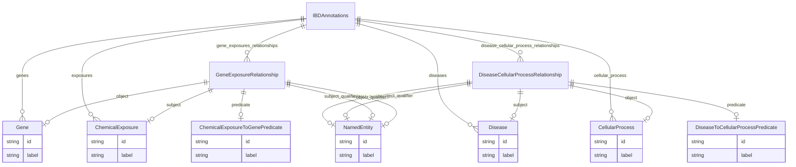

# Class: IBDAnnotations


URI: [ibdlit:IBDAnnotations](http://w3id.org/ontogpt/ibd_literature/IBDAnnotations)





<!-- no inheritance hierarchy -->


## Slots

| Name | Cardinality and Range | Description | Inheritance |
| ---  | --- | --- | --- |
| [genes](genes.md) | * <br/> [Gene](Gene.md) | semicolon-separated list of genes | direct |
| [exposures](exposures.md) | * <br/> [ChemicalExposure](ChemicalExposure.md) | semicolon-separated list of exposures | direct |
| [gene_exposures_relationships](gene_exposures_relationships.md) | * <br/> [GeneExposureRelationship](GeneExposureRelationship.md) | semicolon-separated list of gene to molecular activity relationships | direct |
| [diseases](diseases.md) | * <br/> [Disease](Disease.md) | semicolon-separated list of diseases | direct |
| [cellular_process](cellular_process.md) | * <br/> [CellularProcess](CellularProcess.md) | semicolon-separated list of cellular processes | direct |
| [disease_cellular_process_relationships](disease_cellular_process_relationships.md) | * <br/> [DiseaseCellularProcessRelationship](DiseaseCellularProcessRelationship.md) | semicolon-separated list of disease to cellular process relationships | direct |


## Identifier and Mapping Information


### Schema Source


* from schema: http://w3id.org/ontogpt/ibd_literature


## Mappings

| Mapping Type | Mapped Value |
| ---  | ---  |
| self | ibdlit:IBDAnnotations |
| native | ibdlit:IBDAnnotations |


## LinkML Source

<!-- TODO: investigate https://stackoverflow.com/questions/37606292/how-to-create-tabbed-code-blocks-in-mkdocs-or-sphinx -->

### Direct

<details>
```yaml
name: IBDAnnotations
from_schema: http://w3id.org/ontogpt/ibd_literature
attributes:
  genes:
    name: genes
    description: semicolon-separated list of genes
    from_schema: http://w3id.org/ontogpt/ibd_literature
    rank: 1000
    multivalued: true
    domain_of:
    - IBDAnnotations
    range: Gene
  exposures:
    name: exposures
    annotations:
      prompt:
        tag: prompt
        value: a chemical or molecule whose direct or indirect effects cause one or
          more entities to experience biological change
    description: semicolon-separated list of exposures
    from_schema: http://w3id.org/ontogpt/ibd_literature
    rank: 1000
    multivalued: true
    domain_of:
    - IBDAnnotations
    range: ChemicalExposure
  gene_exposures_relationships:
    name: gene_exposures_relationships
    description: semicolon-separated list of gene to molecular activity relationships
    from_schema: http://w3id.org/ontogpt/ibd_literature
    rank: 1000
    multivalued: true
    domain_of:
    - IBDAnnotations
    range: GeneExposureRelationship
  diseases:
    name: diseases
    description: semicolon-separated list of diseases
    from_schema: http://w3id.org/ontogpt/ibd_literature
    rank: 1000
    multivalued: true
    domain_of:
    - IBDAnnotations
    range: Disease
  cellular_process:
    name: cellular_process
    description: semicolon-separated list of cellular processes
    from_schema: http://w3id.org/ontogpt/ibd_literature
    rank: 1000
    multivalued: true
    domain_of:
    - IBDAnnotations
    range: CellularProcess
  disease_cellular_process_relationships:
    name: disease_cellular_process_relationships
    description: semicolon-separated list of disease to cellular process relationships
    from_schema: http://w3id.org/ontogpt/ibd_literature
    rank: 1000
    multivalued: true
    domain_of:
    - IBDAnnotations
    range: DiseaseCellularProcessRelationship
tree_root: true

```
</details>

### Induced

<details>
```yaml
name: IBDAnnotations
from_schema: http://w3id.org/ontogpt/ibd_literature
attributes:
  genes:
    name: genes
    description: semicolon-separated list of genes
    from_schema: http://w3id.org/ontogpt/ibd_literature
    rank: 1000
    multivalued: true
    alias: genes
    owner: IBDAnnotations
    domain_of:
    - IBDAnnotations
    range: Gene
  exposures:
    name: exposures
    annotations:
      prompt:
        tag: prompt
        value: a chemical or molecule whose direct or indirect effects cause one or
          more entities to experience biological change
    description: semicolon-separated list of exposures
    from_schema: http://w3id.org/ontogpt/ibd_literature
    rank: 1000
    multivalued: true
    alias: exposures
    owner: IBDAnnotations
    domain_of:
    - IBDAnnotations
    range: ChemicalExposure
  gene_exposures_relationships:
    name: gene_exposures_relationships
    description: semicolon-separated list of gene to molecular activity relationships
    from_schema: http://w3id.org/ontogpt/ibd_literature
    rank: 1000
    multivalued: true
    alias: gene_exposures_relationships
    owner: IBDAnnotations
    domain_of:
    - IBDAnnotations
    range: GeneExposureRelationship
  diseases:
    name: diseases
    description: semicolon-separated list of diseases
    from_schema: http://w3id.org/ontogpt/ibd_literature
    rank: 1000
    multivalued: true
    alias: diseases
    owner: IBDAnnotations
    domain_of:
    - IBDAnnotations
    range: Disease
  cellular_process:
    name: cellular_process
    description: semicolon-separated list of cellular processes
    from_schema: http://w3id.org/ontogpt/ibd_literature
    rank: 1000
    multivalued: true
    alias: cellular_process
    owner: IBDAnnotations
    domain_of:
    - IBDAnnotations
    range: CellularProcess
  disease_cellular_process_relationships:
    name: disease_cellular_process_relationships
    description: semicolon-separated list of disease to cellular process relationships
    from_schema: http://w3id.org/ontogpt/ibd_literature
    rank: 1000
    multivalued: true
    alias: disease_cellular_process_relationships
    owner: IBDAnnotations
    domain_of:
    - IBDAnnotations
    range: DiseaseCellularProcessRelationship
tree_root: true

```
</details>