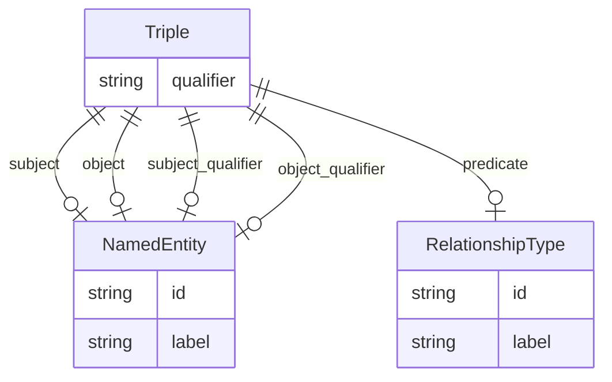

# Class: Triple


_Abstract parent for Relation Extraction tasks_


* __NOTE__: this is an abstract class and should not be instantiated directly


URI: [ibdlit:Triple](http://w3id.org/ontogpt/ibd_literature/Triple)





## Inheritance
* [CompoundExpression](CompoundExpression.md)
    * **Triple**


## Slots

| Name | Cardinality and Range | Description | Inheritance |
| ---  | --- | --- | --- |
| [subject](subject.md) | 0..1 <br/> [NamedEntity](NamedEntity.md) |  | direct |
| [predicate](predicate.md) | 0..1 <br/> [RelationshipType](RelationshipType.md) |  | direct |
| [object](object.md) | 0..1 <br/> [NamedEntity](NamedEntity.md) |  | direct |
| [qualifier](qualifier.md) | 0..1 <br/> [String](String.md) | A qualifier for the statements, e | direct |
| [subject_qualifier](subject_qualifier.md) | 0..1 <br/> [NamedEntity](NamedEntity.md) | An optional qualifier or modifier for the subject of the statement, e | direct |
| [object_qualifier](object_qualifier.md) | 0..1 <br/> [NamedEntity](NamedEntity.md) | An optional qualifier or modifier for the object of the statement, e | direct |


## Usages

| used by | used in | type | used |
| ---  | --- | --- | --- |
| [TextWithTriples](TextWithTriples.md) | [triples](triples.md) | range | [Triple](Triple.md) |


## Identifier and Mapping Information


### Schema Source


* from schema: http://w3id.org/ontogpt/ibd_literature


## Mappings

| Mapping Type | Mapped Value |
| ---  | ---  |
| self | ibdlit:Triple |
| native | ibdlit:Triple |


## LinkML Source

<!-- TODO: investigate https://stackoverflow.com/questions/37606292/how-to-create-tabbed-code-blocks-in-mkdocs-or-sphinx -->

### Direct

<details>
```yaml
name: Triple
description: Abstract parent for Relation Extraction tasks
from_schema: http://w3id.org/ontogpt/ibd_literature
is_a: CompoundExpression
abstract: true
attributes:
  subject:
    name: subject
    from_schema: http://w3id.org/ontogpt/ibd_literature
    domain_of:
    - GeneExposureRelationship
    - DiseaseCellularProcessRelationship
    - Triple
    range: NamedEntity
  predicate:
    name: predicate
    from_schema: http://w3id.org/ontogpt/ibd_literature
    domain_of:
    - GeneExposureRelationship
    - DiseaseCellularProcessRelationship
    - Triple
    range: RelationshipType
  object:
    name: object
    from_schema: http://w3id.org/ontogpt/ibd_literature
    domain_of:
    - GeneExposureRelationship
    - DiseaseCellularProcessRelationship
    - Triple
    range: NamedEntity
  qualifier:
    name: qualifier
    description: A qualifier for the statements, e.g. "NOT" for negation
    from_schema: http://w3id.org/ontogpt/ibd_literature
    rank: 1000
    domain_of:
    - Triple
    range: string
  subject_qualifier:
    name: subject_qualifier
    description: An optional qualifier or modifier for the subject of the statement,
      e.g. "high dose" or "intravenously administered"
    from_schema: http://w3id.org/ontogpt/ibd_literature
    domain_of:
    - GeneExposureRelationship
    - DiseaseCellularProcessRelationship
    - Triple
    range: NamedEntity
  object_qualifier:
    name: object_qualifier
    description: An optional qualifier or modifier for the object of the statement,
      e.g. "severe" or "with additional complications"
    from_schema: http://w3id.org/ontogpt/ibd_literature
    domain_of:
    - GeneExposureRelationship
    - DiseaseCellularProcessRelationship
    - Triple
    range: NamedEntity

```
</details>

### Induced

<details>
```yaml
name: Triple
description: Abstract parent for Relation Extraction tasks
from_schema: http://w3id.org/ontogpt/ibd_literature
is_a: CompoundExpression
abstract: true
attributes:
  subject:
    name: subject
    from_schema: http://w3id.org/ontogpt/ibd_literature
    alias: subject
    owner: Triple
    domain_of:
    - GeneExposureRelationship
    - DiseaseCellularProcessRelationship
    - Triple
    range: NamedEntity
  predicate:
    name: predicate
    from_schema: http://w3id.org/ontogpt/ibd_literature
    alias: predicate
    owner: Triple
    domain_of:
    - GeneExposureRelationship
    - DiseaseCellularProcessRelationship
    - Triple
    range: RelationshipType
  object:
    name: object
    from_schema: http://w3id.org/ontogpt/ibd_literature
    alias: object
    owner: Triple
    domain_of:
    - GeneExposureRelationship
    - DiseaseCellularProcessRelationship
    - Triple
    range: NamedEntity
  qualifier:
    name: qualifier
    description: A qualifier for the statements, e.g. "NOT" for negation
    from_schema: http://w3id.org/ontogpt/ibd_literature
    rank: 1000
    alias: qualifier
    owner: Triple
    domain_of:
    - Triple
    range: string
  subject_qualifier:
    name: subject_qualifier
    description: An optional qualifier or modifier for the subject of the statement,
      e.g. "high dose" or "intravenously administered"
    from_schema: http://w3id.org/ontogpt/ibd_literature
    alias: subject_qualifier
    owner: Triple
    domain_of:
    - GeneExposureRelationship
    - DiseaseCellularProcessRelationship
    - Triple
    range: NamedEntity
  object_qualifier:
    name: object_qualifier
    description: An optional qualifier or modifier for the object of the statement,
      e.g. "severe" or "with additional complications"
    from_schema: http://w3id.org/ontogpt/ibd_literature
    alias: object_qualifier
    owner: Triple
    domain_of:
    - GeneExposureRelationship
    - DiseaseCellularProcessRelationship
    - Triple
    range: NamedEntity

```
</details>