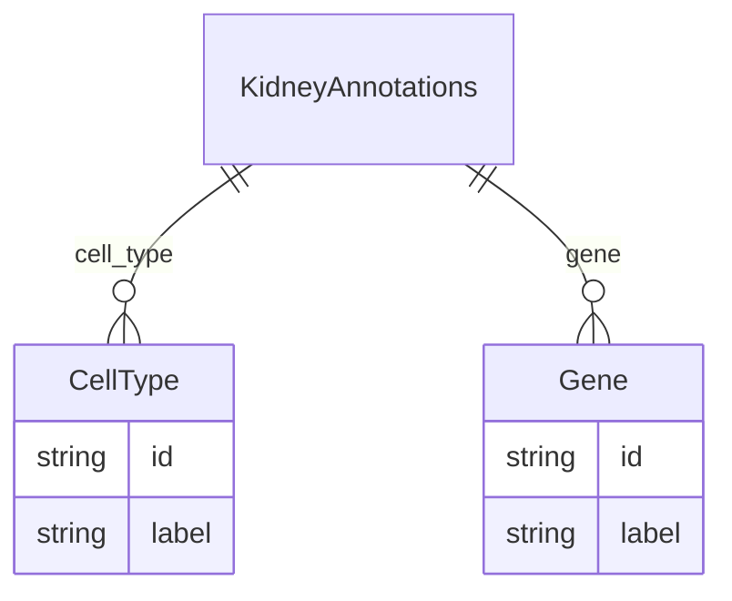

# Class: KidneyAnnotations


URI: [kidney:KidneyAnnotations](http://w3id.org/ontogpt/kidney-templateKidneyAnnotations)





<!-- no inheritance hierarchy -->


## Slots

| Name | Cardinality and Range | Description | Inheritance |
| ---  | --- | --- | --- |
| [cell_type](cell_type.md) | * <br/> [CellType](CellType.md) |  | direct |
| [gene](gene.md) | * <br/> [Gene](Gene.md) | A gene | direct |


## Identifier and Mapping Information


### Schema Source


* from schema: https://w3id.org/ontogpt/biological_process


## Mappings

| Mapping Type | Mapped Value |
| ---  | ---  |
| self | kidney:KidneyAnnotations |
| native | kidney:KidneyAnnotations |


## LinkML Source

<!-- TODO: investigate https://stackoverflow.com/questions/37606292/how-to-create-tabbed-code-blocks-in-mkdocs-or-sphinx -->

### Direct

<details>
```yaml
name: KidneyAnnotations
from_schema: https://w3id.org/ontogpt/biological_process
attributes:
  cell_type:
    name: cell_type
    from_schema: https://w3id.org/ontogpt/biological_process
    rank: 1000
    multivalued: true
    domain_of:
    - KidneyAnnotations
    range: CellType
  gene:
    name: gene
    description: A gene
    from_schema: https://w3id.org/ontogpt/biological_process
    rank: 1000
    multivalued: true
    domain_of:
    - KidneyAnnotations
    range: Gene
tree_root: true

```
</details>

### Induced

<details>
```yaml
name: KidneyAnnotations
from_schema: https://w3id.org/ontogpt/biological_process
attributes:
  cell_type:
    name: cell_type
    from_schema: https://w3id.org/ontogpt/biological_process
    rank: 1000
    multivalued: true
    alias: cell_type
    owner: KidneyAnnotations
    domain_of:
    - KidneyAnnotations
    range: CellType
  gene:
    name: gene
    description: A gene
    from_schema: https://w3id.org/ontogpt/biological_process
    rank: 1000
    multivalued: true
    alias: gene
    owner: KidneyAnnotations
    domain_of:
    - KidneyAnnotations
    range: Gene
tree_root: true

```
</details>