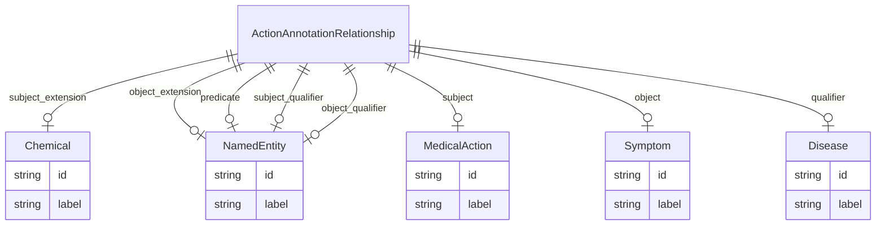

# Class: ActionAnnotationRelationship


_An association representing a relationships between a disease, the mentioned signs and symptoms associated with that disease, the medical actions relating to each symptom, and the type of relationship between each action and symptom (usually TREATS or PREVENTS)._


URI: [maxo_extract:ActionAnnotationRelationship](http://w3id.org/ontogpt/maxoActionAnnotationRelationship)





## Inheritance
* [CompoundExpression](CompoundExpression.md)
    * [Triple](Triple.md)
        * [ExtendedTriple](ExtendedTriple.md)
            * **ActionAnnotationRelationship**


## Slots

| Name | Cardinality and Range | Description | Inheritance |
| ---  | --- | --- | --- |
| [subject_extension](subject_extension.md) | 0..1 <br/> [Chemical](Chemical.md) | A chemical or drug mentioned in the relationship between the medical action a... | [ExtendedTriple](ExtendedTriple.md) |
| [object_extension](object_extension.md) | 0..1 <br/> [NamedEntity](NamedEntity.md) | An optional term describing some specific aspect of the object, e | [ExtendedTriple](ExtendedTriple.md) |
| [subject](subject.md) | 0..1 <br/> [MedicalAction](MedicalAction.md) | The medical action | [Triple](Triple.md) |
| [predicate](predicate.md) | 0..1 <br/> [NamedEntity](NamedEntity.md) | The relationship type between the medical action and the symptom, usually TRE... | [Triple](Triple.md) |
| [object](object.md) | 0..1 <br/> [Symptom](Symptom.md) | A sign or symptom associated with the disease and targeted by the medical act... | [Triple](Triple.md) |
| [qualifier](qualifier.md) | 0..1 <br/> [Disease](Disease.md) | The primary disease the relationship is about, or specifically the disease th... | [Triple](Triple.md) |
| [subject_qualifier](subject_qualifier.md) | 0..1 <br/> [NamedEntity](NamedEntity.md) | An optional qualifier or modifier for the subject of the statement, e | [Triple](Triple.md) |
| [object_qualifier](object_qualifier.md) | 0..1 <br/> [NamedEntity](NamedEntity.md) | An optional qualifier or modifier for the object of the statement, e | [Triple](Triple.md) |


## Usages

| used by | used in | type | used |
| ---  | --- | --- | --- |
| [MaxoAnnotations](MaxoAnnotations.md) | [action_annotation_relationships](action_annotation_relationships.md) | range | [ActionAnnotationRelationship](ActionAnnotationRelationship.md) |


## Identifier and Mapping Information


### Schema Source


* from schema: http://w3id.org/ontogpt/maxo


## Mappings

| Mapping Type | Mapped Value |
| ---  | ---  |
| self | maxo_extract:ActionAnnotationRelationship |
| native | maxo_extract:ActionAnnotationRelationship |


## LinkML Source

<!-- TODO: investigate https://stackoverflow.com/questions/37606292/how-to-create-tabbed-code-blocks-in-mkdocs-or-sphinx -->

### Direct

<details>
```yaml
name: ActionAnnotationRelationship
description: An association representing a relationships between a disease, the mentioned
  signs and symptoms associated with that disease, the medical actions relating to
  each symptom, and the type of relationship between each action and symptom (usually
  TREATS or PREVENTS).
from_schema: http://w3id.org/ontogpt/maxo
is_a: ExtendedTriple
slot_usage:
  qualifier:
    name: qualifier
    description: The primary disease the relationship is about, or specifically the
      disease the symptom is related to. For example, Beck-Fahrner syndrome, hereditary
      retinoblastoma, progeria, diabetes mellitus, infectious otitis media
    domain_of:
    - Triple
    range: Disease
  subject:
    name: subject
    description: 'The medical action. For example: blood transfusion, radiation therapy,
      cardiac catheterization, pulse oximetry, otoscopy'
    domain_of:
    - Triple
    range: MedicalAction
  object:
    name: object
    description: A sign or symptom associated with the disease and targeted by the
      medical action. For example, Low serum calcitriol, hypoplasia of the thymus,
      chronic cough, aortic stiffness, low pulse pressure
    domain_of:
    - Triple
    range: Symptom
  predicate:
    name: predicate
    description: The relationship type between the medical action and the symptom,
      usually TREATS or PREVENTS.
    domain_of:
    - Triple
    range: NamedEntity
  subject_extension:
    name: subject_extension
    description: A chemical or drug mentioned in the relationship between the medical
      action and the symptom, for example, "analgesic agent therapy" has the aspect
      "analgesic"
    domain_of:
    - ExtendedTriple
    range: Chemical

```
</details>

### Induced

<details>
```yaml
name: ActionAnnotationRelationship
description: An association representing a relationships between a disease, the mentioned
  signs and symptoms associated with that disease, the medical actions relating to
  each symptom, and the type of relationship between each action and symptom (usually
  TREATS or PREVENTS).
from_schema: http://w3id.org/ontogpt/maxo
is_a: ExtendedTriple
slot_usage:
  qualifier:
    name: qualifier
    description: The primary disease the relationship is about, or specifically the
      disease the symptom is related to. For example, Beck-Fahrner syndrome, hereditary
      retinoblastoma, progeria, diabetes mellitus, infectious otitis media
    domain_of:
    - Triple
    range: Disease
  subject:
    name: subject
    description: 'The medical action. For example: blood transfusion, radiation therapy,
      cardiac catheterization, pulse oximetry, otoscopy'
    domain_of:
    - Triple
    range: MedicalAction
  object:
    name: object
    description: A sign or symptom associated with the disease and targeted by the
      medical action. For example, Low serum calcitriol, hypoplasia of the thymus,
      chronic cough, aortic stiffness, low pulse pressure
    domain_of:
    - Triple
    range: Symptom
  predicate:
    name: predicate
    description: The relationship type between the medical action and the symptom,
      usually TREATS or PREVENTS.
    domain_of:
    - Triple
    range: NamedEntity
  subject_extension:
    name: subject_extension
    description: A chemical or drug mentioned in the relationship between the medical
      action and the symptom, for example, "analgesic agent therapy" has the aspect
      "analgesic"
    domain_of:
    - ExtendedTriple
    range: Chemical
attributes:
  subject_extension:
    name: subject_extension
    description: A chemical or drug mentioned in the relationship between the medical
      action and the symptom, for example, "analgesic agent therapy" has the aspect
      "analgesic"
    from_schema: http://w3id.org/ontogpt/maxo
    rank: 1000
    alias: subject_extension
    owner: ActionAnnotationRelationship
    domain_of:
    - ExtendedTriple
    range: Chemical
  object_extension:
    name: object_extension
    description: An optional term describing some specific aspect of the object, e.g.
      "analgesic agent therapy" has the aspect "analgesic"
    from_schema: http://w3id.org/ontogpt/maxo
    rank: 1000
    alias: object_extension
    owner: ActionAnnotationRelationship
    domain_of:
    - ExtendedTriple
    range: NamedEntity
  subject:
    name: subject
    description: 'The medical action. For example: blood transfusion, radiation therapy,
      cardiac catheterization, pulse oximetry, otoscopy'
    from_schema: http://w3id.org/ontogpt/maxo
    rank: 1000
    alias: subject
    owner: ActionAnnotationRelationship
    domain_of:
    - Triple
    range: MedicalAction
  predicate:
    name: predicate
    description: The relationship type between the medical action and the symptom,
      usually TREATS or PREVENTS.
    from_schema: http://w3id.org/ontogpt/maxo
    rank: 1000
    alias: predicate
    owner: ActionAnnotationRelationship
    domain_of:
    - Triple
    range: NamedEntity
  object:
    name: object
    description: A sign or symptom associated with the disease and targeted by the
      medical action. For example, Low serum calcitriol, hypoplasia of the thymus,
      chronic cough, aortic stiffness, low pulse pressure
    from_schema: http://w3id.org/ontogpt/maxo
    rank: 1000
    alias: object
    owner: ActionAnnotationRelationship
    domain_of:
    - Triple
    range: Symptom
  qualifier:
    name: qualifier
    description: The primary disease the relationship is about, or specifically the
      disease the symptom is related to. For example, Beck-Fahrner syndrome, hereditary
      retinoblastoma, progeria, diabetes mellitus, infectious otitis media
    from_schema: http://w3id.org/ontogpt/maxo
    rank: 1000
    alias: qualifier
    owner: ActionAnnotationRelationship
    domain_of:
    - Triple
    range: Disease
  subject_qualifier:
    name: subject_qualifier
    description: An optional qualifier or modifier for the subject of the statement,
      e.g. "high dose" or "intravenously administered"
    from_schema: http://w3id.org/ontogpt/maxo
    rank: 1000
    alias: subject_qualifier
    owner: ActionAnnotationRelationship
    domain_of:
    - Triple
    range: NamedEntity
  object_qualifier:
    name: object_qualifier
    description: An optional qualifier or modifier for the object of the statement,
      e.g. "severe" or "with additional complications"
    from_schema: http://w3id.org/ontogpt/maxo
    rank: 1000
    alias: object_qualifier
    owner: ActionAnnotationRelationship
    domain_of:
    - Triple
    range: NamedEntity

```
</details>