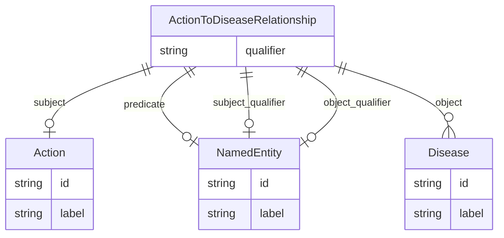

# Class: ActionToDiseaseRelationship


_A triple representing a relationship between a medical action (A clinically prescribed procedure, therapy, intervention, or recommendation) and a disease, for example, radiation therapy TREATS cancer, or PET scan IS USED TO DIAGNOSE myocarditis._


URI: [maxo_extract:ActionToDiseaseRelationship](http://w3id.org/ontogpt/maxoActionToDiseaseRelationship)





## Inheritance
* [CompoundExpression](CompoundExpression.md)
    * [Triple](Triple.md)
        * **ActionToDiseaseRelationship**


## Slots

| Name | Cardinality and Range | Description | Inheritance |
| ---  | --- | --- | --- |
| [subject](subject.md) | 0..1 <br/> [Action](Action.md) |  | [Triple](Triple.md) |
| [predicate](predicate.md) | 0..1 <br/> [NamedEntity](NamedEntity.md) | The relationship type, usually TREATS or IS USED TO DIAGNOSE | [Triple](Triple.md) |
| [object](object.md) | 0..* <br/> [Disease](Disease.md) |  | [Triple](Triple.md) |
| [qualifier](qualifier.md) | 0..1 <br/> [String](String.md) | A qualifier for the statements, e | [Triple](Triple.md) |
| [subject_qualifier](subject_qualifier.md) | 0..1 <br/> [NamedEntity](NamedEntity.md) | An optional qualifier or modifier for the medical action | [Triple](Triple.md) |
| [object_qualifier](object_qualifier.md) | 0..1 <br/> [NamedEntity](NamedEntity.md) | An optional qualifier or modifier for the disease | [Triple](Triple.md) |


## Usages

| used by | used in | type | used |
| ---  | --- | --- | --- |
| [MaxoAnnotations](MaxoAnnotations.md) | [action_to_disease](action_to_disease.md) | range | [ActionToDiseaseRelationship](ActionToDiseaseRelationship.md) |


## Identifier and Mapping Information


### Schema Source


* from schema: http://w3id.org/ontogpt/maxo


## Mappings

| Mapping Type | Mapped Value |
| ---  | ---  |
| self | maxo_extract:ActionToDiseaseRelationship |
| native | maxo_extract:ActionToDiseaseRelationship |


## LinkML Source

<!-- TODO: investigate https://stackoverflow.com/questions/37606292/how-to-create-tabbed-code-blocks-in-mkdocs-or-sphinx -->

### Direct

<details>
```yaml
name: ActionToDiseaseRelationship
description: A triple representing a relationship between a medical action (A clinically
  prescribed procedure, therapy, intervention, or recommendation) and a disease, for
  example, radiation therapy TREATS cancer, or PET scan IS USED TO DIAGNOSE myocarditis.
from_schema: http://w3id.org/ontogpt/maxo
is_a: Triple
slot_usage:
  subject:
    name: subject
    domain_of:
    - Triple
    range: Action
  object:
    name: object
    multivalued: true
    domain_of:
    - Triple
    range: Disease
  predicate:
    name: predicate
    description: The relationship type, usually TREATS or IS USED TO DIAGNOSE
    domain_of:
    - Triple
    range: NamedEntity
  subject_qualifier:
    name: subject_qualifier
    description: An optional qualifier or modifier for the medical action.
    domain_of:
    - Triple
    range: NamedEntity
  object_qualifier:
    name: object_qualifier
    description: An optional qualifier or modifier for the disease.
    domain_of:
    - Triple
    range: NamedEntity

```
</details>

### Induced

<details>
```yaml
name: ActionToDiseaseRelationship
description: A triple representing a relationship between a medical action (A clinically
  prescribed procedure, therapy, intervention, or recommendation) and a disease, for
  example, radiation therapy TREATS cancer, or PET scan IS USED TO DIAGNOSE myocarditis.
from_schema: http://w3id.org/ontogpt/maxo
is_a: Triple
slot_usage:
  subject:
    name: subject
    domain_of:
    - Triple
    range: Action
  object:
    name: object
    multivalued: true
    domain_of:
    - Triple
    range: Disease
  predicate:
    name: predicate
    description: The relationship type, usually TREATS or IS USED TO DIAGNOSE
    domain_of:
    - Triple
    range: NamedEntity
  subject_qualifier:
    name: subject_qualifier
    description: An optional qualifier or modifier for the medical action.
    domain_of:
    - Triple
    range: NamedEntity
  object_qualifier:
    name: object_qualifier
    description: An optional qualifier or modifier for the disease.
    domain_of:
    - Triple
    range: NamedEntity
attributes:
  subject:
    name: subject
    from_schema: http://w3id.org/ontogpt/maxo
    rank: 1000
    alias: subject
    owner: ActionToDiseaseRelationship
    domain_of:
    - Triple
    range: Action
  predicate:
    name: predicate
    description: The relationship type, usually TREATS or IS USED TO DIAGNOSE
    from_schema: http://w3id.org/ontogpt/maxo
    rank: 1000
    alias: predicate
    owner: ActionToDiseaseRelationship
    domain_of:
    - Triple
    range: NamedEntity
  object:
    name: object
    from_schema: http://w3id.org/ontogpt/maxo
    rank: 1000
    multivalued: true
    alias: object
    owner: ActionToDiseaseRelationship
    domain_of:
    - Triple
    range: Disease
  qualifier:
    name: qualifier
    description: A qualifier for the statements, e.g. "NOT" for negation
    from_schema: http://w3id.org/ontogpt/maxo
    rank: 1000
    alias: qualifier
    owner: ActionToDiseaseRelationship
    domain_of:
    - Triple
    range: string
  subject_qualifier:
    name: subject_qualifier
    description: An optional qualifier or modifier for the medical action.
    from_schema: http://w3id.org/ontogpt/maxo
    rank: 1000
    alias: subject_qualifier
    owner: ActionToDiseaseRelationship
    domain_of:
    - Triple
    range: NamedEntity
  object_qualifier:
    name: object_qualifier
    description: An optional qualifier or modifier for the disease.
    from_schema: http://w3id.org/ontogpt/maxo
    rank: 1000
    alias: object_qualifier
    owner: ActionToDiseaseRelationship
    domain_of:
    - Triple
    range: NamedEntity

```
</details>