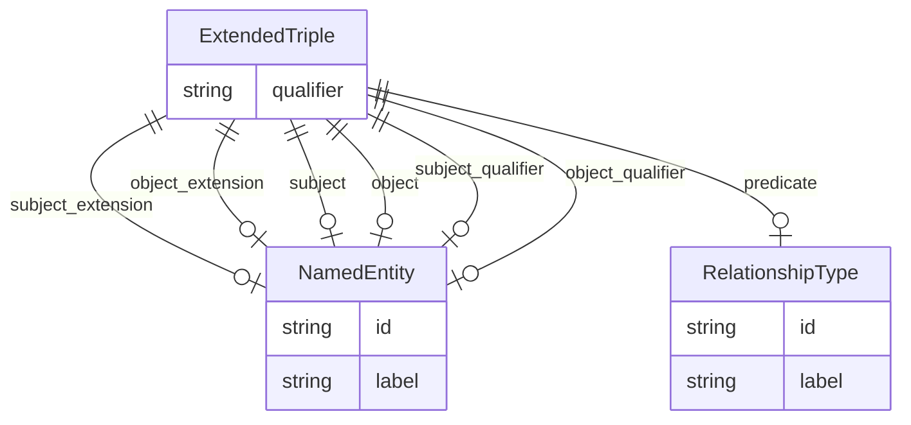

# Class: ExtendedTriple


_Abstract parent for Relation Extraction tasks, with additional support for an extension term describing some aspect of the subject and object._


* __NOTE__: this is an abstract class and should not be instantiated directly


URI: [maxo_extract:ExtendedTriple](http://w3id.org/ontogpt/maxoExtendedTriple)





## Inheritance
* [CompoundExpression](CompoundExpression.md)
    * [Triple](Triple.md)
        * **ExtendedTriple**
            * [ActionAnnotationRelationship](ActionAnnotationRelationship.md)


## Slots

| Name | Cardinality and Range | Description | Inheritance |
| ---  | --- | --- | --- |
| [subject_extension](subject_extension.md) | 0..1 <br/> [NamedEntity](NamedEntity.md) | An optional term describing some specific aspect of the subject, e | direct |
| [object_extension](object_extension.md) | 0..1 <br/> [NamedEntity](NamedEntity.md) | An optional term describing some specific aspect of the object, e | direct |
| [subject](subject.md) | 0..1 <br/> [NamedEntity](NamedEntity.md) |  | [Triple](Triple.md) |
| [predicate](predicate.md) | 0..1 <br/> [RelationshipType](RelationshipType.md) |  | [Triple](Triple.md) |
| [object](object.md) | 0..1 <br/> [NamedEntity](NamedEntity.md) |  | [Triple](Triple.md) |
| [qualifier](qualifier.md) | 0..1 <br/> [String](String.md) | A qualifier for the statements, e | [Triple](Triple.md) |
| [subject_qualifier](subject_qualifier.md) | 0..1 <br/> [NamedEntity](NamedEntity.md) | An optional qualifier or modifier for the subject of the statement, e | [Triple](Triple.md) |
| [object_qualifier](object_qualifier.md) | 0..1 <br/> [NamedEntity](NamedEntity.md) | An optional qualifier or modifier for the object of the statement, e | [Triple](Triple.md) |


## Identifier and Mapping Information


### Schema Source


* from schema: http://w3id.org/ontogpt/maxo


## Mappings

| Mapping Type | Mapped Value |
| ---  | ---  |
| self | maxo_extract:ExtendedTriple |
| native | maxo_extract:ExtendedTriple |


## LinkML Source

<!-- TODO: investigate https://stackoverflow.com/questions/37606292/how-to-create-tabbed-code-blocks-in-mkdocs-or-sphinx -->

### Direct

<details>
```yaml
name: ExtendedTriple
description: Abstract parent for Relation Extraction tasks, with additional support
  for an extension term describing some aspect of the subject and object.
from_schema: http://w3id.org/ontogpt/maxo
is_a: Triple
abstract: true
attributes:
  subject_extension:
    name: subject_extension
    description: An optional term describing some specific aspect of the subject,
      e.g. "analgesic agent therapy" has the aspect "analgesic"
    from_schema: http://w3id.org/ontogpt/maxo
    rank: 1000
    domain_of:
    - ExtendedTriple
    range: NamedEntity
  object_extension:
    name: object_extension
    description: An optional term describing some specific aspect of the object, e.g.
      "analgesic agent therapy" has the aspect "analgesic"
    from_schema: http://w3id.org/ontogpt/maxo
    rank: 1000
    domain_of:
    - ExtendedTriple
    range: NamedEntity

```
</details>

### Induced

<details>
```yaml
name: ExtendedTriple
description: Abstract parent for Relation Extraction tasks, with additional support
  for an extension term describing some aspect of the subject and object.
from_schema: http://w3id.org/ontogpt/maxo
is_a: Triple
abstract: true
attributes:
  subject_extension:
    name: subject_extension
    description: An optional term describing some specific aspect of the subject,
      e.g. "analgesic agent therapy" has the aspect "analgesic"
    from_schema: http://w3id.org/ontogpt/maxo
    rank: 1000
    alias: subject_extension
    owner: ExtendedTriple
    domain_of:
    - ExtendedTriple
    range: NamedEntity
  object_extension:
    name: object_extension
    description: An optional term describing some specific aspect of the object, e.g.
      "analgesic agent therapy" has the aspect "analgesic"
    from_schema: http://w3id.org/ontogpt/maxo
    rank: 1000
    alias: object_extension
    owner: ExtendedTriple
    domain_of:
    - ExtendedTriple
    range: NamedEntity
  subject:
    name: subject
    from_schema: http://w3id.org/ontogpt/maxo
    rank: 1000
    alias: subject
    owner: ExtendedTriple
    domain_of:
    - Triple
    range: NamedEntity
  predicate:
    name: predicate
    from_schema: http://w3id.org/ontogpt/maxo
    rank: 1000
    alias: predicate
    owner: ExtendedTriple
    domain_of:
    - Triple
    range: RelationshipType
  object:
    name: object
    from_schema: http://w3id.org/ontogpt/maxo
    rank: 1000
    alias: object
    owner: ExtendedTriple
    domain_of:
    - Triple
    range: NamedEntity
  qualifier:
    name: qualifier
    description: A qualifier for the statements, e.g. "NOT" for negation
    from_schema: http://w3id.org/ontogpt/maxo
    rank: 1000
    alias: qualifier
    owner: ExtendedTriple
    domain_of:
    - Triple
    range: string
  subject_qualifier:
    name: subject_qualifier
    description: An optional qualifier or modifier for the subject of the statement,
      e.g. "high dose" or "intravenously administered"
    from_schema: http://w3id.org/ontogpt/maxo
    rank: 1000
    alias: subject_qualifier
    owner: ExtendedTriple
    domain_of:
    - Triple
    range: NamedEntity
  object_qualifier:
    name: object_qualifier
    description: An optional qualifier or modifier for the object of the statement,
      e.g. "severe" or "with additional complications"
    from_schema: http://w3id.org/ontogpt/maxo
    rank: 1000
    alias: object_qualifier
    owner: ExtendedTriple
    domain_of:
    - Triple
    range: NamedEntity

```
</details>