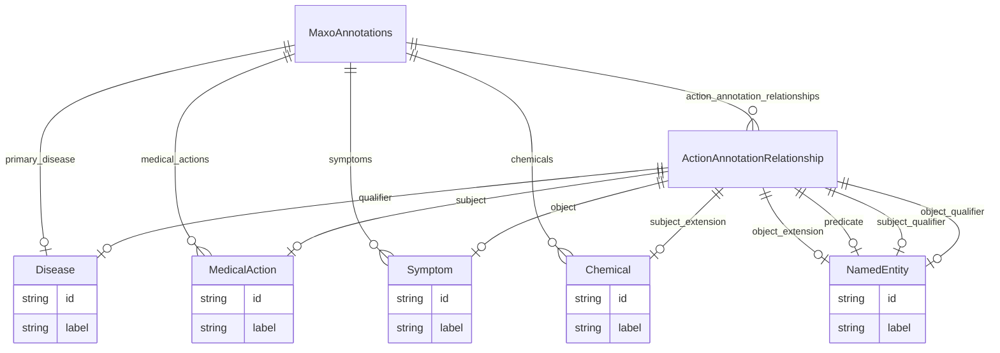

# Class: MaxoAnnotations


URI: [maxo_extract:MaxoAnnotations](http://w3id.org/ontogpt/maxoMaxoAnnotations)





<!-- no inheritance hierarchy -->


## Slots

| Name | Cardinality and Range | Description | Inheritance |
| ---  | --- | --- | --- |
| [primary_disease](primary_disease.md) | 0..1 <br/> [Disease](Disease.md) | The main disease the text is about, or its central disease topic | direct |
| [medical_actions](medical_actions.md) | * <br/> [MedicalAction](MedicalAction.md) | Semicolon-separated list of medical actions | direct |
| [symptoms](symptoms.md) | * <br/> [Symptom](Symptom.md) | Semicolon-separated list of signs or symptoms | direct |
| [chemicals](chemicals.md) | * <br/> [Chemical](Chemical.md) | Semicolon-separated list of chemicals or drugs | direct |
| [action_annotation_relationships](action_annotation_relationships.md) | * <br/> [ActionAnnotationRelationship](ActionAnnotationRelationship.md) | Semicolon-separated list of relationships between a disease, the mentioned si... | direct |


## Identifier and Mapping Information


### Schema Source


* from schema: http://w3id.org/ontogpt/maxo


## Mappings

| Mapping Type | Mapped Value |
| ---  | ---  |
| self | maxo_extract:MaxoAnnotations |
| native | maxo_extract:MaxoAnnotations |


## LinkML Source

<!-- TODO: investigate https://stackoverflow.com/questions/37606292/how-to-create-tabbed-code-blocks-in-mkdocs-or-sphinx -->

### Direct

<details>
```yaml
name: MaxoAnnotations
from_schema: http://w3id.org/ontogpt/maxo
attributes:
  primary_disease:
    name: primary_disease
    description: The main disease the text is about, or its central disease topic.
      This is often the disease mentioned in an article's title or in its first few
      sentences.
    from_schema: http://w3id.org/ontogpt/maxo
    rank: 1000
    domain_of:
    - MaxoAnnotations
    range: Disease
    multivalued: false
  medical_actions:
    name: medical_actions
    annotations:
      prompt:
        tag: prompt
        value: Semicolon-separated list of medical actions, where each is a clinically
          prescribed procedure, therapy, intervention, or recommendation.
    description: Semicolon-separated list of medical actions.
    from_schema: http://w3id.org/ontogpt/maxo
    rank: 1000
    domain_of:
    - MaxoAnnotations
    range: MedicalAction
    multivalued: true
  symptoms:
    name: symptoms
    description: Semicolon-separated list of signs or symptoms.
    from_schema: http://w3id.org/ontogpt/maxo
    rank: 1000
    domain_of:
    - MaxoAnnotations
    range: Symptom
    multivalued: true
  chemicals:
    name: chemicals
    description: Semicolon-separated list of chemicals or drugs
    from_schema: http://w3id.org/ontogpt/maxo
    rank: 1000
    domain_of:
    - MaxoAnnotations
    range: Chemical
    multivalued: true
  action_annotation_relationships:
    name: action_annotation_relationships
    description: Semicolon-separated list of relationships between a disease, the
      mentioned signs and symptoms associated with that disease, the medical actions
      relating to each symptom, and the type of relationship between each action and
      symptom (usually TREATS or PREVENTS). The disease name must be included in the
      relationship, for example, "treatment TREATS symptom IN disease". If the medical
      action includes a specific chemical or drug, include the chemical or drug name
      in the relationship, for example, "treatment (with chemical) TREATS symptom
      IN disease".
    from_schema: http://w3id.org/ontogpt/maxo
    rank: 1000
    domain_of:
    - MaxoAnnotations
    range: ActionAnnotationRelationship
    multivalued: true
tree_root: true

```
</details>

### Induced

<details>
```yaml
name: MaxoAnnotations
from_schema: http://w3id.org/ontogpt/maxo
attributes:
  primary_disease:
    name: primary_disease
    description: The main disease the text is about, or its central disease topic.
      This is often the disease mentioned in an article's title or in its first few
      sentences.
    from_schema: http://w3id.org/ontogpt/maxo
    rank: 1000
    alias: primary_disease
    owner: MaxoAnnotations
    domain_of:
    - MaxoAnnotations
    range: Disease
    multivalued: false
  medical_actions:
    name: medical_actions
    annotations:
      prompt:
        tag: prompt
        value: Semicolon-separated list of medical actions, where each is a clinically
          prescribed procedure, therapy, intervention, or recommendation.
    description: Semicolon-separated list of medical actions.
    from_schema: http://w3id.org/ontogpt/maxo
    rank: 1000
    alias: medical_actions
    owner: MaxoAnnotations
    domain_of:
    - MaxoAnnotations
    range: MedicalAction
    multivalued: true
  symptoms:
    name: symptoms
    description: Semicolon-separated list of signs or symptoms.
    from_schema: http://w3id.org/ontogpt/maxo
    rank: 1000
    alias: symptoms
    owner: MaxoAnnotations
    domain_of:
    - MaxoAnnotations
    range: Symptom
    multivalued: true
  chemicals:
    name: chemicals
    description: Semicolon-separated list of chemicals or drugs
    from_schema: http://w3id.org/ontogpt/maxo
    rank: 1000
    alias: chemicals
    owner: MaxoAnnotations
    domain_of:
    - MaxoAnnotations
    range: Chemical
    multivalued: true
  action_annotation_relationships:
    name: action_annotation_relationships
    description: Semicolon-separated list of relationships between a disease, the
      mentioned signs and symptoms associated with that disease, the medical actions
      relating to each symptom, and the type of relationship between each action and
      symptom (usually TREATS or PREVENTS). The disease name must be included in the
      relationship, for example, "treatment TREATS symptom IN disease". If the medical
      action includes a specific chemical or drug, include the chemical or drug name
      in the relationship, for example, "treatment (with chemical) TREATS symptom
      IN disease".
    from_schema: http://w3id.org/ontogpt/maxo
    rank: 1000
    alias: action_annotation_relationships
    owner: MaxoAnnotations
    domain_of:
    - MaxoAnnotations
    range: ActionAnnotationRelationship
    multivalued: true
tree_root: true

```
</details>