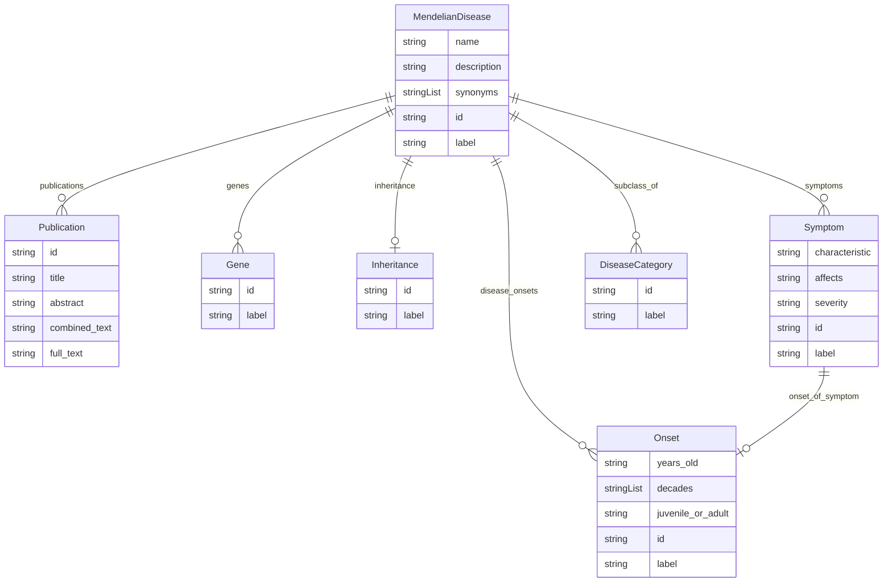

# Class: MendelianDisease


URI: [mendelian_disease:MendelianDisease](http://w3id.org/ontogpt/mendelian_disease/MendelianDisease)





## Inheritance
* [NamedEntity](NamedEntity.md)
    * **MendelianDisease**


## Slots

| Name | Cardinality and Range | Description | Inheritance |
| ---  | --- | --- | --- |
| [name](name.md) | 0..1 <br/> [String](String.md) | the name of the disease | direct |
| [description](description.md) | 0..1 <br/> [String](String.md) | a description of the disease | direct |
| [synonyms](synonyms.md) | * <br/> [String](String.md) |  | direct |
| [subclass_of](subclass_of.md) | * <br/> [DiseaseCategory](DiseaseCategory.md) |  | direct |
| [symptoms](symptoms.md) | * <br/> [Symptom](Symptom.md) |  | direct |
| [inheritance](inheritance.md) | 0..1 <br/> [Inheritance](Inheritance.md) |  | direct |
| [genes](genes.md) | * <br/> [Gene](Gene.md) |  | direct |
| [disease_onsets](disease_onsets.md) | * <br/> [Onset](Onset.md) |  | direct |
| [publications](publications.md) | * <br/> [Publication](Publication.md) |  | direct |
| [id](id.md) | 1 <br/> [String](String.md) | A unique identifier for the named entity | [NamedEntity](NamedEntity.md) |
| [label](label.md) | 0..1 <br/> [String](String.md) | The label (name) of the named thing | [NamedEntity](NamedEntity.md) |


## Identifier and Mapping Information


### Schema Source


* from schema: http://w3id.org/ontogpt/mendelian_disease


## Mappings

| Mapping Type | Mapped Value |
| ---  | ---  |
| self | mendelian_disease:MendelianDisease |
| native | mendelian_disease:MendelianDisease |


## LinkML Source

<!-- TODO: investigate https://stackoverflow.com/questions/37606292/how-to-create-tabbed-code-blocks-in-mkdocs-or-sphinx -->

### Direct

<details>
```yaml
name: MendelianDisease
from_schema: http://w3id.org/ontogpt/mendelian_disease
is_a: NamedEntity
attributes:
  name:
    name: name
    description: the name of the disease
    examples:
    - value: peroxisome biogenesis disorder
    from_schema: http://w3id.org/ontogpt/mendelian_disease
    rank: 1000
    domain_of:
    - MendelianDisease
  description:
    name: description
    description: a description of the disease
    examples:
    - value: Peroxisome biogenesis disorders, Zellweger syndrome spectrum (PBD-ZSS)
        is a group of autosomal recessive disorders affecting the formation of functional
        peroxisomes, characterized by sensorineural hearing loss, pigmentary retinal
        degeneration, multiple organ dysfunction and psychomotor impairment
    from_schema: http://w3id.org/ontogpt/mendelian_disease
    rank: 1000
    domain_of:
    - MendelianDisease
  synonyms:
    name: synonyms
    examples:
    - value: Zellweger syndrome spectrum
    - value: PBD-ZSS
    from_schema: http://w3id.org/ontogpt/mendelian_disease
    rank: 1000
    domain_of:
    - MendelianDisease
    multivalued: true
  subclass_of:
    name: subclass_of
    examples:
    - value: lysosomal disease
    - value: autosomal recessive disorder
    from_schema: http://w3id.org/ontogpt/mendelian_disease
    rank: 1000
    domain_of:
    - MendelianDisease
    range: DiseaseCategory
    multivalued: true
  symptoms:
    name: symptoms
    examples:
    - value: sensorineural hearing loss
    - value: pigmentary retinal degeneration
    from_schema: http://w3id.org/ontogpt/mendelian_disease
    rank: 1000
    domain_of:
    - MendelianDisease
    range: Symptom
    multivalued: true
  inheritance:
    name: inheritance
    examples:
    - value: autosomal recessive
    from_schema: http://w3id.org/ontogpt/mendelian_disease
    rank: 1000
    domain_of:
    - MendelianDisease
    range: Inheritance
  genes:
    name: genes
    annotations:
      prompt:
        tag: prompt
        value: 'semicolon separated list of gene symbols; for example: PEX1; PEX2;
          PEX3'
    examples:
    - value: PEX1
    - value: PEX2
    - value: PEX3
    from_schema: http://w3id.org/ontogpt/mendelian_disease
    rank: 1000
    domain_of:
    - MendelianDisease
    range: Gene
    multivalued: true
  disease_onsets:
    name: disease_onsets
    annotations:
      prompt:
        tag: prompt
        value: 'semi-colon separated list of onsets at which the disease occurs, for
          example: adult; juvenile; first decade'
    from_schema: http://w3id.org/ontogpt/mendelian_disease
    rank: 1000
    domain_of:
    - MendelianDisease
    range: Onset
    multivalued: true
  publications:
    name: publications
    annotations:
      prompt.skip:
        tag: prompt.skip
        value: 'true'
    from_schema: http://w3id.org/ontogpt/mendelian_disease
    rank: 1000
    domain_of:
    - MendelianDisease
    range: Publication
    multivalued: true
tree_root: true

```
</details>

### Induced

<details>
```yaml
name: MendelianDisease
from_schema: http://w3id.org/ontogpt/mendelian_disease
is_a: NamedEntity
attributes:
  name:
    name: name
    description: the name of the disease
    examples:
    - value: peroxisome biogenesis disorder
    from_schema: http://w3id.org/ontogpt/mendelian_disease
    rank: 1000
    alias: name
    owner: MendelianDisease
    domain_of:
    - MendelianDisease
    range: string
  description:
    name: description
    description: a description of the disease
    examples:
    - value: Peroxisome biogenesis disorders, Zellweger syndrome spectrum (PBD-ZSS)
        is a group of autosomal recessive disorders affecting the formation of functional
        peroxisomes, characterized by sensorineural hearing loss, pigmentary retinal
        degeneration, multiple organ dysfunction and psychomotor impairment
    from_schema: http://w3id.org/ontogpt/mendelian_disease
    rank: 1000
    alias: description
    owner: MendelianDisease
    domain_of:
    - MendelianDisease
    range: string
  synonyms:
    name: synonyms
    examples:
    - value: Zellweger syndrome spectrum
    - value: PBD-ZSS
    from_schema: http://w3id.org/ontogpt/mendelian_disease
    rank: 1000
    alias: synonyms
    owner: MendelianDisease
    domain_of:
    - MendelianDisease
    range: string
    multivalued: true
  subclass_of:
    name: subclass_of
    examples:
    - value: lysosomal disease
    - value: autosomal recessive disorder
    from_schema: http://w3id.org/ontogpt/mendelian_disease
    rank: 1000
    alias: subclass_of
    owner: MendelianDisease
    domain_of:
    - MendelianDisease
    range: DiseaseCategory
    multivalued: true
  symptoms:
    name: symptoms
    examples:
    - value: sensorineural hearing loss
    - value: pigmentary retinal degeneration
    from_schema: http://w3id.org/ontogpt/mendelian_disease
    rank: 1000
    alias: symptoms
    owner: MendelianDisease
    domain_of:
    - MendelianDisease
    range: Symptom
    multivalued: true
  inheritance:
    name: inheritance
    examples:
    - value: autosomal recessive
    from_schema: http://w3id.org/ontogpt/mendelian_disease
    rank: 1000
    alias: inheritance
    owner: MendelianDisease
    domain_of:
    - MendelianDisease
    range: Inheritance
  genes:
    name: genes
    annotations:
      prompt:
        tag: prompt
        value: 'semicolon separated list of gene symbols; for example: PEX1; PEX2;
          PEX3'
    examples:
    - value: PEX1
    - value: PEX2
    - value: PEX3
    from_schema: http://w3id.org/ontogpt/mendelian_disease
    rank: 1000
    alias: genes
    owner: MendelianDisease
    domain_of:
    - MendelianDisease
    range: Gene
    multivalued: true
  disease_onsets:
    name: disease_onsets
    annotations:
      prompt:
        tag: prompt
        value: 'semi-colon separated list of onsets at which the disease occurs, for
          example: adult; juvenile; first decade'
    from_schema: http://w3id.org/ontogpt/mendelian_disease
    rank: 1000
    alias: disease_onsets
    owner: MendelianDisease
    domain_of:
    - MendelianDisease
    range: Onset
    multivalued: true
  publications:
    name: publications
    annotations:
      prompt.skip:
        tag: prompt.skip
        value: 'true'
    from_schema: http://w3id.org/ontogpt/mendelian_disease
    rank: 1000
    alias: publications
    owner: MendelianDisease
    domain_of:
    - MendelianDisease
    range: Publication
    multivalued: true
  id:
    name: id
    annotations:
      prompt.skip:
        tag: prompt.skip
        value: 'true'
    description: A unique identifier for the named entity
    comments:
    - this is populated during the grounding and normalization step
    from_schema: http://w3id.org/ontogpt/mendelian_disease
    rank: 1000
    identifier: true
    alias: id
    owner: MendelianDisease
    domain_of:
    - NamedEntity
    - Publication
    range: string
    required: true
  label:
    name: label
    annotations:
      owl:
        tag: owl
        value: AnnotationProperty, AnnotationAssertion
    description: The label (name) of the named thing
    from_schema: http://w3id.org/ontogpt/mendelian_disease
    aliases:
    - name
    rank: 1000
    slot_uri: rdfs:label
    alias: label
    owner: MendelianDisease
    domain_of:
    - NamedEntity
    range: string
tree_root: true

```
</details>