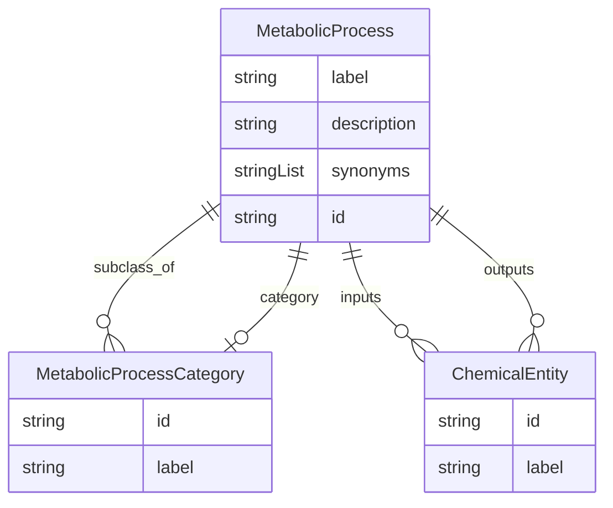

# Class: MetabolicProcess


URI: [bp:MetabolicProcess](http://w3id.org/ontogpt/metabolic-process-templateMetabolicProcess)





## Inheritance
* [NamedEntity](NamedEntity.md)
    * **MetabolicProcess**


## Slots

| Name | Cardinality and Range | Description | Inheritance |
| ---  | --- | --- | --- |
| [label](label.md) | 0..1 <br/> [String](String.md) | the name of the metabolic process | direct |
| [description](description.md) | 0..1 <br/> [String](String.md) | a textual description of the metabolic process | direct |
| [synonyms](synonyms.md) | * <br/> [String](String.md) | alternative names of the metabolic process | direct |
| [subclass_of](subclass_of.md) | * <br/> [MetabolicProcessCategory](MetabolicProcessCategory.md) | a semicolon separated list of broader metabolic processes which this is a sub... | direct |
| [category](category.md) | 0..1 <br/> [MetabolicProcessCategory](MetabolicProcessCategory.md) | the category of metabolic process, e | direct |
| [inputs](inputs.md) | * <br/> [ChemicalEntity](ChemicalEntity.md) | the inputs of the metabolic process | direct |
| [outputs](outputs.md) | * <br/> [ChemicalEntity](ChemicalEntity.md) | the outputs of the metabolic process | direct |
| [id](id.md) | 1 <br/> [String](String.md) | A unique identifier for the named entity | [NamedEntity](NamedEntity.md) |


## Identifier and Mapping Information


### Schema Source


* from schema: https://w3id.org/ontogpt/metabolic_process


## Mappings

| Mapping Type | Mapped Value |
| ---  | ---  |
| self | bp:MetabolicProcess |
| native | bp:MetabolicProcess |


## LinkML Source

<!-- TODO: investigate https://stackoverflow.com/questions/37606292/how-to-create-tabbed-code-blocks-in-mkdocs-or-sphinx -->

### Direct

<details>
```yaml
name: MetabolicProcess
from_schema: https://w3id.org/ontogpt/metabolic_process
is_a: NamedEntity
attributes:
  label:
    name: label
    description: the name of the metabolic process
    from_schema: https://w3id.org/ontogpt/metabolic_process
    rank: 1000
    domain_of:
    - MetabolicProcess
    - NamedEntity
  description:
    name: description
    description: a textual description of the metabolic process
    from_schema: https://w3id.org/ontogpt/metabolic_process
    rank: 1000
    domain_of:
    - MetabolicProcess
  synonyms:
    name: synonyms
    description: alternative names of the metabolic process
    from_schema: https://w3id.org/ontogpt/metabolic_process
    rank: 1000
    multivalued: true
    domain_of:
    - MetabolicProcess
  subclass_of:
    name: subclass_of
    description: a semicolon separated list of broader metabolic processes which this
      is a subclass of
    from_schema: https://w3id.org/ontogpt/metabolic_process
    rank: 1000
    multivalued: true
    domain_of:
    - MetabolicProcess
    range: MetabolicProcessCategory
  category:
    name: category
    description: the category of metabolic process, e.g metabolic process, catabolic
      process, biosynthetic process, small molecule sensor activity
    from_schema: https://w3id.org/ontogpt/metabolic_process
    rank: 1000
    domain_of:
    - MetabolicProcess
    range: MetabolicProcessCategory
  inputs:
    name: inputs
    description: the inputs of the metabolic process
    from_schema: https://w3id.org/ontogpt/metabolic_process
    rank: 1000
    multivalued: true
    domain_of:
    - MetabolicProcess
    range: ChemicalEntity
  outputs:
    name: outputs
    description: the outputs of the metabolic process
    from_schema: https://w3id.org/ontogpt/metabolic_process
    rank: 1000
    multivalued: true
    domain_of:
    - MetabolicProcess
    range: ChemicalEntity

```
</details>

### Induced

<details>
```yaml
name: MetabolicProcess
from_schema: https://w3id.org/ontogpt/metabolic_process
is_a: NamedEntity
attributes:
  label:
    name: label
    description: the name of the metabolic process
    from_schema: https://w3id.org/ontogpt/metabolic_process
    rank: 1000
    alias: label
    owner: MetabolicProcess
    domain_of:
    - MetabolicProcess
    - NamedEntity
    range: string
  description:
    name: description
    description: a textual description of the metabolic process
    from_schema: https://w3id.org/ontogpt/metabolic_process
    rank: 1000
    alias: description
    owner: MetabolicProcess
    domain_of:
    - MetabolicProcess
    range: string
  synonyms:
    name: synonyms
    description: alternative names of the metabolic process
    from_schema: https://w3id.org/ontogpt/metabolic_process
    rank: 1000
    multivalued: true
    alias: synonyms
    owner: MetabolicProcess
    domain_of:
    - MetabolicProcess
    range: string
  subclass_of:
    name: subclass_of
    description: a semicolon separated list of broader metabolic processes which this
      is a subclass of
    from_schema: https://w3id.org/ontogpt/metabolic_process
    rank: 1000
    multivalued: true
    alias: subclass_of
    owner: MetabolicProcess
    domain_of:
    - MetabolicProcess
    range: MetabolicProcessCategory
  category:
    name: category
    description: the category of metabolic process, e.g metabolic process, catabolic
      process, biosynthetic process, small molecule sensor activity
    from_schema: https://w3id.org/ontogpt/metabolic_process
    rank: 1000
    alias: category
    owner: MetabolicProcess
    domain_of:
    - MetabolicProcess
    range: MetabolicProcessCategory
  inputs:
    name: inputs
    description: the inputs of the metabolic process
    from_schema: https://w3id.org/ontogpt/metabolic_process
    rank: 1000
    multivalued: true
    alias: inputs
    owner: MetabolicProcess
    domain_of:
    - MetabolicProcess
    range: ChemicalEntity
  outputs:
    name: outputs
    description: the outputs of the metabolic process
    from_schema: https://w3id.org/ontogpt/metabolic_process
    rank: 1000
    multivalued: true
    alias: outputs
    owner: MetabolicProcess
    domain_of:
    - MetabolicProcess
    range: ChemicalEntity
  id:
    name: id
    annotations:
      prompt.skip:
        tag: prompt.skip
        value: 'true'
    description: A unique identifier for the named entity
    comments:
    - this is populated during the grounding and normalization step
    from_schema: https://w3id.org/ontogpt/metabolic_process
    rank: 1000
    identifier: true
    alias: id
    owner: MetabolicProcess
    domain_of:
    - NamedEntity
    - Publication
    range: string
    required: true

```
</details>