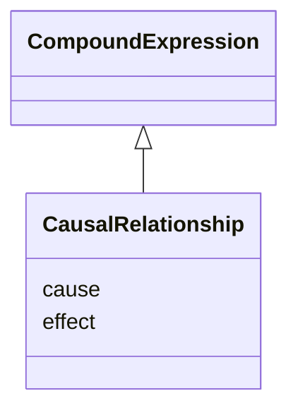

# Class: CausalRelationship


URI: [eg:CausalRelationship](http://w3id.org/ontogpt/environmental-metagenome/CausalRelationship)





## Inheritance
* [CompoundExpression](CompoundExpression.md)
    * **CausalRelationship**


## Slots

| Name | Cardinality and Range | Description | Inheritance |
| ---  | --- | --- | --- |
| [cause](cause.md) | 0..1 <br/> [Variable](Variable.md) | the variable that is the cause of the effect | direct |
| [effect](effect.md) | 0..1 <br/> [Variable](Variable.md) | the things that is affected | direct |


## Usages

| used by | used in | type | used |
| ---  | --- | --- | --- |
| [Study](Study.md) | [causal_relationships](causal_relationships.md) | range | [CausalRelationship](CausalRelationship.md) |


## Identifier and Mapping Information


### Schema Source


* from schema: http://w3id.org/ontogpt/metagenome


## Mappings

| Mapping Type | Mapped Value |
| ---  | ---  |
| self | eg:CausalRelationship |
| native | eg:CausalRelationship |


## LinkML Source

<!-- TODO: investigate https://stackoverflow.com/questions/37606292/how-to-create-tabbed-code-blocks-in-mkdocs-or-sphinx -->

### Direct

<details>
```yaml
name: CausalRelationship
from_schema: http://w3id.org/ontogpt/metagenome
rank: 1000
is_a: CompoundExpression
attributes:
  cause:
    name: cause
    description: the variable that is the cause of the effect
    from_schema: http://w3id.org/ontogpt/metagenome
    rank: 1000
    range: Variable
  effect:
    name: effect
    description: the things that is affected
    from_schema: http://w3id.org/ontogpt/metagenome
    rank: 1000
    range: Variable

```
</details>

### Induced

<details>
```yaml
name: CausalRelationship
from_schema: http://w3id.org/ontogpt/metagenome
rank: 1000
is_a: CompoundExpression
attributes:
  cause:
    name: cause
    description: the variable that is the cause of the effect
    from_schema: http://w3id.org/ontogpt/metagenome
    rank: 1000
    alias: cause
    owner: CausalRelationship
    domain_of:
    - CausalRelationship
    range: Variable
  effect:
    name: effect
    description: the things that is affected
    from_schema: http://w3id.org/ontogpt/metagenome
    rank: 1000
    alias: effect
    owner: CausalRelationship
    domain_of:
    - CausalRelationship
    range: Variable

```
</details>