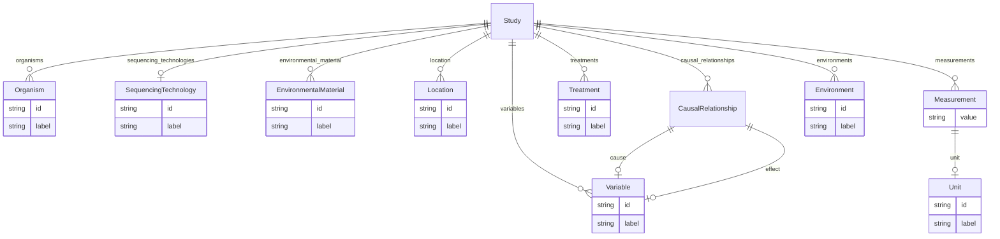

# Class: Study


URI: [eg:Study](http://w3id.org/ontogpt/environmental-metagenome/Study)





<!-- no inheritance hierarchy -->


## Slots

| Name | Cardinality and Range | Description | Inheritance |
| ---  | --- | --- | --- |
| [environments](environments.md) | * <br/> [Environment](Environment.md) |  | direct |
| [causal_relationships](causal_relationships.md) | * <br/> [CausalRelationship](CausalRelationship.md) |  | direct |
| [variables](variables.md) | * <br/> [Variable](Variable.md) |  | direct |
| [treatments](treatments.md) | * <br/> [Treatment](Treatment.md) |  | direct |
| [measurements](measurements.md) | * <br/> [Measurement](Measurement.md) |  | direct |
| [location](location.md) | * <br/> [Location](Location.md) | the sites at which the study was conducted | direct |
| [environmental_material](environmental_material.md) | * <br/> [EnvironmentalMaterial](EnvironmentalMaterial.md) | the environmental material that was sampled | direct |
| [sequencing_technologies](sequencing_technologies.md) | 0..1 <br/> [SequencingTechnology](SequencingTechnology.md) |  | direct |
| [organisms](organisms.md) | * <br/> [Organism](Organism.md) | semicolon-separated list of all studied organism taxons | direct |


## Identifier and Mapping Information


### Schema Source


* from schema: http://w3id.org/ontogpt/metagenome


## Mappings

| Mapping Type | Mapped Value |
| ---  | ---  |
| self | eg:Study |
| native | eg:Study |


## LinkML Source

<!-- TODO: investigate https://stackoverflow.com/questions/37606292/how-to-create-tabbed-code-blocks-in-mkdocs-or-sphinx -->

### Direct

<details>
```yaml
name: Study
from_schema: http://w3id.org/ontogpt/metagenome
attributes:
  environments:
    name: environments
    annotations:
      prompt:
        tag: prompt
        value: semicolon-separated list of environmental systems or biomes in which
          the study was conducted
    from_schema: http://w3id.org/ontogpt/metagenome
    rank: 1000
    multivalued: true
    domain_of:
    - Study
    range: Environment
  causal_relationships:
    name: causal_relationships
    annotations:
      prompt:
        tag: prompt
        value: semicolon-separated list of cause-effect pairs, for example, effect
          of temperature on growth
    from_schema: http://w3id.org/ontogpt/metagenome
    rank: 1000
    multivalued: true
    domain_of:
    - Study
    range: CausalRelationship
  variables:
    name: variables
    annotations:
      prompt:
        tag: prompt
        value: semicolon-separated list of environmental variables which are studies.
          E.g. temperature, pH, salinity
    from_schema: http://w3id.org/ontogpt/metagenome
    rank: 1000
    multivalued: true
    domain_of:
    - Study
    range: Variable
  treatments:
    name: treatments
    annotations:
      prompt:
        tag: prompt
        value: semicolon-separated list of treatments that are applied
    from_schema: http://w3id.org/ontogpt/metagenome
    rank: 1000
    multivalued: true
    domain_of:
    - Study
    range: Treatment
  measurements:
    name: measurements
    annotations:
      prompt:
        tag: prompt
        value: semicolon-separated list of value-measurement pairs
    from_schema: http://w3id.org/ontogpt/metagenome
    rank: 1000
    multivalued: true
    domain_of:
    - Study
    range: Measurement
  location:
    name: location
    annotations:
      prompt:
        tag: prompt
        value: semicolon-separated list of sites at which the study was conducted
    description: the sites at which the study was conducted
    from_schema: http://w3id.org/ontogpt/metagenome
    rank: 1000
    multivalued: true
    domain_of:
    - Study
    range: Location
  environmental_material:
    name: environmental_material
    annotations:
      prompt:
        tag: prompt
        value: semicolon-separated list of environmental materials
    description: the environmental material that was sampled
    from_schema: http://w3id.org/ontogpt/metagenome
    rank: 1000
    multivalued: true
    domain_of:
    - Study
    range: EnvironmentalMaterial
  sequencing_technologies:
    name: sequencing_technologies
    annotations:
      prompt:
        tag: prompt
        value: semicolon-separated list of  sequencing technologies used in the project
    from_schema: http://w3id.org/ontogpt/metagenome
    rank: 1000
    domain_of:
    - Study
    range: SequencingTechnology
  organisms:
    name: organisms
    description: semicolon-separated list of all studied organism taxons
    from_schema: http://w3id.org/ontogpt/metagenome
    rank: 1000
    multivalued: true
    domain_of:
    - Study
    range: Organism

```
</details>

### Induced

<details>
```yaml
name: Study
from_schema: http://w3id.org/ontogpt/metagenome
attributes:
  environments:
    name: environments
    annotations:
      prompt:
        tag: prompt
        value: semicolon-separated list of environmental systems or biomes in which
          the study was conducted
    from_schema: http://w3id.org/ontogpt/metagenome
    rank: 1000
    multivalued: true
    alias: environments
    owner: Study
    domain_of:
    - Study
    range: Environment
  causal_relationships:
    name: causal_relationships
    annotations:
      prompt:
        tag: prompt
        value: semicolon-separated list of cause-effect pairs, for example, effect
          of temperature on growth
    from_schema: http://w3id.org/ontogpt/metagenome
    rank: 1000
    multivalued: true
    alias: causal_relationships
    owner: Study
    domain_of:
    - Study
    range: CausalRelationship
  variables:
    name: variables
    annotations:
      prompt:
        tag: prompt
        value: semicolon-separated list of environmental variables which are studies.
          E.g. temperature, pH, salinity
    from_schema: http://w3id.org/ontogpt/metagenome
    rank: 1000
    multivalued: true
    alias: variables
    owner: Study
    domain_of:
    - Study
    range: Variable
  treatments:
    name: treatments
    annotations:
      prompt:
        tag: prompt
        value: semicolon-separated list of treatments that are applied
    from_schema: http://w3id.org/ontogpt/metagenome
    rank: 1000
    multivalued: true
    alias: treatments
    owner: Study
    domain_of:
    - Study
    range: Treatment
  measurements:
    name: measurements
    annotations:
      prompt:
        tag: prompt
        value: semicolon-separated list of value-measurement pairs
    from_schema: http://w3id.org/ontogpt/metagenome
    rank: 1000
    multivalued: true
    alias: measurements
    owner: Study
    domain_of:
    - Study
    range: Measurement
  location:
    name: location
    annotations:
      prompt:
        tag: prompt
        value: semicolon-separated list of sites at which the study was conducted
    description: the sites at which the study was conducted
    from_schema: http://w3id.org/ontogpt/metagenome
    rank: 1000
    multivalued: true
    alias: location
    owner: Study
    domain_of:
    - Study
    range: Location
  environmental_material:
    name: environmental_material
    annotations:
      prompt:
        tag: prompt
        value: semicolon-separated list of environmental materials
    description: the environmental material that was sampled
    from_schema: http://w3id.org/ontogpt/metagenome
    rank: 1000
    multivalued: true
    alias: environmental_material
    owner: Study
    domain_of:
    - Study
    range: EnvironmentalMaterial
  sequencing_technologies:
    name: sequencing_technologies
    annotations:
      prompt:
        tag: prompt
        value: semicolon-separated list of  sequencing technologies used in the project
    from_schema: http://w3id.org/ontogpt/metagenome
    rank: 1000
    alias: sequencing_technologies
    owner: Study
    domain_of:
    - Study
    range: SequencingTechnology
  organisms:
    name: organisms
    description: semicolon-separated list of all studied organism taxons
    from_schema: http://w3id.org/ontogpt/metagenome
    rank: 1000
    multivalued: true
    alias: organisms
    owner: Study
    domain_of:
    - Study
    range: Organism

```
</details>