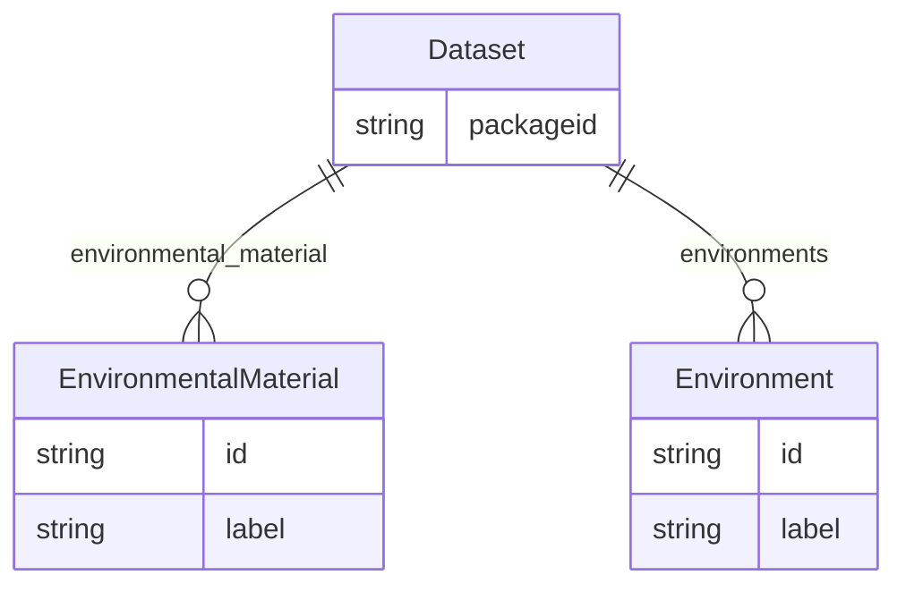

# Class: Dataset


URI: [nmdcsd:Dataset](http://w3id.org/ontogpt/nmdc-schema-dataDataset)





<!-- no inheritance hierarchy -->


## Slots

| Name | Cardinality and Range | Description | Inheritance |
| ---  | --- | --- | --- |
| [packageid](packageid.md) | 0..1 <br/> [String](String.md) | The internal identifier for the dataset | direct |
| [environmental_material](environmental_material.md) | * <br/> [EnvironmentalMaterial](EnvironmentalMaterial.md) | the environmental material that was sampled | direct |
| [environments](environments.md) | * <br/> [Environment](Environment.md) | the environmental context in which the study was conducted | direct |


## Identifier and Mapping Information


### Schema Source


* from schema: http://w3id.org/ontogpt/nmdc-schema-data


## Mappings

| Mapping Type | Mapped Value |
| ---  | ---  |
| self | nmdcsd:Dataset |
| native | nmdcsd:Dataset |


## LinkML Source

<!-- TODO: investigate https://stackoverflow.com/questions/37606292/how-to-create-tabbed-code-blocks-in-mkdocs-or-sphinx -->

### Direct

<details>
```yaml
name: Dataset
from_schema: http://w3id.org/ontogpt/nmdc-schema-data
attributes:
  packageid:
    name: packageid
    annotations:
      prompt:
        tag: prompt
        value: single unique identifier for the dataset
    description: The internal identifier for the dataset
    from_schema: http://w3id.org/ontogpt/nmdc-schema-data
    rank: 1000
    multivalued: false
    domain_of:
    - Dataset
    range: string
  environmental_material:
    name: environmental_material
    annotations:
      prompt:
        tag: prompt
        value: semicolon-separated list of environmental materials
    description: the environmental material that was sampled
    from_schema: http://w3id.org/ontogpt/nmdc-schema-data
    rank: 1000
    multivalued: true
    domain_of:
    - Dataset
    range: EnvironmentalMaterial
  environments:
    name: environments
    annotations:
      prompt:
        tag: prompt
        value: semicolon-separated list of environmental contexts in which the study
          was conducted
    description: the environmental context in which the study was conducted
    from_schema: http://w3id.org/ontogpt/nmdc-schema-data
    rank: 1000
    multivalued: true
    domain_of:
    - Dataset
    range: Environment
tree_root: true

```
</details>

### Induced

<details>
```yaml
name: Dataset
from_schema: http://w3id.org/ontogpt/nmdc-schema-data
attributes:
  packageid:
    name: packageid
    annotations:
      prompt:
        tag: prompt
        value: single unique identifier for the dataset
    description: The internal identifier for the dataset
    from_schema: http://w3id.org/ontogpt/nmdc-schema-data
    rank: 1000
    multivalued: false
    alias: packageid
    owner: Dataset
    domain_of:
    - Dataset
    range: string
  environmental_material:
    name: environmental_material
    annotations:
      prompt:
        tag: prompt
        value: semicolon-separated list of environmental materials
    description: the environmental material that was sampled
    from_schema: http://w3id.org/ontogpt/nmdc-schema-data
    rank: 1000
    multivalued: true
    alias: environmental_material
    owner: Dataset
    domain_of:
    - Dataset
    range: EnvironmentalMaterial
  environments:
    name: environments
    annotations:
      prompt:
        tag: prompt
        value: semicolon-separated list of environmental contexts in which the study
          was conducted
    description: the environmental context in which the study was conducted
    from_schema: http://w3id.org/ontogpt/nmdc-schema-data
    rank: 1000
    multivalued: true
    alias: environments
    owner: Dataset
    domain_of:
    - Dataset
    range: Environment
tree_root: true

```
</details>