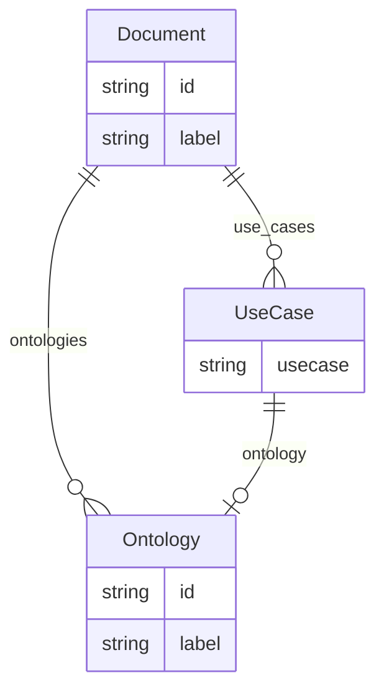

# Class: Document


URI: [onto_usage:Document](http://w3id.org/ontogpt/onto_usageDocument)





## Inheritance
* [NamedEntity](NamedEntity.md)
    * **Document**


## Slots

| Name | Cardinality and Range | Description | Inheritance |
| ---  | --- | --- | --- |
| [ontologies](ontologies.md) | * <br/> [Ontology](Ontology.md) |  | direct |
| [use_cases](use_cases.md) | * <br/> [UseCase](UseCase.md) |  | direct |
| [id](id.md) | 1 <br/> [String](String.md) | A unique identifier for the named entity | [NamedEntity](NamedEntity.md) |
| [label](label.md) | 0..1 <br/> [String](String.md) | The label (name) of the named thing | [NamedEntity](NamedEntity.md) |


## Identifier and Mapping Information


### Schema Source


* from schema: http://w3id.org/ontogpt/onto_usage


## Mappings

| Mapping Type | Mapped Value |
| ---  | ---  |
| self | onto_usage:Document |
| native | onto_usage:Document |


## LinkML Source

<!-- TODO: investigate https://stackoverflow.com/questions/37606292/how-to-create-tabbed-code-blocks-in-mkdocs-or-sphinx -->

### Direct

<details>
```yaml
name: Document
from_schema: http://w3id.org/ontogpt/onto_usage
is_a: NamedEntity
attributes:
  ontologies:
    name: ontologies
    annotations:
      prompt:
        tag: prompt
        value: A semicolon-delimited list of all ontologies mentioned in the text,
          either in name or abbreviation. For example, "Gene Ontology", "GO", "Human
          Phenotype Ontology", "HPO". Include all ontologies, even if they are not
          the focus of a specific use case.
    from_schema: http://w3id.org/ontogpt/onto_usage
    rank: 1000
    domain_of:
    - Document
    range: Ontology
    multivalued: true
  use_cases:
    name: use_cases
    annotations:
      prompt:
        tag: prompt
        value: A semicolon-delimited list of all use cases mentioned in the text.
          A use case is a specific application or context in which an ontology is
          used. For example, "Gene Ontology USED FOR gene function prediction", "MONDO
          Disease Ontology USED FOR disease diagnosis"
    from_schema: http://w3id.org/ontogpt/onto_usage
    rank: 1000
    domain_of:
    - Document
    range: UseCase
    multivalued: true
tree_root: true

```
</details>

### Induced

<details>
```yaml
name: Document
from_schema: http://w3id.org/ontogpt/onto_usage
is_a: NamedEntity
attributes:
  ontologies:
    name: ontologies
    annotations:
      prompt:
        tag: prompt
        value: A semicolon-delimited list of all ontologies mentioned in the text,
          either in name or abbreviation. For example, "Gene Ontology", "GO", "Human
          Phenotype Ontology", "HPO". Include all ontologies, even if they are not
          the focus of a specific use case.
    from_schema: http://w3id.org/ontogpt/onto_usage
    rank: 1000
    alias: ontologies
    owner: Document
    domain_of:
    - Document
    range: Ontology
    multivalued: true
  use_cases:
    name: use_cases
    annotations:
      prompt:
        tag: prompt
        value: A semicolon-delimited list of all use cases mentioned in the text.
          A use case is a specific application or context in which an ontology is
          used. For example, "Gene Ontology USED FOR gene function prediction", "MONDO
          Disease Ontology USED FOR disease diagnosis"
    from_schema: http://w3id.org/ontogpt/onto_usage
    rank: 1000
    alias: use_cases
    owner: Document
    domain_of:
    - Document
    range: UseCase
    multivalued: true
  id:
    name: id
    annotations:
      prompt.skip:
        tag: prompt.skip
        value: 'true'
    description: A unique identifier for the named entity
    comments:
    - this is populated during the grounding and normalization step
    from_schema: http://w3id.org/ontogpt/onto_usage
    rank: 1000
    identifier: true
    alias: id
    owner: Document
    domain_of:
    - NamedEntity
    - Publication
    range: string
    required: true
  label:
    name: label
    annotations:
      owl:
        tag: owl
        value: AnnotationProperty, AnnotationAssertion
    description: The label (name) of the named thing
    from_schema: http://w3id.org/ontogpt/onto_usage
    aliases:
    - name
    rank: 1000
    slot_uri: rdfs:label
    alias: label
    owner: Document
    domain_of:
    - NamedEntity
    range: string
tree_root: true

```
</details>