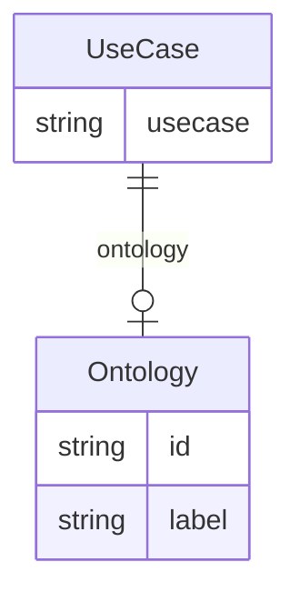

# Class: UseCase


URI: [onto_usage:UseCase](http://w3id.org/ontogpt/onto_usageUseCase)





## Inheritance
* [CompoundExpression](CompoundExpression.md)
    * **UseCase**


## Slots

| Name | Cardinality and Range | Description | Inheritance |
| ---  | --- | --- | --- |
| [ontology](ontology.md) | 0..1 <br/> [Ontology](Ontology.md) | The ontology involved in a specific use case | direct |
| [usecase](usecase.md) | 0..1 <br/> [String](String.md) | A short description of the use case, in one or two sentences | direct |


## Usages

| used by | used in | type | used |
| ---  | --- | --- | --- |
| [Document](Document.md) | [use_cases](use_cases.md) | range | [UseCase](UseCase.md) |


## Identifier and Mapping Information


### Annotations

| property | value |
| --- | --- |
| owl | IntersectionOf |


### Schema Source


* from schema: http://w3id.org/ontogpt/onto_usage


## Mappings

| Mapping Type | Mapped Value |
| ---  | ---  |
| self | onto_usage:UseCase |
| native | onto_usage:UseCase |


## LinkML Source

<!-- TODO: investigate https://stackoverflow.com/questions/37606292/how-to-create-tabbed-code-blocks-in-mkdocs-or-sphinx -->

### Direct

<details>
```yaml
name: UseCase
annotations:
  owl:
    tag: owl
    value: IntersectionOf
from_schema: http://w3id.org/ontogpt/onto_usage
is_a: CompoundExpression
attributes:
  ontology:
    name: ontology
    description: The ontology involved in a specific use case.
    from_schema: http://w3id.org/ontogpt/onto_usage
    rank: 1000
    domain_of:
    - UseCase
    range: Ontology
  usecase:
    name: usecase
    description: A short description of the use case, in one or two sentences.
    from_schema: http://w3id.org/ontogpt/onto_usage
    rank: 1000
    domain_of:
    - UseCase
    range: string

```
</details>

### Induced

<details>
```yaml
name: UseCase
annotations:
  owl:
    tag: owl
    value: IntersectionOf
from_schema: http://w3id.org/ontogpt/onto_usage
is_a: CompoundExpression
attributes:
  ontology:
    name: ontology
    description: The ontology involved in a specific use case.
    from_schema: http://w3id.org/ontogpt/onto_usage
    rank: 1000
    alias: ontology
    owner: UseCase
    domain_of:
    - UseCase
    range: Ontology
  usecase:
    name: usecase
    description: A short description of the use case, in one or two sentences.
    from_schema: http://w3id.org/ontogpt/onto_usage
    rank: 1000
    alias: usecase
    owner: UseCase
    domain_of:
    - UseCase
    range: string

```
</details>