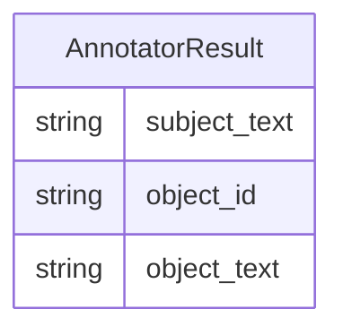

# Class: AnnotatorResult


URI: [oc:AnnotatorResult](http://w3id.org/ontogpt/ontology-class-templateAnnotatorResult)





<!-- no inheritance hierarchy -->


## Slots

| Name | Cardinality and Range | Description | Inheritance |
| ---  | --- | --- | --- |
| [subject_text](subject_text.md) | 0..1 <br/> [String](String.md) |  | direct |
| [object_id](object_id.md) | 0..1 <br/> [String](String.md) |  | direct |
| [object_text](object_text.md) | 0..1 <br/> [String](String.md) |  | direct |


## Identifier and Mapping Information


### Schema Source


* from schema: https://w3id.org/ontogpt/ontology_class


## Mappings

| Mapping Type | Mapped Value |
| ---  | ---  |
| self | oc:AnnotatorResult |
| native | oc:AnnotatorResult |


## LinkML Source

<!-- TODO: investigate https://stackoverflow.com/questions/37606292/how-to-create-tabbed-code-blocks-in-mkdocs-or-sphinx -->

### Direct

<details>
```yaml
name: AnnotatorResult
from_schema: https://w3id.org/ontogpt/ontology_class
rank: 1000
attributes:
  subject_text:
    name: subject_text
    from_schema: https://w3id.org/ontogpt/ontology_class
    rank: 1000
  object_id:
    name: object_id
    from_schema: https://w3id.org/ontogpt/ontology_class
    rank: 1000
  object_text:
    name: object_text
    from_schema: https://w3id.org/ontogpt/ontology_class
    rank: 1000

```
</details>

### Induced

<details>
```yaml
name: AnnotatorResult
from_schema: https://w3id.org/ontogpt/ontology_class
rank: 1000
attributes:
  subject_text:
    name: subject_text
    from_schema: https://w3id.org/ontogpt/ontology_class
    rank: 1000
    alias: subject_text
    owner: AnnotatorResult
    domain_of:
    - AnnotatorResult
    range: string
  object_id:
    name: object_id
    from_schema: https://w3id.org/ontogpt/ontology_class
    rank: 1000
    alias: object_id
    owner: AnnotatorResult
    domain_of:
    - AnnotatorResult
    range: string
  object_text:
    name: object_text
    from_schema: https://w3id.org/ontogpt/ontology_class
    rank: 1000
    alias: object_text
    owner: AnnotatorResult
    domain_of:
    - AnnotatorResult
    range: string

```
</details>