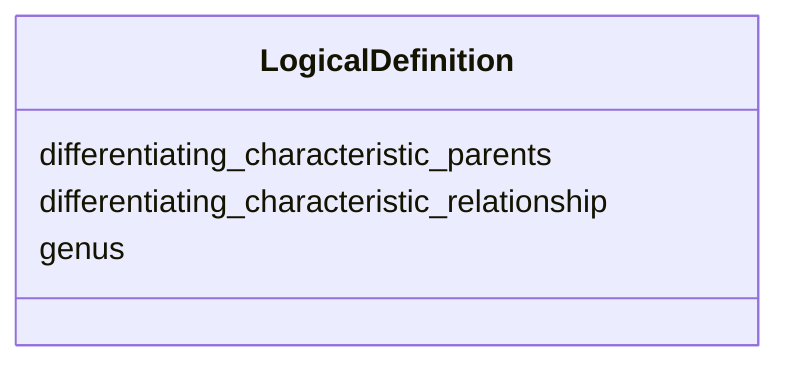

# Class: LogicalDefinition


URI: [oc:LogicalDefinition](http://w3id.org/ontogpt/ontology-class-templateLogicalDefinition)





<!-- no inheritance hierarchy -->


## Slots

| Name | Cardinality and Range | Description | Inheritance |
| ---  | --- | --- | --- |
| [genus](genus.md) | 0..* <br/> [OntologyClass](OntologyClass.md) |  | direct |
| [differentiating_characteristic_relationship](differentiating_characteristic_relationship.md) | 0..1 <br/> [Relation](Relation.md) |  | direct |
| [differentiating_characteristic_parents](differentiating_characteristic_parents.md) | 0..* <br/> [OntologyClass](OntologyClass.md) |  | direct |


## Usages

| used by | used in | type | used |
| ---  | --- | --- | --- |
| [OntologyClass](OntologyClass.md) | [logical_definition](logical_definition.md) | range | [LogicalDefinition](LogicalDefinition.md) |


## Identifier and Mapping Information


### Schema Source


* from schema: https://w3id.org/ontogpt/ontology_class


## Mappings

| Mapping Type | Mapped Value |
| ---  | ---  |
| self | oc:LogicalDefinition |
| native | oc:LogicalDefinition |


## LinkML Source

<!-- TODO: investigate https://stackoverflow.com/questions/37606292/how-to-create-tabbed-code-blocks-in-mkdocs-or-sphinx -->

### Direct

<details>
```yaml
name: LogicalDefinition
from_schema: https://w3id.org/ontogpt/ontology_class
rank: 1000
attributes:
  genus:
    name: genus
    annotations:
      prompt:
        tag: prompt
        value: in a logical definition expression, this is the parent (genus) class,
          e.g. bone
    from_schema: https://w3id.org/ontogpt/ontology_class
    rank: 1000
    multivalued: true
    range: OntologyClass
  differentiating_characteristic_relationship:
    name: differentiating_characteristic_relationship
    annotations:
      prompt:
        tag: prompt
        value: in a logical definition expression, this is the parent (differentiating
          characteristic) relationship type, e.g. part of
    from_schema: https://w3id.org/ontogpt/ontology_class
    rank: 1000
    range: Relation
  differentiating_characteristic_parents:
    name: differentiating_characteristic_parents
    annotations:
      prompt:
        tag: prompt
        value: in a logical definition expression, this the parent (differentiating
          characteristic) class, e.g. hand
    from_schema: https://w3id.org/ontogpt/ontology_class
    rank: 1000
    multivalued: true
    range: OntologyClass

```
</details>

### Induced

<details>
```yaml
name: LogicalDefinition
from_schema: https://w3id.org/ontogpt/ontology_class
rank: 1000
attributes:
  genus:
    name: genus
    annotations:
      prompt:
        tag: prompt
        value: in a logical definition expression, this is the parent (genus) class,
          e.g. bone
    from_schema: https://w3id.org/ontogpt/ontology_class
    rank: 1000
    multivalued: true
    alias: genus
    owner: LogicalDefinition
    domain_of:
    - LogicalDefinition
    range: OntologyClass
  differentiating_characteristic_relationship:
    name: differentiating_characteristic_relationship
    annotations:
      prompt:
        tag: prompt
        value: in a logical definition expression, this is the parent (differentiating
          characteristic) relationship type, e.g. part of
    from_schema: https://w3id.org/ontogpt/ontology_class
    rank: 1000
    alias: differentiating_characteristic_relationship
    owner: LogicalDefinition
    domain_of:
    - LogicalDefinition
    range: Relation
  differentiating_characteristic_parents:
    name: differentiating_characteristic_parents
    annotations:
      prompt:
        tag: prompt
        value: in a logical definition expression, this the parent (differentiating
          characteristic) class, e.g. hand
    from_schema: https://w3id.org/ontogpt/ontology_class
    rank: 1000
    multivalued: true
    alias: differentiating_characteristic_parents
    owner: LogicalDefinition
    domain_of:
    - LogicalDefinition
    range: OntologyClass

```
</details>