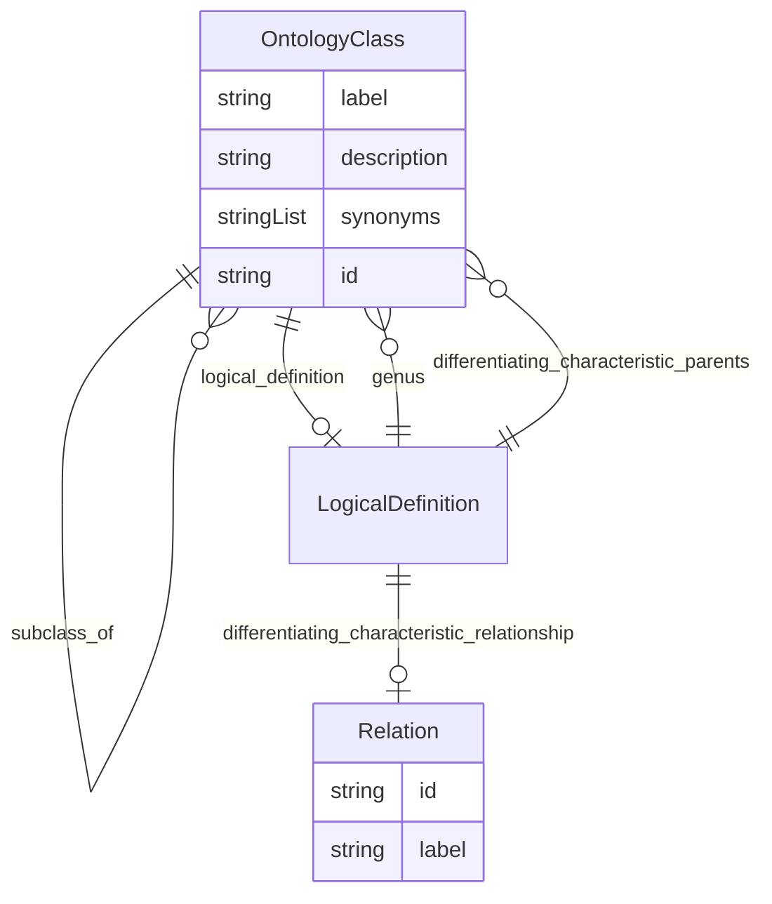

# Class: OntologyClass


URI: [oc:OntologyClass](http://w3id.org/ontogpt/ontology-class-templateOntologyClass)





## Inheritance
* [NamedEntity](NamedEntity.md)
    * **OntologyClass**


## Slots

| Name | Cardinality and Range | Description | Inheritance |
| ---  | --- | --- | --- |
| [label](label.md) | 0..1 <br/> [String](String.md) |  | direct |
| [description](description.md) | 0..1 <br/> [String](String.md) | a textual description of the entity | direct |
| [synonyms](synonyms.md) | 0..* <br/> [String](String.md) | alternative names of the entity | direct |
| [categories](categories.md) | 0..* <br/> [OntologyClass](OntologyClass.md) | the categories to which this entity belongs | direct |
| [subclass_of](subclass_of.md) | 0..* <br/> [OntologyClass](OntologyClass.md) |  | direct |
| [logical_definition](logical_definition.md) | 0..1 <br/> [LogicalDefinition](LogicalDefinition.md) | the necessary and sufficient conditions for this entity to be an instance of ... | direct |
| [id](id.md) | 1..1 <br/> [String](String.md) | A unique identifier for the named entity | [NamedEntity](NamedEntity.md) |


## Usages

| used by | used in | type | used |
| ---  | --- | --- | --- |
| [OntologyClass](OntologyClass.md) | [categories](categories.md) | range | [OntologyClass](OntologyClass.md) |
| [OntologyClass](OntologyClass.md) | [subclass_of](subclass_of.md) | range | [OntologyClass](OntologyClass.md) |
| [LogicalDefinition](LogicalDefinition.md) | [genus](genus.md) | range | [OntologyClass](OntologyClass.md) |
| [LogicalDefinition](LogicalDefinition.md) | [differentiating_characteristic_parents](differentiating_characteristic_parents.md) | range | [OntologyClass](OntologyClass.md) |


## Identifier and Mapping Information


### Schema Source


* from schema: https://w3id.org/ontogpt/ontology_class


## Mappings

| Mapping Type | Mapped Value |
| ---  | ---  |
| self | oc:OntologyClass |
| native | oc:OntologyClass |


## LinkML Source

<!-- TODO: investigate https://stackoverflow.com/questions/37606292/how-to-create-tabbed-code-blocks-in-mkdocs-or-sphinx -->

### Direct

<details>
```yaml
name: OntologyClass
from_schema: https://w3id.org/ontogpt/ontology_class
rank: 1000
is_a: NamedEntity
attributes:
  label:
    name: label
    description: the name of the main entity being defined
    from_schema: https://w3id.org/ontogpt/ontology_class
    rank: 1000
  description:
    name: description
    description: a textual description of the entity
    from_schema: https://w3id.org/ontogpt/ontology_class
    rank: 1000
  synonyms:
    name: synonyms
    description: alternative names of the entity
    from_schema: https://w3id.org/ontogpt/ontology_class
    rank: 1000
    multivalued: true
  categories:
    name: categories
    annotations:
      prompt:
        tag: prompt
        value: semicolon-separated list of categories to which the entity belongs.
          These may be taken from an upper level ontology such as COB, BioLink, or
          UMLS semantic types.
    description: the categories to which this entity belongs.
    from_schema: https://w3id.org/ontogpt/ontology_class
    rank: 1000
    multivalued: true
    range: OntologyClass
  subclass_of:
    name: subclass_of
    annotations:
      prompt:
        tag: prompt
        value: semicolon-separated list of parent classes, indicating broader concepts.
          E.g. if the input text is "a type of bone", then the parent class is "bone"
    from_schema: https://w3id.org/ontogpt/ontology_class
    rank: 1000
    multivalued: true
    range: OntologyClass
  logical_definition:
    name: logical_definition
    annotations:
      prompt:
        tag: prompt
        value: the necessary and sufficient conditions for this entity to be an instance
          of this class, written in OWL manchester syntax, e.g. bone and (part_of
          some 'hand')
    description: the necessary and sufficient conditions for this entity to be an
      instance of this class
    from_schema: https://w3id.org/ontogpt/ontology_class
    rank: 1000
    range: LogicalDefinition
tree_root: true

```
</details>

### Induced

<details>
```yaml
name: OntologyClass
from_schema: https://w3id.org/ontogpt/ontology_class
rank: 1000
is_a: NamedEntity
attributes:
  label:
    name: label
    description: the name of the main entity being defined
    from_schema: https://w3id.org/ontogpt/ontology_class
    rank: 1000
    alias: label
    owner: OntologyClass
    domain_of:
    - OntologyClass
    - NamedEntity
    range: string
  description:
    name: description
    description: a textual description of the entity
    from_schema: https://w3id.org/ontogpt/ontology_class
    rank: 1000
    alias: description
    owner: OntologyClass
    domain_of:
    - OntologyClass
    range: string
  synonyms:
    name: synonyms
    description: alternative names of the entity
    from_schema: https://w3id.org/ontogpt/ontology_class
    rank: 1000
    multivalued: true
    alias: synonyms
    owner: OntologyClass
    domain_of:
    - OntologyClass
    range: string
  categories:
    name: categories
    annotations:
      prompt:
        tag: prompt
        value: semicolon-separated list of categories to which the entity belongs.
          These may be taken from an upper level ontology such as COB, BioLink, or
          UMLS semantic types.
    description: the categories to which this entity belongs.
    from_schema: https://w3id.org/ontogpt/ontology_class
    rank: 1000
    multivalued: true
    alias: categories
    owner: OntologyClass
    domain_of:
    - OntologyClass
    range: OntologyClass
  subclass_of:
    name: subclass_of
    annotations:
      prompt:
        tag: prompt
        value: semicolon-separated list of parent classes, indicating broader concepts.
          E.g. if the input text is "a type of bone", then the parent class is "bone"
    from_schema: https://w3id.org/ontogpt/ontology_class
    rank: 1000
    multivalued: true
    alias: subclass_of
    owner: OntologyClass
    domain_of:
    - OntologyClass
    range: OntologyClass
  logical_definition:
    name: logical_definition
    annotations:
      prompt:
        tag: prompt
        value: the necessary and sufficient conditions for this entity to be an instance
          of this class, written in OWL manchester syntax, e.g. bone and (part_of
          some 'hand')
    description: the necessary and sufficient conditions for this entity to be an
      instance of this class
    from_schema: https://w3id.org/ontogpt/ontology_class
    rank: 1000
    alias: logical_definition
    owner: OntologyClass
    domain_of:
    - OntologyClass
    range: LogicalDefinition
  id:
    name: id
    annotations:
      prompt.skip:
        tag: prompt.skip
        value: 'true'
    description: A unique identifier for the named entity
    comments:
    - this is populated during the grounding and normalization step
    from_schema: https://w3id.org/ontogpt/ontology_class
    rank: 1000
    identifier: true
    alias: id
    owner: OntologyClass
    domain_of:
    - NamedEntity
    - Publication
    range: string
tree_root: true

```
</details>