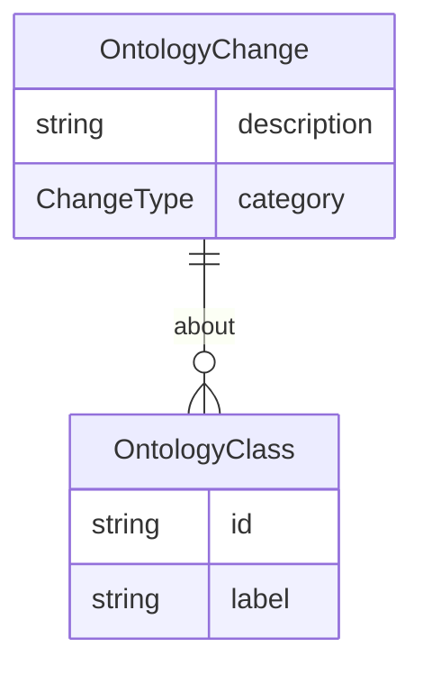

# Class: OntologyChange


URI: [oc:OntologyChange](http://w3id.org/ontogpt/ontology-class-templateOntologyChange)





## Inheritance
* [CompoundExpression](CompoundExpression.md)
    * **OntologyChange**


## Slots

| Name | Cardinality and Range | Description | Inheritance |
| ---  | --- | --- | --- |
| [description](description.md) | 0..1 <br/> [String](String.md) |  | direct |
| [category](category.md) | 0..1 <br/> [String](String.md) |  | direct |
| [about](about.md) | 0..1 <br/> [String](String.md) |  | direct |


## Usages

| used by | used in | type | used |
| ---  | --- | --- | --- |
| [OntologyIssue](OntologyIssue.md) | [proposed_changes](proposed_changes.md) | range | [OntologyChange](OntologyChange.md) |


## Identifier and Mapping Information


### Schema Source


* from schema: https://w3id.org/ontogpt/ontology_issue


## Mappings

| Mapping Type | Mapped Value |
| ---  | ---  |
| self | oc:OntologyChange |
| native | oc:OntologyChange |


## LinkML Source

<!-- TODO: investigate https://stackoverflow.com/questions/37606292/how-to-create-tabbed-code-blocks-in-mkdocs-or-sphinx -->

### Direct

<details>
```yaml
name: OntologyChange
from_schema: https://w3id.org/ontogpt/ontology_issue
rank: 1000
is_a: CompoundExpression
attributes:
  description:
    name: description
    description: A succinct description of the proposed change
    from_schema: https://w3id.org/ontogpt/ontology_issue
  category:
    name: category
    description: What kind of change?
    from_schema: https://w3id.org/ontogpt/ontology_issue
    range: ChangeType
  about:
    name: about
    annotations:
      prompt:
        tag: prompt
        value: semicolon-separated list of specific terms in the ontology which will
          be affected by the change.
    description: What terms in the ontology will this change affect?
    from_schema: https://w3id.org/ontogpt/ontology_issue
    multivalued: true
    range: OntologyClass

```
</details>

### Induced

<details>
```yaml
name: OntologyChange
from_schema: https://w3id.org/ontogpt/ontology_issue
rank: 1000
is_a: CompoundExpression
attributes:
  description:
    name: description
    description: A succinct description of the proposed change
    from_schema: https://w3id.org/ontogpt/ontology_issue
    alias: description
    owner: OntologyChange
    domain_of:
    - OntologyProblem
    - OntologyChange
    range: string
  category:
    name: category
    description: What kind of change?
    from_schema: https://w3id.org/ontogpt/ontology_issue
    alias: category
    owner: OntologyChange
    domain_of:
    - OntologyProblem
    - OntologyChange
    range: ChangeType
  about:
    name: about
    annotations:
      prompt:
        tag: prompt
        value: semicolon-separated list of specific terms in the ontology which will
          be affected by the change.
    description: What terms in the ontology will this change affect?
    from_schema: https://w3id.org/ontogpt/ontology_issue
    multivalued: true
    alias: about
    owner: OntologyChange
    domain_of:
    - OntologyProblem
    - OntologyChange
    range: OntologyClass

```
</details>