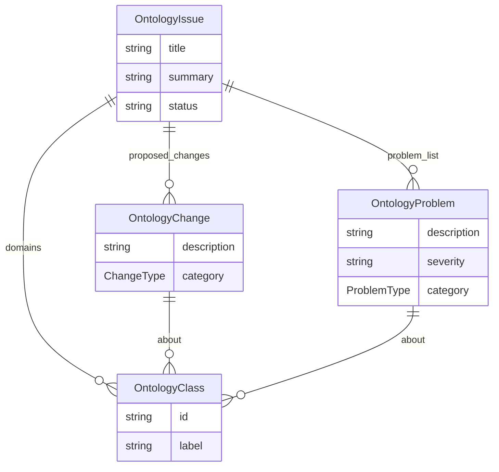

# Class: OntologyIssue


URI: [oc:OntologyIssue](http://w3id.org/ontogpt/ontology-class-templateOntologyIssue)





<!-- no inheritance hierarchy -->


## Slots

| Name | Cardinality and Range | Description | Inheritance |
| ---  | --- | --- | --- |
| [title](title.md) | 0..1 <br/> [String](String.md) |  | direct |
| [summary](summary.md) | 0..1 <br/> [String](String.md) | a high level summary | direct |
| [status](status.md) | 0..1 <br/> [String](String.md) |  | direct |
| [domains](domains.md) | 0..* <br/> [OntologyClass](OntologyClass.md) | What part of the ontology does this pertain to | direct |
| [problem_list](problem_list.md) | 0..* <br/> [OntologyProblem](OntologyProblem.md) | A list of problems stated at a high level | direct |
| [proposed_changes](proposed_changes.md) | 0..* <br/> [OntologyChange](OntologyChange.md) | What part of the ontology does this pertain to | direct |


## Identifier and Mapping Information


### Schema Source


* from schema: https://w3id.org/ontogpt/ontology_issue


## Mappings

| Mapping Type | Mapped Value |
| ---  | ---  |
| self | oc:OntologyIssue |
| native | oc:OntologyIssue |


## LinkML Source

<!-- TODO: investigate https://stackoverflow.com/questions/37606292/how-to-create-tabbed-code-blocks-in-mkdocs-or-sphinx -->

### Direct

<details>
```yaml
name: OntologyIssue
from_schema: https://w3id.org/ontogpt/ontology_issue
rank: 1000
attributes:
  title:
    name: title
    description: the title of the issue
    from_schema: https://w3id.org/ontogpt/ontology_issue
    rank: 1000
  summary:
    name: summary
    annotations:
      prompt:
        tag: prompt
        value: a high level one or two line summary of the issue, e.g. "the definition
          of the class 'bone' is too vague"
    description: a high level summary
    from_schema: https://w3id.org/ontogpt/ontology_issue
    rank: 1000
  status:
    name: status
    from_schema: https://w3id.org/ontogpt/ontology_issue
    rank: 1000
  domains:
    name: domains
    annotations:
      prompt:
        tag: prompt
        value: semicolon-separated list of grouping terms in the ontology.
    description: What part of the ontology does this pertain to.
    from_schema: https://w3id.org/ontogpt/ontology_issue
    rank: 1000
    multivalued: true
    range: OntologyClass
  problem_list:
    name: problem_list
    annotations:
      prompt:
        tag: prompt
        value: semicolon-separated list of problems each written as a simple statement.
          For example "T cell is classified in the wrong place"
    description: A list of problems stated at a high level
    from_schema: https://w3id.org/ontogpt/ontology_issue
    rank: 1000
    multivalued: true
    range: OntologyProblem
  proposed_changes:
    name: proposed_changes
    annotations:
      prompt:
        tag: prompt
        value: semicolon-separated list of grouping terms in the ontology. Example
          terms will be high level terms in the relevant ontology, e.g. "skeletal
          system" for an anatomy ontology.
    description: What part of the ontology does this pertain to.
    from_schema: https://w3id.org/ontogpt/ontology_issue
    rank: 1000
    multivalued: true
    range: OntologyChange
tree_root: true

```
</details>

### Induced

<details>
```yaml
name: OntologyIssue
from_schema: https://w3id.org/ontogpt/ontology_issue
rank: 1000
attributes:
  title:
    name: title
    description: the title of the issue
    from_schema: https://w3id.org/ontogpt/ontology_issue
    rank: 1000
    alias: title
    owner: OntologyIssue
    domain_of:
    - OntologyIssue
    - Publication
    range: string
  summary:
    name: summary
    annotations:
      prompt:
        tag: prompt
        value: a high level one or two line summary of the issue, e.g. "the definition
          of the class 'bone' is too vague"
    description: a high level summary
    from_schema: https://w3id.org/ontogpt/ontology_issue
    rank: 1000
    alias: summary
    owner: OntologyIssue
    domain_of:
    - OntologyIssue
    range: string
  status:
    name: status
    from_schema: https://w3id.org/ontogpt/ontology_issue
    rank: 1000
    alias: status
    owner: OntologyIssue
    domain_of:
    - OntologyIssue
    range: string
  domains:
    name: domains
    annotations:
      prompt:
        tag: prompt
        value: semicolon-separated list of grouping terms in the ontology.
    description: What part of the ontology does this pertain to.
    from_schema: https://w3id.org/ontogpt/ontology_issue
    rank: 1000
    multivalued: true
    alias: domains
    owner: OntologyIssue
    domain_of:
    - OntologyIssue
    range: OntologyClass
  problem_list:
    name: problem_list
    annotations:
      prompt:
        tag: prompt
        value: semicolon-separated list of problems each written as a simple statement.
          For example "T cell is classified in the wrong place"
    description: A list of problems stated at a high level
    from_schema: https://w3id.org/ontogpt/ontology_issue
    rank: 1000
    multivalued: true
    alias: problem_list
    owner: OntologyIssue
    domain_of:
    - OntologyIssue
    range: OntologyProblem
  proposed_changes:
    name: proposed_changes
    annotations:
      prompt:
        tag: prompt
        value: semicolon-separated list of grouping terms in the ontology. Example
          terms will be high level terms in the relevant ontology, e.g. "skeletal
          system" for an anatomy ontology.
    description: What part of the ontology does this pertain to.
    from_schema: https://w3id.org/ontogpt/ontology_issue
    rank: 1000
    multivalued: true
    alias: proposed_changes
    owner: OntologyIssue
    domain_of:
    - OntologyIssue
    range: OntologyChange
tree_root: true

```
</details>