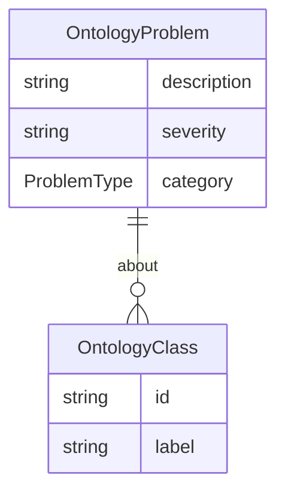

# Class: OntologyProblem


URI: [oc:OntologyProblem](http://w3id.org/ontogpt/ontology-class-templateOntologyProblem)





## Inheritance
* [CompoundExpression](CompoundExpression.md)
    * **OntologyProblem**


## Slots

| Name | Cardinality and Range | Description | Inheritance |
| ---  | --- | --- | --- |
| [description](description.md) | 0..1 <br/> [String](String.md) |  | direct |
| [severity](severity.md) | 0..1 <br/> [String](String.md) | How severe is this problem? | direct |
| [category](category.md) | 0..1 <br/> [String](String.md) |  | direct |
| [about](about.md) | 0..1 <br/> [String](String.md) |  | direct |


## Usages

| used by | used in | type | used |
| ---  | --- | --- | --- |
| [OntologyIssue](OntologyIssue.md) | [problem_list](problem_list.md) | range | [OntologyProblem](OntologyProblem.md) |


## Identifier and Mapping Information


### Schema Source


* from schema: https://w3id.org/ontogpt/ontology_issue


## Mappings

| Mapping Type | Mapped Value |
| ---  | ---  |
| self | oc:OntologyProblem |
| native | oc:OntologyProblem |


## LinkML Source

<!-- TODO: investigate https://stackoverflow.com/questions/37606292/how-to-create-tabbed-code-blocks-in-mkdocs-or-sphinx -->

### Direct

<details>
```yaml
name: OntologyProblem
from_schema: https://w3id.org/ontogpt/ontology_issue
rank: 1000
is_a: CompoundExpression
attributes:
  description:
    name: description
    description: A succinct description of the problem
    from_schema: https://w3id.org/ontogpt/ontology_issue
    rank: 1000
  severity:
    name: severity
    description: How severe is this problem?
    from_schema: https://w3id.org/ontogpt/ontology_issue
    rank: 1000
  category:
    name: category
    description: What category does this problem fall into?
    from_schema: https://w3id.org/ontogpt/ontology_issue
    rank: 1000
    range: ProblemType
  about:
    name: about
    annotations:
      prompt:
        tag: prompt
        value: semicolon-separated list of terms in the ontology that are problematic.
    description: What terms in the ontology is this problem about?
    from_schema: https://w3id.org/ontogpt/ontology_issue
    rank: 1000
    multivalued: true
    range: OntologyClass

```
</details>

### Induced

<details>
```yaml
name: OntologyProblem
from_schema: https://w3id.org/ontogpt/ontology_issue
rank: 1000
is_a: CompoundExpression
attributes:
  description:
    name: description
    description: A succinct description of the problem
    from_schema: https://w3id.org/ontogpt/ontology_issue
    rank: 1000
    alias: description
    owner: OntologyProblem
    domain_of:
    - OntologyProblem
    - OntologyChange
    range: string
  severity:
    name: severity
    description: How severe is this problem?
    from_schema: https://w3id.org/ontogpt/ontology_issue
    rank: 1000
    alias: severity
    owner: OntologyProblem
    domain_of:
    - OntologyProblem
    range: string
  category:
    name: category
    description: What category does this problem fall into?
    from_schema: https://w3id.org/ontogpt/ontology_issue
    rank: 1000
    alias: category
    owner: OntologyProblem
    domain_of:
    - OntologyProblem
    - OntologyChange
    range: ProblemType
  about:
    name: about
    annotations:
      prompt:
        tag: prompt
        value: semicolon-separated list of terms in the ontology that are problematic.
    description: What terms in the ontology is this problem about?
    from_schema: https://w3id.org/ontogpt/ontology_issue
    rank: 1000
    multivalued: true
    alias: about
    owner: OntologyProblem
    domain_of:
    - OntologyProblem
    - OntologyChange
    range: OntologyClass

```
</details>